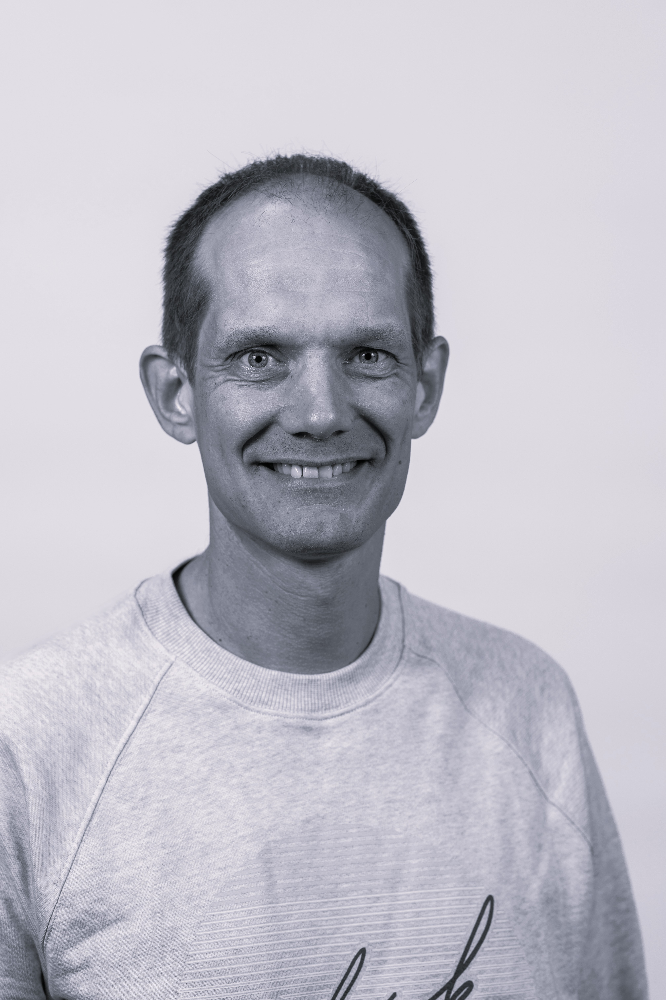
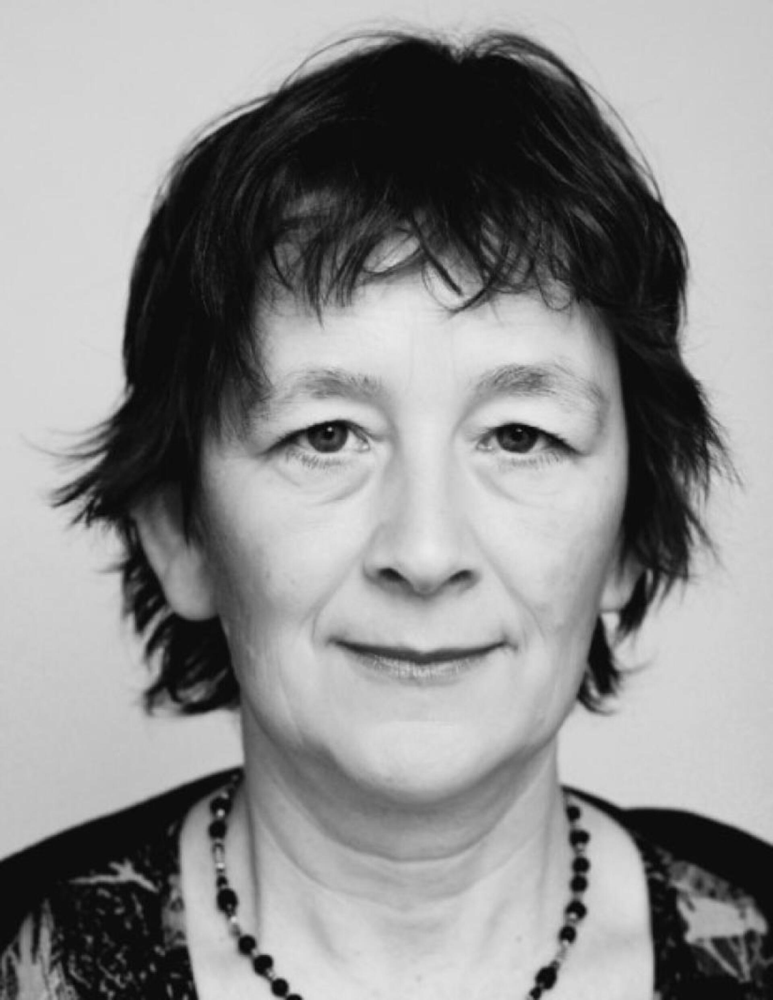
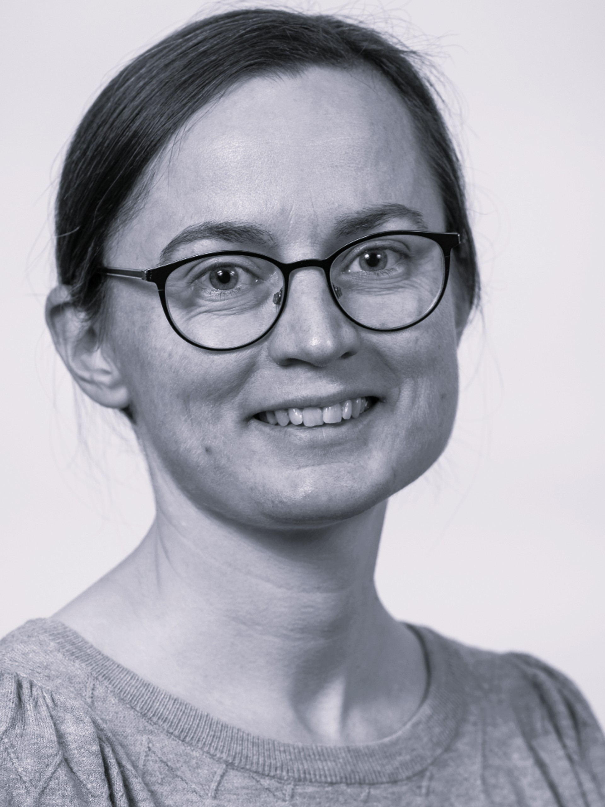
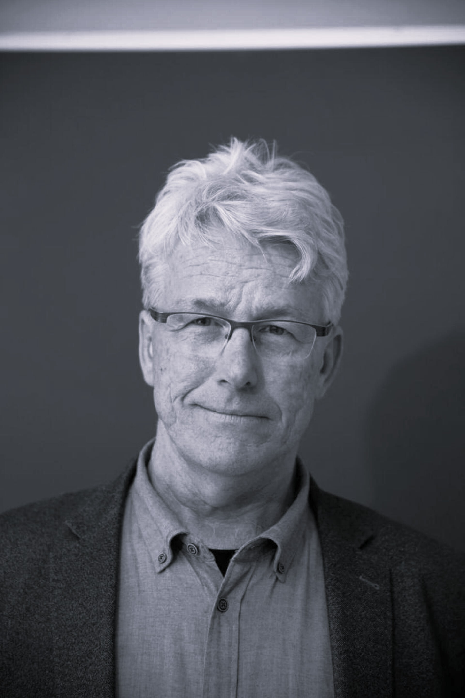
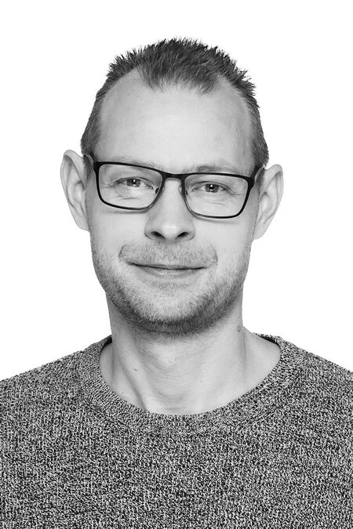
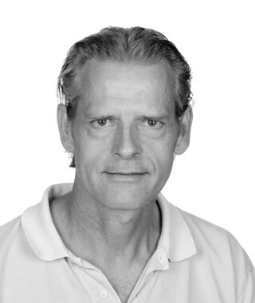
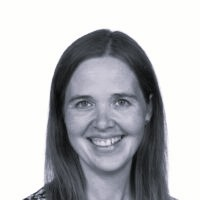
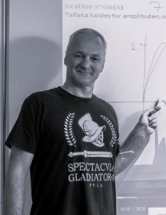
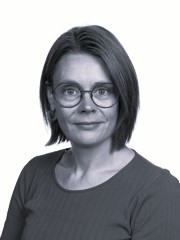

Projektet \"AI - Aalborg Intelligence\" er finansieret af Novo Nordisk Fonden og forankret på Institut for Matematiske Fag på Aalborg Universitet (AAU). Projektet inkluderer en repræsentant fra hver af de fem STX-gymnasier i Aalborg.

## Forskere fra AAU

::: {.grid .about-grid}

::: {.g-col-3 .person}
{.about-img}
Ege Rubak   (projektleder)
:::

::: {.g-col-3 .person}
{.about-img}
Lisbeth Fajstrup
:::

::: {.g-col-3 .person}
{.about-img}
Anne Marie Svane
:::

::: {.g-col-3 .person}
{.about-img}
Søren Højsgaard
:::

:::

## Gymnasielærere

::: {.grid .about-grid}

::: {.g-col-3 .person}
{.about-img}
Allan Frendrup   (Nørresundby Gymnasium)
:::

::: {.g-col-3 .person}
{.about-img}
Nikolaj Hess-Nielsen   (Aalborg Katedralskole)
:::

::: {.g-col-3 .person}
{.about-img}
Mette Kristensen   (Hasseris Gymnasium)
:::

::: {.g-col-3 .person}
{.about-img}
Jan B. Sørensen   (Aalborg City Gymnasium)
:::

::: {.g-col-3 .person}
{.about-img}
Malene Cramer Engebjerg   (Aalborghus Gymnasium)
:::

:::

## Kontakt

Email: rubak@math.aau.dk