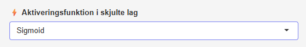

#### [Aktiveringsfunktion]{.fremhaev}

{style='float:right; margin-left:1rem;'  width=50%}

Under **Aktiveringsfunktion** kan vælges [Sigmoid](/undervisningsforlob/aktiveringsfunktioner.qmd#sigmoid){target="_blank"} og ... 
tangenthyperbolsk, ReLu, Softsign og identitet

\