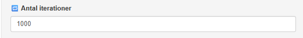

#### [Antal iterationer]{.fremhaev}

{style='float:right; margin-left:1rem;'  width=50%}

**Antal iterationer** angiver det antal gange vægtene opdateres i forbindelse med gradientnedstigning. Antal iterationer skal sættes stort nok til at grafen for tabsfunktionen, som funktion af antal iterationer begynder at flade ud. 

\