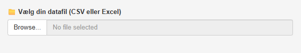
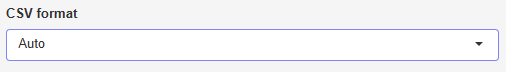

{style='float:right; margin-left:1rem;'  width=50%}

Tryk på **Browse...** og vælg den datafil, du vil uploade. Det skal enten være en csv- eller excel-fil.

\

Hvis du uploader en fil i **CSV format**, kommer følgende frem:

{style='float:right; margin-left:1rem;'  width=50%}

Her skal du vælge, hvordan data er separeret. Der er følgende muligheder:

* Auto
* Komma (,)
* Semikolon (; - Dansk/Excel)

Ved \"Auto\" prøver app'en selv at finde ud af, hvordan data er separeret. Hvis du ikke ved, hvad du skal vælge, så prøv alle muligheder og se efter, hvordan data bliver indlæst i højre side af skærmen.

\