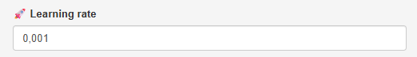

#### [Learning rate]{.fremhaev}

{style='float:right; margin-left:1rem;'  width=50%}

Når vægtene opdateres ved hjælp af [gradientnedstigning](/noter/gradientnedstigning/gradientnedstigning.qmd#optimering-ved-hjælp-af-gradientnedstigning){target="_blank"} benyttes denne opdateringsregel (hvor $E$ er tabsfunktionen)

$$
w^{(\textrm{ny})} \leftarrow  w - \eta \cdot \frac{\partial E }{\partial w}
$$

her er $\eta$ det, som kaldes for en **learning rate**. Hvis $\eta$ vælges for stor, kan man risikere at \"træde henover\" minimum (det ses typisk ved at grafen for tabsfunktionen som funktion af antal iterationer -- til højre i skærmbilledet -- fluktuerer eller \"stikker af\"). Vælges $\eta$ for lille går opdateringen for langsom, som ses ved at værdien af tabsfunktionen næsten ikke ændrer sig.

\