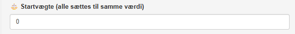

#### [Startvægte]{.fremhaev}

{style='float:right; margin-left:1rem;'  width=50%}

AI modellen trænes ved at finde minimum for en tabsfunktion, som gøres ved hjælp af [gradientnedstigning](/noter/gradientnedstigning/gradientnedstigning.qmd#optimering-ved-hjælp-af-gradientnedstigning){target="_blank"} (som også er forklaret i denne [video](https://youtu.be/WcM8aEoPzf8?si=FgxIjWm-nFyGAnkn){target="_blank"}). 

Under **Startvægte** er det muligt at vælge hvilke værdier af vægtene, gradientnedstigning skal tage sit udgangspunkt i. Bemærk, at alle vægte starter i den samme værdi.

\