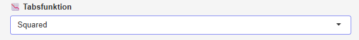

{style='float:right; margin-left:1rem;'  width=50%}

Her kan vælges den **tabsfunktion**, som minimeres. **Squared** svarer til  [squared error tabsfuntkionen](/noter/tabsfunktioner/tabsfunktioner.qmd#squared-error-tabsfunktionen){target="_blank"}, som måler de kvadrerede fejl:

$$
\begin{aligned}
E(w_0, w_1, &\dots, w_n) = \frac{1}{2} \sum_{m=1}^{M} \left (t^{(m)}-
o^{(m)} \right)^2,
\end{aligned}
$$

mens **Cross-entropy** svarer til [cross-entropy tabsfunktionen](/noter/tabsfunktioner/tabsfunktioner.qmd#cross-entropy-tabsfunktionen){target="_blank"}:

$$
\begin{aligned}
E(w_0, w_1, \dots, & w_n) = \\ &- \sum_{m=1}^{M} \left (t^{(m)} \cdot \ln(o^{(m)}) + (1-t^{(m)}) \cdot \ln(1-o^{(m)})  \right)
\end{aligned}
$$

I forbindelse med binær klassifikation kan **squared error** have problemer med [slow learning](/noter/tabsfunktioner/tabsfunktioner.qmd#slow-learning){target="_blank"} som ikke på samme måde ses, hvis **cross-entropy** i stedet vælges.