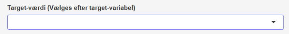

#### [Target-værdi]{.fremhaev}

{style='float:right; margin-left:1rem;'  width=50%}

Under **target-værdi** vælger du den specifikke værdi, som skal svare til en target-værdi på $1$. Hvis du for eksempel har en kolonne, hvor værdierne er $A$, $B$ og $C$, og du vælger $B$ som target-værdi, så laves der automatisk en target-variabel, hvor

$$
t = 
\begin{cases}
1 & \textrm{hvis target-variablen har værdien } B \\
0 & \textrm{hvis target-variablen har værdien } A \textrm{ eller } C
\end{cases}
$$

\