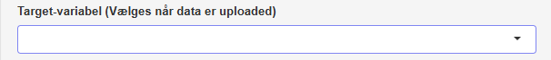

#### [Target-variabel]{.fremhaev}

{style='float:right; margin-left:1rem;'  width=50%}

Under **Target-variabel** vælger du den kolonne i dit datasæt, som angiver den klasse, der skal prædikteres. Du skal altså her vælge den kolonne, hvor **target-værdierne** står.  

\