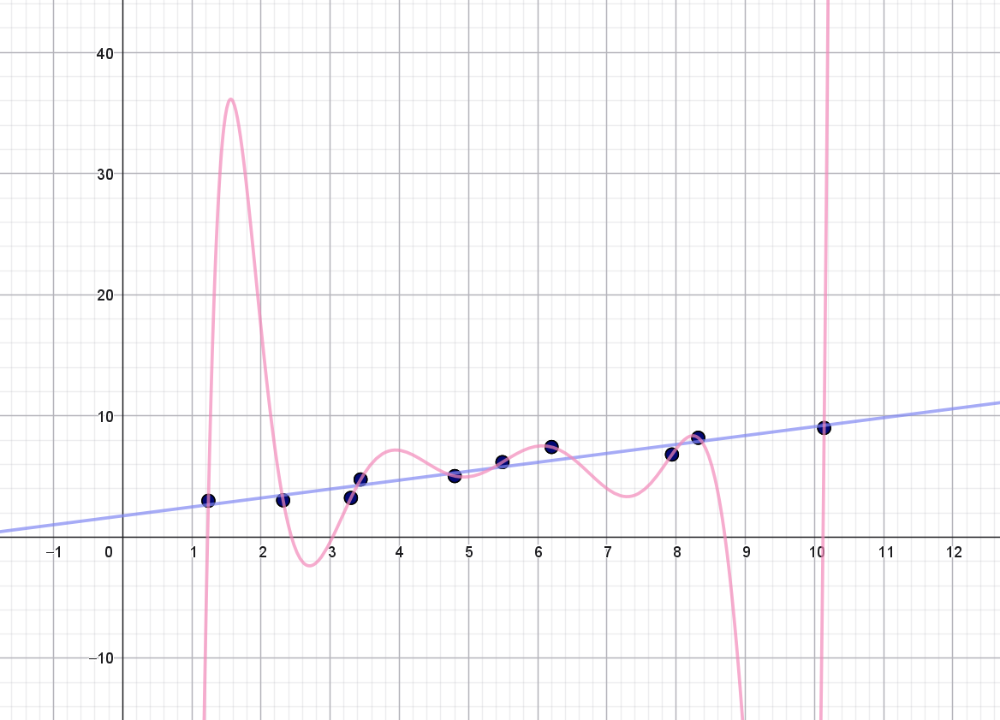

Hvis du har læst nogle af vores andre noter om kunstige neurale netværk, så har de alle handlet om **klassifikation**. Det kunne for eksempel være: aktiverer en kunde et tilbud i en app? (ja/nej), bliver det regnvejr i morgen? (ja/nej), har en patient en bestemt sygdom? (ja/nej), hvilket af fire valg skal jeg træffe? De tre første eksempler er eksempler på det, som man kalder for **binær klassifikation** (fordi der kun er to muligheder), mens det sidste eksempel er et eksempel på **multipel klassifikation** (fordi der er mere end to muligheder). I denne note vil vi se på, hvordan man kan bruge kunstige neurale netværk til at forudsige en såkaldt numerisk variabel -- mere konkret vil vi her se på, hvordan man kan lave et kunstigt neuralt netværk, som kan bruges til at prædiktere salgsprisen på en lejlighed i Aalborg.

## Hvad koster min lejlighed?

Vi forestiller os helt generelt en række inputvariable eller features: $x_1, x_2, \dots, x_n$ på baggrund af hvilke vi gerne vil kunne forudsige en såkaldt targetvariabel $t$, som her er salgsprisen på en lejlighed i Aalborg. 


::: {#exm-lejlighed1}

## Lejlighedspriser -- Home datasættet


{style='float:right;' width='30%'}

Ejendomsmæglerkæden \"Home\" har stillet information om salg af ejendomme i perioden fra 2010 til 2022 til rådighed. Vi har i dette eksempel valgt at se på salget af lejligheder beliggende i 9000 Aalborg. Du kan downloade denne del af datasættet [her](data/home_Aalborg9000_lejlighed.xlsx).

Targetvariablen $t$ står i kolonnen `pris` og angiver salgsprisen af en given lejlighed. Derudover indeholder det oprindelige datasættet en lang række oplysninger, men vi har her valgt kun at fokusere på en delmængde af disse.


Vi vil specielt se på følgende features:

* `areal`: boligens areal målt i kvadratmeter  ($x_1$)
* `alder`: boligens alder i år  ($x_2$) 

Og vi vil lade targetvariablen $t$ være 

* $t$: boligens pris i kroner

I eksemplet her har vi information om $1140$ salg af lejligheder og i $4$ tilfælde har vi ikke information om lejlighedens alder, vi vil derfor i det følgende begrænse os til $1136$ salg.

:::

Lad os starte simpelt og opstille en kunstig neuron til formålet. Så vil vi sige, at vores prædiktion af salgsprisen skal være en outputværdi $o$, som helt generelt er den vægtede sum af vores inputvariable:

$$
o = w_0 + w_1 \cdot x_1 + w_2 \cdot x_2 + \cdots + w_n \cdot x_n
$$

Her kaldes $w_0, w_1, w_2, \dots, w_n$ for vægte.

Hvis du har læst noten om [kunstige neuroner](../kunstige_neuroner/kunstige_neuroner.qmd), så er den eneste forskel her, at vi ikke længere bruger sigmoid-funktionen som aktiveringsfunktion[^1], fordi vi ikke her har brug for at få en outputværdi, som ligger mellem $0$ og $1$.

[^1]: Vi bruger sådan set stadig en aktiveringsfunktion -- det bare den funktion, som kaldes for *identiteten* med forskrift $f(x)=x$.

Vi ønsker nu, at bestemme vægtene $w_0, w_1, w_2, \dots, w_n$ sådan at vores prædikterede salgspris $o$ kommer så tæt som muligt på den faktiske salgspris $t.$

Det vil sige, at vi ønsker, at forskellen

$$
t-o = t - \left ( w_0 + w_1 \cdot x_1 + w_2 \cdot x_2 + \cdots + w_n \cdot x_n \right )
$$

bliver så lille som mulig.

Da denne differens både kan være positiv og negativ, men vi egentlig ikke er interesseret i fortegnet -- blot om differensen er lille eller stor, så vælger vi i stedet at se på den kvadrerede forskel:

$$
\left ( t - \left ( w_0 + w_1 \cdot x_1 + w_2 \cdot x_2 + \cdots + w_n \cdot x_n \right ) \right )^2
$$

Vi får en sådan kvadreret differens for hvert eneste salg i vores træningsdatasæt, og vi vælger derfor blot at lægge alle disse størrelser sammen:

$$
E = \frac{1}{2}\sum \left ( t - \left ( w_0 + w_1 \cdot x_1 + w_2 \cdot x_2 + \cdots + w_n \cdot x_n \right ) \right )^2
$$

Størrelsen $E$ kaldes for en **tabsfunktion**. Læg mærke til, at hvis vores kunstige neuron er god til at forudsige salgspriser, så får vi en lille værdi af tabsfunktionen, mens vi får en stor værdi af $E$, hvis modellen er dårlig til at forudsige salgspriser. Vi har her valgt at gange med $\frac{1}{2}$, fordi det senere kommer til at forkorte ud, men det er faktisk ikke så afgørende.

Idéen er så bare at bestemme værdier af vægtene $w_0, w_1, w_2, \dots, w_n$, sådan at tabsfunktionen minimeres.

Inden vi forklarer, hvordan det gøres, så lad os lige blive lidt mere specifikke i forhold til notationen af vores træningsdata. Vi forestiller os, at vi har information om $M$ lejlighedssalg (i eksemplet er $M=1136$). Så vil vi nummere vores træningsdata på denne måde:

$$
\begin{aligned}
&\text{Træningseksempel 1:} \quad (x_1^{(1)}, x_2^{(1)}, \dots, x_n^{(1)}, t^{(1)}) \\
&  \quad \quad \quad \quad \vdots \\
&\text{Træningseksempel m:} \quad (x_1^{(m)}, x_2^{(m)}, \dots, x_n^{(m)}, t^{(m)}) \\
&  \quad \quad \quad \quad \vdots \\
&\text{Træningseksempel M:} \quad (x_1^{(M)}, x_2^{(M)}, \dots, x_n^{(M)}, t^{(M)}) \\
\end{aligned}
$$

Gør vi det, bliver tabsfunktionen:

$$
\begin{aligned}
E(w_0, w_1, &\dots, w_n) \\ &= \frac{1}{2} \sum_{m=1}^{M} \left (t^{(m)}-
(w_0 + w_1 \cdot x_1^{(m)} + \cdots + w_n \cdot x_n^{(m)}) \right)^2.
\end{aligned}
$$

Hvis vi samtidig indfører, at vi kalder outputværdien for det $m$'te lejlighedssalg for $o^{(m)}$:

$$
o^{(m)} = w_0 + w_1 \cdot x_1^{(m)} + \cdots + w_n \cdot x_n^{(m)}
$$
Så kan tabsfunktionen udtrykkes kort på denne måde:

$$
\begin{aligned}
E(w_0, w_1, &\dots, w_n) \\ &= \frac{1}{2} \sum_{m=1}^{M} \left (t^{(m)}-
o^{(m)} \right)^2
\end{aligned}
$$

hvor det nu så bare ikke er helt så tydeligt, at $E$ jo faktisk afhænger af alle vægtene.

For at bestemme de værdier af vægtene, som minimerer tabsfunktionen, vil vi bruge en metode, som kaldes for gradientnedstigning. Vi har lavet videoer om både [funktioner af to variable](https://youtu.be/tlq2UYWF2Rw){target="blank"} og [gradientnedstigning](https://youtu.be/WcM8aEoPzf8){target="blank"}, hvis du vil vide mere.

Idéen i gradientnedstigning er, at vi opdaterer alle vægtene ved at gå et lille stykke i den negative gradients retning. Det kommer til at se sådan her ud:

$$
\begin{aligned}
w_0^{(\textrm{ny})} \leftarrow & w_0 - \eta \cdot \frac{\partial E }{\partial w_0} \\
w_1^{(\textrm{ny})} \leftarrow & w_1 - \eta \cdot \frac{\partial E }{\partial w_1} \\
&\vdots  \\
w_n^{(\textrm{ny})} \leftarrow & w_n - \eta \cdot \frac{\partial E }{\partial w_n} \\
\end{aligned}
$$

hvor $\eta$ kaldes for en **learning rate**.

Vi får derfor brug for alle de partielle afledede af $E$ med hensyn til $w_i$ for $i \in \{0, 1, 2, \dots, n\}$. Det er ikke svært at vise, at

$$
\begin{aligned}
\frac{\partial E}{\partial w_i} &= - \sum_{m=1}^M \left (t^{(m)}-
(w_0 + w_1 \cdot x_1^{(m)} + \cdots + w_n \cdot x_n^{(m)}) \right) \cdot x_i^{(m)} \\
&= - \sum_{m=1}^M \left (t^{(m)}- o^{(m)} \right) \cdot x_i^{(m)}
\end{aligned}
$$
for $i \in \{1, 2, \dots, n\}$ og 

$$
\frac{\partial E}{\partial w_0} = - \sum_{m=1}^M \left (t^{(m)}- o^{(m)} \right)
$$
Opdateringsreglerne for vægtene bliver derfor:

::: {.callout-note collapse="false" appearance="minimal"} 
## Opdateringsregler for kunstige neuroner til regression
$$
\begin{aligned}
w_0^{(\textrm{ny})} \leftarrow & w_0 + \eta \cdot \sum_{m=1}^{M} \left (t^{(m)}-o^{(m)} \right)\\
w_1^{(\textrm{ny})} \leftarrow & w_1 + \eta \cdot \sum_{m=1}^{M} \left (t^{(m)}-o^{(m)} \right)\cdot x_1^{(m)}\\
&\vdots  \\
w_n^{(\textrm{ny})} \leftarrow & w_n + \eta \cdot \sum_{m=1}^{M} \left (t^{(m)}-o^{(m)} \right)\cdot x_n^{(m)}
\end{aligned}
$$

hvor $o^{(m)} = w_0 + w_1 \cdot x_1^{(m)} + \cdots + w_n \cdot x_n^{(m)}$.

:::

At opstille en kunstig neuron til regression, som vi har gjort her, svarer til det, man kalder for **multipel lineær regression**, som egentlig bare er en udvidelse af lineær regression, som I kender det, blot med flere inputvariable/features.

Det gode ved at opstille en kunstig neuron til regression, som vi her har gjort det, er at man kan give en fortolkning af vægtene. 

### Fortolkning af vægtene 

Lad os sige, at vi har bestemt vægtene $w_0, w_1, \dots, w_n$, så tabsfunktionen er blevet minimeret, og at $x_1$ fortsat angiver boligarealet. Vi vil her forklare, hvordan vi kan fortolke $w_1$.

Vi forstiller os, at vi har to lejligheder med præcis samme værdier af de $n$ features $x_1, x_2, \dots, x_n$ bortset fra, at den ene lejlighed er præcis $1 \, m^2$ større end den anden. Så den ene lejlighed har en størrelse på $x_1 \, m^2$, mens det andet har en størrelse på $x_1+1 \, m^2$ -- de resterende features er ens.

Det giver følgende prædikterede salgspriser $o_1$ og $o_2$ for de to lejligheder:

$$
\begin{aligned}
o_1 &= w_0 + w_1 \cdot x_1 + w_2 \cdot x_2 + \cdots + w_n \cdot x_n \\
\\
o_2 &= w_0 + w_1 \cdot (x_1 + 1) + w_2 \cdot x_2 + \cdots + w_n \cdot x_n \\ 
&= w_0 + w_1 \cdot x_1 + w_1 + w_2 \cdot x_2 + \cdots + w_n \cdot x_n
\end{aligned}
$$

Da bliver forskellen mellem de to prædikterede salgspriser:

$$
\begin{aligned}
o_2 - o_1 &= w_0 + w_1 \cdot x_1 + w_1 + w_2 \cdot x_2 + \cdots + w_n \cdot x_n \\
& \quad \quad - \left ( w_0 + w_1 \cdot x_1 + w_2 \cdot x_2 + \cdots + w_n \cdot x_n \right) \\
&= w_0 + w_1 \cdot x_1 + w_1 + w_2 \cdot x_2 + \cdots + w_n \cdot x_n \\ & \quad \quad - w_0 - w_1 \cdot x_1 - w_2 \cdot x_2 - \cdots - w_n \cdot x_n \\
& = w_1
\end{aligned}
$$

Det vil sige, at hvis alt andet er holdt ens, så vil en forøgelse i boligarealet på $1 \, m^2$ give en forøgelse i den prædikterede salgspris på $w_1$ kroner.

Da $x_2$ angiver lejlighedens alder, så vil $w_2$ helt tilsvarende kunne fortolkes som den størrelse, den prædikterede salgspris vil stige med, hvis en lejlighed er præcis ét år ældre end en anden tilsvarende lejlighed (det vil her sige en lejlighed med samme areal).

Vi illustrerer dette med et eksempel:

::: {#exm-lejlighed2}

## Lejlighedspriser -- fortolkning af vægtene

Man kan træne en kunstig neuron til regression ved at bruge [Kunstig neuron app til regression](https://apps01.math.aau.dk/ai/neuron_regression/).

Bruger vi denne app på datasættet om lejlighedssalg, hvor vi sætter alle startvægte til $0$, vælger en learning rate på $0.0001$ og antal iterationer til $500$, får vi følgende værdier af vægtene

|  $w_0$  <br>  <br> |  $w_1$ <br> (`areal`)  |  $w_2$  <br>(`alder`)  | 
|:---:|:---:|:---:|
| $0.0637521$ | $0.0195118$ | $-0.0023493$ | 
: {.bordered}

For eksempel kan vi se, at $w_1 = 0.0195118$. Det vil sige, at ifølge modellen vil prisen på en lejlighed, som er præcis én kvadratmeter større end en anden tilsvarende[^2] lejlighed, være cirka $19512$ kroner højere (husk på at prisen er målt i millioner, så vi skal lige gange med en million, hvis vi skal have værdien oversat til kroner).

[^2]: En tilsvarende lejlighed vil her mere præcist betyde en lejlighed med den samme alder.

Vi ser også, at $w_2=-0.0023493$, som betyder, at hvis vi står med to tilsvarende lejligheder, hvor den ene er præcis et år ældre end den anden, så vil salgsprisen på den ældste lejlighed ifølge modellen være $2349$ kroner lavere.

I det nedenstående har vi plottet den faktiske pris (i millioner) ud af $x$-aksen og den prædikterede pris op af $y$-aksen.

```{r}
#| echo: false
#| fig-cap: Den faktiske lejlighedspris (i millioner) ud af $x$-aksen og den prædikterede pris op af $y$-aksen.
#| label: fig-pred_versus_price
library(aimat)
library(ggplot2)
dat <- readxl::read_excel(here::here("noter/simple_neurale_net_regression/data/home_Aalborg9000_lejlighed.xlsx"))
fit_lm <- lm(pris_mio ~ areal + alder, data = dat)
#fit <- nn_fun(price ~ area + bedrooms + bathrooms + basement, data = dat, n_hidden = c(0, 0), iter = #500, type = "regression", lossfun = "squared", eta = .0001, weights=0)
#w <- as.vector(fit$params$W1)
#b <- as.vector(fit$params$b1)
#if(!is.null(fit$scale_val)){
#  w <- w / fit$scale_val
#  b <- b - sum(w * fit$center_val)
#}
dat$pred <- predict(fit_lm, dat, type = "response")
dat |> 
  ggplot(aes(pris_mio, pred)) +
  geom_point(color="#020873", shape = 21) + 
  geom_abline(slope = 1, intercept = 0, color = "#8085F2") +
  theme_bw() + 
  labs(x = "Faktisk pris (mio kr)", y = "Prædikteret pris (mio kr)") +
  theme(strip.background = element_rect(fill = "white", color = "white"), strip.text = element_text(size = 20))
```
Hvis vi har en perfekt model, så vil den prædikterede pris være lig med den faktiske pris. Det vil svare til, at alle punkterne i @fig-pred_versus_price vil ligge på linjen med ligning $y=x$ (som er indtegnet med lyseblå i figuren). På figuren kan vi derfor se, at for lejligheder, som koster under $3$ millioner er modellen ikke helt dårlig. Til gengæld er modellen ikke super god til at prædiktere salgsprisen for de dyrere lejligheder: For nogle lejligheder er den prædikterede salgspris for høj, mens det omvendte også gør sig gældende -- specielt de meget dyre lejligheder, som koster over $5$ millioner, prædikterer modellen for lavt.

:::

## Vurdering af modellens anvendelighed

Når man træner en kunstig neuron, har man brug for et mål for, hvor god modellen er. Du kender nok allerede $R^2$-værdien fra lineær regression, som et tal mellem $0$ og $1$, hvor vi gerne vil have tallet så tæt på $1$ som muligt (og så alligevel ikke helt -- det kommer vi tilbage til senere). Hvis du vil vide mere om, hvordan $R^2$-værdien rent faktisk regnes ud, kan du læse mere [her](../vurdering_model/vurdering_model.qmd#forklaringsgraden-r2-værdien).


Et andet mål, som kan bruges til at sammenligne modeller, er **root mean squared error (RMSE)**. Du kan læse en lidt længere forklaring [her](../vurdering_model/vurdering_model.qmd#root-mean-squared-error-rmse), men målet er defineret således:

$$
\mathrm{RMSE} = \sqrt{\frac{1}{M} \sum_{m=1}^{M} \left (t^{(m)}-o^{(m)} \right)^2}
$$

Det er altså denne størrelse, som er **root mean squared error (RMSE)**. Da vi ønsker så lille en fejl som muligt, vil vi gerne have, at RMSE er så tæt på $0$ som muligt.


::: {#exm-lejlighed3}

## Lejlighedspriser -- RMSE og $R^2$

Ser vi på den kunstige neuron fra @exm-lejlighed2 kan man udregne RMSE. Gør man det får man

$$
\mathrm{RMSE} = 0.497
$$

Uden sammenligning med andre modeller er det svært at vide, om det tal er godt eller skidt. Til gengæld kan vi udregne $R^2$-værdien, som er

$$
R^2 = 0.596
$$
Du er måske vant til at se $R^2$-værdier, som er meget større, men for en model baseret på et datasæt fra den virkelige verden er det såmen ikke helt tosset!

:::


### Krydsvalidering

Når en models anvendelighed vurderes ved hjælp af mål som RMSE og $R^2$-værdi, så vil det altid være sådan, at jo mere kompliceret en model, man bruger, desto bedre mål vil man få (det vil sige en lille værdi af RMSE og en værdi af $R^2$, som er tæt på $1$). Hvorfor det er tilfældet, kan du læse meget mere om i noten [Overfitting, modeludvælgelse og krydsvalidering](../krydsvalidering/krydsvalidering.qmd){target="_blank"}). Kort fortalt går det ud på, at en meget kompliceret model kan fange tendenser i data, som i virkeligheden ikke er reelle -- det er bare støj. Et eksempel ses i @fig-overfitting:

{width='80%' #fig-overfitting}

Det kan her tydeligt ses, at en ret linje beskriver punkterne udmærket. Et 9. grads polynomium har til gengæld så meget fleksibilitet, at grafen for polynomiet kan gå igennem alle ti punkter. Det ses tydeligt på @fig-overfitting, at det bliver alt for mærkeligt, og vi har ingen forventninger om, at dette polynomium vil kunne bruges til at beskrive nye punkter, som ikke kommer fra datasættet. Men bruger vi for eksempel $R^2$-værdien til at sammenligne de to modeller, så får vi:

| Model | $R^2$-værdi | RMSE | 
|:---|:---:|:---:|
| Lineær regression | $0.916$ | $0.603$ |
| 9. grads polynomiel regression | $1.000$ |  $0.000$ |
: {.bordered}


Så ser vi alene på $R^2$-værdien og RMSE, kunne vi blive foranlediget til at tro, at vi skulle vælge polynomiel regression. Man skal altså være utrolig varsom med uden videre at sammenligne den type mål! Men hvad gør man så? Ét bud er at bruge noget, som kaldes for **krydsvalidering**. Princippet er illustreret i @fig-krydsvalidering.


```{tikz}
#| echo: false
#| fig-cap: Illustration af idéen ved $5$-fold krydsvalidering.
#| label: fig-krydsvalidering
\definecolor{myblue}{HTML}{8086F2}
\definecolor{myred}{HTML}{F288B9}
\begin{tikzpicture}
	\draw[fill, myred] (0,0) -- (2,0) -- (2,0.5) -- (0,0.5) -- (0,0);
	\draw[fill, myblue] (2,0) -- (10,0) -- (10,0.5) -- (2,0.5) -- (2,0);
	\node at (1,0.25) {test} ;
	\node at (6,0.25) {træning} ;
	
	\draw[fill,myblue] (0,-1) -- (2,-1) -- (2,-0.5) -- (0,-0.5) -- (0,-1);
	\draw[fill, myred] (2,-1) -- (4,-1) -- (4,-0.5) -- (2,-0.5) -- (2,-1);
	\draw[fill, myblue] (4,-1) -- (10,-1) -- (10,-0.5) -- (4,-0.5) -- (4,-1);
	\node at (3,-0.75) {test} ;
	\node at (7,-0.75) {træning} ;
	
	\draw[fill,myblue] (0,-2) -- (4,-2) -- (4,-1.5) -- (0,-1.5) -- (0,-2);
	\draw[fill, myred] (4,-2) -- (6,-2) -- (6,-1.5) -- (4,-1.5) -- (4,-2);
	\draw[fill, myblue] (6,-2) -- (10,-2) -- (10,-1.5) -- (6,-1.5) -- (6,-2);
	\node at (5,-1.75) {test} ;
	\node at (8,-1.75) {træning} ;
	
	\draw[fill,myblue] (0,-3) -- (6,-3) -- (6,-2.5) -- (0,-2.5) -- (0,-3);
	\draw[fill, myred] (6,-3) -- (8,-3) -- (8,-2.5) -- (6,-2.5) -- (6,-3);
	\draw[fill, myblue] (8,-3) -- (10,-3) -- (10,-2.5) -- (8,-2.5) -- (8,-3);
	\node at (7,-2.75) {test} ;
	\node at (3,-2.75) {træning} ;
	
	\draw[fill,myblue] (0,-4) -- (8,-4) -- (8,-3.5) -- (0,-3.5) -- (0,-4);
	\draw[fill, myred] (8,-4) -- (10,-4) -- (10,-3.5) -- (8,-3.5) -- (8,-4);
	\node at (9,-3.75) {test} ;
	\node at (4,-3.75) {træning} ;
\end{tikzpicture}
```

Man starter med at inddele data tilfældigt i $5$ lige store dele: del 1, 2, 3, 4 og 5. Så træner man en model (lad os sige, at man laver lineær regression) baseret på del 2, 3, 4 og 5. Det giver en ret linje. Hefter bruger man del 1 til at udregne for eksempel RMSE baseret på den model, man lige har bestemt. 

Har man for eksempel et datasæt med $500$ dataeksempler så udregnes RMSE på denne måde:

$$
\mathrm{RMSE} = \sqrt{\frac{1}{100} \sum_{m \in \textrm{del 1}}\left (t^{(m)}-o^{(m)} \right)^2}
$$

Her summerer vi altså over alle træningseksempler i del 1. Husk på, at outputværdien $o^{(m)}$ findes ved

$$
o^{(m)} = w_0 + w_1 \cdot x_1^{(m)} + \cdots + w_n \cdot x_n^{(m)}
$$

Her stammer inputværdierne $x_1^{(m)}, x_2^{(m)}, \dots, x_n^{(m)}$ fra del 1, men vægtene $w_0, w_1, w_2, \dots, w_n$ er fundet ved at bruge data fra del 2, 3, 4 og 5. Man undersøger altså, hvor god modellen er til at prædiktere data i del 1, hvis den kun er trænet på data fra del 2, 3, 4 og 5. Derfor kalder man del 1 for **testdata** og del 2, 3, 4 og 5 for **træningsdata**. Det er helt essentielt her, at man tester sin model på en del af data, som *ikke* har været brugt til at træne modellen på. Dette gentager man så, men næste gang er det del 2, som er testdata og del 1, 3, 4 og 5 som er træningsdata. Igen udregnes RMSE. Denne proceduren gentages i alt 5 gang. Det giver 5 forskellige RMSE værdier. Herefter tager man gennemsnittet af dem for at få et samlet mål for modellens anvendelighed. 

Det viser sig, at det ikke giver så meget mening, at udregne $R^2$-værdien i forbindelse med krydsvalidering. For eksempel kan værdien gå hen og blive negativ. Vi vil derfor i det følgende nøjes med at se på RMSE.

::: {#exm-lejlighed4}

## Lejlighedspriser -- RMSE med krydsvalidering

Vi vil nu udregne RMSE baseret på $5$-folds krydsvalidering. Det giver

$$
\mathrm{RMSE} = 0.502
$$

Bemærk, at hvis vi sammenligner med RMSE, som ikke er baseret på krydsvalidering fra @exm-lejlighed3, så er RMSE her blevet en smule højere her. Det er helt forventeligt, at modellen vil klare sig bedre, når den er testet på de data, som den også er trænet på.

:::


## Prædiktion af lejlighedspriser -- med skjulte lag!

Når man skal sælge en lejlighed, skal der helst ikke være skjulte fejl og mangler. Det kan til gengæld være en rigtig god idé med nogle skjulte lag, når man skal prædiktere lejlighedspriser! Det vil vi se på nu.

I det ovenstående kommer den prædikterede pris til at afhænge lineært af inputvariablene. Men verden er sjældent lineær -- og en af styrkerne ved kunstige neurale netværk er netop, at de kan prædiktere størrelser eller kategorier ved hjælp af funktioner, som ikke er lineære. Vi skal derfor nu opstille et simpelt kunstigt neuralt netværk til prædiktion af lejlighedspriser. Vi vil lave et netværk med to features $x_1, x_2$ men nu med noget, som vi vil kalde for et skjult lag, som her består af fem såkaldte neuroner. Det kan illustreres, som vist i @fig-neuralt_net_regression:

{#fig-neuralt_net_regression width=70% fig-align='center'}

Som det ses i @fig-neuralt_net_regression, er der til hver pil knyttet en vægt (for eksempel $v_1, u_1, w_1$ og så videre), som skal bruges til at udregne outputværdien $o$. Hvis vi for en stund forestiller os, at vi kender alle vægtene, så udregner vi outputværdien $o$ på følgende måde:

Ved hjælp af inputvariablene og $v$-vægtene (de lysegrønne pile på @fig-neuralt_net_regression) beregner vi $z_1$:

$$
z_1 = f(v_0 + v_1 \cdot x_1 + v_2 \cdot x_2)
$$
som selvfølgelig kan generaliseres til

$$
z_1 = f(v_0 + v_1 \cdot x_1 + \cdots + v_n \cdot x_n)
$$

Her er $f$ en funktion, som kaldes for en **aktiveringsfunktion**, og det er den, der gør, at vi ender med at prædiktere lejlighedspriser på en ikke-lineær måde. Den kommer vi tilbage til lige om lidt.

På tilsvarende vis udregner vi $z_2$ ved at bruge $u$-vægtene (de mørkegrønne pile på @fig-neuralt_net_regression):

$$
z_2 = f(u_0 + u_1 \cdot x_1 + u_2 \cdot x_2)
$$


Når vi nu har $z_1$ og $z_2$ beregnes outputværdien $o$, som vi gjorde det tidligere (her er $w$-vægtene vist som de lyseblå pile på @fig-neuralt_net_regression):

$$
o = w_0 + w_1 \cdot z_1 + w_2 \cdot z_2
$$ 

### ReLu aktiveringsfunktionen

Lad os se nærmere på aktiveringsfunktionen $f$. Hvis du har læst nogle af vores andre noter, ved du, at en ofte anvendt aktiveringsfunktion er sigmoid-funktionen med forskrift:

$$
\sigma (x) = \frac{1}{1+\mathrm{e}^{-x}}
$$
Grafen for sigmoid-funktionen ses i @fig-sigmoid.

{width=75% #fig-sigmoid}

Denne aktiveringsfunktion er super god at bruge, når outputværdien skal beregnes, hvis man skal lave binær klassifikation, fordi funktionsværdien ligger mellem $0$ og $1$ og derfor kan fortolkes som en sandsynlighed. I alle andre sammenhænge er den faktisk ikke super anvendelig[^sig]! 

[^sig]: Omvendt har Sigmoid-funktionen den skønne egenskab, at den er differentiabel, og man kan vise, at $\sigma'(x) = \sigma(x) (1-\sigma(x))$.

En aktiveringsfunktion, som til gengæld ofte anvendes i de skjulte lag, er ReLu-funktionen[^relu]. Den er defineret således:


[^relu]: ReLU står for **Rectified Linear Unit**.

$$
\textrm{ReLu}(x) = 
\begin{cases}
0 & \textrm {hvis } x \leq 0 \\
x & \textrm {hvis } x > 0
\end{cases}
$$

Grafen for ReLu-funktionen ses i @fig-relu.

{width=75% #fig-relu}

ReLu-funktionen transformerer altså alle negative inputværdier til $0$ og alle positive inputværdier forbliver uændret. Det ser jo næsten lineært ud, men det er altså nok til, at man kan modellere nogle meget ikke-lineære funktioner, hvis bare man har nok skjulte lag med mange neuroner i hvert lag.  

Nu er det sådan, at ReLu-funktionen faktisk ikke er differentiabel i $x=0$ -- til forskel fra Sigmoid-funktionen, som er differentiabel overalt. Til gengæld er det ikke svært at overbevise sig selv om, at

$$
\textrm{ReLu}'(x) =
\begin{cases}
0 & \textrm{hvis } x < 0 \\
1 & \textrm{hvis } x > 0
\end{cases}
$$

Det ses nemt, ved at se på tangenthældningerne i @fig-relu. Og så definerer vi os simpelthen ud af tilfældet, hvor $x=0$, og siger, at i $0$ skal differentialkvotienten også være $0$:

$$
\textrm{ReLu}'(0) = 0.
$$

### Feedforward udtryk

Ovenstående udtryk for beregning af $z_1$, $z_2$ og $o$, hvor $f$ nu beregner ReLu-funktionen, kaldes for **feedforward** ligninger, fordi man laver beregninger \"fremad\" i netværket i @fig-neuralt_net_regression fra venstre mod højre. Hvis vi samtidig holder styr på, hvilket træningseksempel vi står med, får vi følgende:

::: {.callout-note collapse="false" appearance="minimal"} 
## Feedforward-udtryk

På baggrund af inputværdierne $x_1$ og $x_2$ beregnes outputværdien $o$ på følgende måde.

Først beregnes:

$$
z_1^{(m)} = \textrm{ReLu} \left (v_0 + v_1 \cdot x_1^{(m)} + v_2 \cdot x_2^{(m)} \right)
$$ {#eq-z_1}

og

$$
z_2^{(m)} = \textrm{ReLu} \left (u_0 + u_1 \cdot x_1^{(m)} + u_2 \cdot x_2^{(m)} \right)
$$ {#eq-z_2}

Herefter beregnes outputværdien:

$$
o^{(m)} = w_0 + w_1 \cdot z_1^{(m)} + w_2 \cdot z_2^{(m)}
$$ {#eq-o}

:::

Tabsfunktionen definerer vi nu som før

$$
\begin{aligned}
E(v_0, v_1, \dots, v_4, & u_0, u_1, \dots, u_4,w_0, w_1, w_2) \\ &= \frac{1}{2} \sum_{m=1}^{M} \left (t^{(m)}-
o^{(m)} \right)^2
\end{aligned}
$$

hvor $o^{(m)}$ er givet ved udtrykket i (@eq-o). Læg mærke til, at tabsfunktionen afhænger af alle $u$-, $v$- og $w$-vægte, men for nemheds skyld vil vi blot skrive $E$ i det følgende.

Hvis du ikke er interesseret i, hvordan man bestemmer vægtene, så spring det næste afsnit over og gå direkte videre til afsnittet [Lejlighedspriser med neuralt netværk](#lejlighedspriser-med-neuralt-netværk).

### Backpropagation

Man kan nu igen bruge gradientnedstigning til at bestemme de værdier er $v$-, $u$- og $w$-vægtene, som minimerer tabsfunktionen. Det er her en vigtig beregningsfinte, at man bevæger sig \"bagud\" i netværket i @fig-neuralt_net_regression og først opdaterer $w$-vægtene (som er tættest på outputlaget) og dernæst $u$- og $v$-vægtene, som er tættest på inputlaget. Dette kaldes for **backpropagation**.

Gør man det, ender man med følgende opdateringsregler:

::: {.callout-note collapse="false" appearance="minimal"} 
## Backpropagation

Backpropagation foregår samlet set på denne måde:

1) Sæt alle vægtene til en tilfældig værdi og vælg en værdi for learning raten $\eta$.

2) For alle træningsdataeksempler udregnes $z_1^{(m)}$, $z_2^{(m)}$ og $o^{(m)}$ ved hjælp af feedforward-udtrykkene:

   $$
   \begin{aligned}
   z_1^{(m)} &= \textrm{ReLu} \left (v_0 + v_1 \cdot x_1^{(m)} + v_2 \cdot x_2^{(m)} \right ) \\
   z_2^{(m)} &= \textrm{ReLu} \left (u_0 + u_1 \cdot x_1^{(m)} + u_2 \cdot x_2^{(m)} \right ) \\
   o^{(m)} &= w_0 + w_1 \cdot z_1^{(m)} + w_2 \cdot z_2^{(m)}
   \end{aligned}
$$ 

3) Vægtene opdatereres:

   **$w$-vægtene:**
   $$
   \begin{aligned}
   w_0^{\textrm{(ny)}} &\leftarrow w_0 + \eta \cdot \sum_{m=1}^{M} \delta^{(m)} \\
   w_1^{\textrm{(ny)}} &\leftarrow w_1 + \eta \cdot \sum_{m=1}^{M} \delta^{(m)} \cdot z_1^{(m)} \\
   w_2^{\textrm{(ny)}} &\leftarrow w_2 + \eta \cdot \sum_{m=1}^{M} \delta^{(m)} \cdot z_2^{(m)} 
   \end{aligned}
   $$
   hvor
   
   $$
   \delta^{(m)} = t^{(m)}-o^{(m)}
   $$
   **$v$-vægtene:**
   $$
   v_i^{\textrm{(ny)}} \leftarrow 
   \begin{cases}
   v_i & \textrm{hvis } v_0 + v_1 \cdot x_1 + v_2 \cdot x_2 \leq 0 \\
   v_i + \eta \cdot \sum_{m=1}^{M} \delta^{(m)} \cdot w_1  \cdot x_i^{(m)} &    \textrm{ellers} \\
   \end{cases}
   $$
   **$u$-vægtene:**
   $$
   u_i^{\textrm{(ny)}} \leftarrow 
  \begin{cases}
  u_i & \textrm{hvis } u_0 + u_1 \cdot x_1 + u_2 \cdot x_2 \leq 0 \\
   u_i + \eta \cdot \sum_{m=1}^{M} \delta^{(m)} \cdot w_2  \cdot x_i^{(m)} &      \textrm{ellers} \\
  \end{cases}
   $$
   I alle tilfælde sætter vi $x_0^{(m)}=1$, hvis $i=0$.
   
Alle vægtene er nu opdateret, og vi kan gentage punkt 2 og 3, hvor feedforward i 2 hver gang er baseret på de netop opdaterede vægte fra det foregående gennemløb. Opdateringen af vægtene fortsætter, indtil værdien af tabsfunktionen næsten ikke ændrer sig. Håbet er nu, at vi har fundet et minimum (eventuelt kun lokalt) for tabsfunktionen.

:::

   Bemærk her, at vi kender $z_1^{(m)}$, $z_2^{(m)}$ og $o^{(m)}$ på grund af feedforward, mens alle $u-$, $v-$ og $w-$værdierne er de nuværende værdier af vægtene (*inden* opdatering). 

I alle opdateringsreglerne indgår faktoren 

$$
 \delta^{(m)} = t^{(m)}-o^{(m)}
$$

Denne størrelse er et udtryk for den fejl, netværket begår med de nuværende værdier af vægtene (nemlig forskellen på den ønskede targetværdi $t^{(m)}$ og den prædikterede outputværdi $o^{(m)}$). Der er to ting, som er værd at bemærke i den forbindelse:

* Hvis fejlen er stor, bliver vægtene opdateret forholdsvis meget -- og omvendt hvis fejlen er lille.
* Når vi har opdateret $w$-vægtene, har vi allerede beregnet fejlen $\delta^{(m)}$. Denne \"fejlfaktor\" indgår også i opdateringsreglerne for $v$- og $u$-vægtene, og den allerede beregnede fejl kan altså genbruges, når $v$- og $u$-vægtene skal opdateres.

Det kan her virke fuldstændig ligegyldigt, om vi skal beregne fejlen et par ekstra gange eller ej, men i virkelighedens anvendelser af kunstige neurale netværk, er det lige præcis denne beregningsmæssige finte, som gør, at det overhovedet kan lade sig gøre at bruge gradientnedstigning. Det sparer nemlig både tid og lagringsplads på computeren, at tidligere beregnede størrelser kan genbruges i de næste opdateringer.  

Hvis du gerne vil bevise ovenstående, er der lidt hjælp at hente i nedenstående boks.

::: {.callout-tip collapse="true" appearance="minimal"}

## Hjælp til at udlede opdateringsreglerne

Husk på, at vores tabsfunktion ser sådan her ud:

$$
\begin{aligned}
E &= \frac{1}{2} \sum_{m=1}^{M} \left (t^{(m)}-
o^{(m)} \right)^2 \\
&= \sum_{m=1}^{M} \frac{1}{2} \left (t^{(m)}-
(w_0 + w_1 \cdot z_1^{(m)} + w_2 \cdot z_2^{(m)}) \right)^2 \\
&= \sum_{m=1}^{M} E^{(m)},
\end{aligned}
$$

hvor vi her har sat

$$
E^{(m)}= \frac{1}{2} \left (t^{(m)}-
(w_0 + w_1 \cdot z_1^{(m)} + w_2 \cdot z_2^{(m)}) \right)^2
$$ {#eq-Em}


Vi ved fra sumreglen, at vi skal differentiere ledvist. Det vil sige, når $E$ skal differentieres med hensyn til én af vægtene, så kan vi bare differentiere $E^{(m)}$ med hensyn til den pågældende vægt og lægge alle disse partielle afledede sammen. For eksempel er

$$
\frac{\partial E}{\partial w_i} = \sum_{m=1}^M \frac{\partial E^{(m)}}{\partial w_i}
$$
I det følgende får du derfor hints til at differentiere $E^{(m)}$.

Når du skal bestemme

$$
\frac{\partial E^{(m)}}{\partial w_i}
$$

så skal du gøre fuldstændig, som vi gjorde i afsnittet [Hvad koster min lejlighed?](#hvad-koster-min-lejlighed).

Når du skal finde

$$
\frac{\partial E^{(m)}}{\partial v_i}
$$

skal man egentlig bruge kædereglen for funktioner af flere variable, fordi $E^{(m)}$ både afhænger af $z_1^{(m)}(v_i)$ og $z_2^{(m)}(v_i)$. Det ser sådan her ud:

$$
\frac{\partial E^{(m)}}{\partial v_i} = \frac{\partial E^{(m)}}{\partial z_1^{(m)}}\cdot\frac{\partial z_1^{(m)}}{\partial v_i} + \frac{\partial E^{(m)}}{\partial z_2^{(m)}}\cdot\frac{\partial z_2^{(m)}}{\partial v_i} 
$$

Men vi ved fra feedforward udtrykkene, at

$$
z_1^{(m)} = \textrm{ReLu} \left (v_0 + v_1 \cdot x_1^{(m)} + v_2 \cdot x_2^{(m)} \right ) 
$$ {#eq-z_1m}

og

$$
z_2^{(m)} = \textrm{ReLu} \left (u_0 + u_1 \cdot x_1^{(m)} + u_2 \cdot x_2^{(m)} \right ) 
$$ 


og her kan vi se, at det kun er $z_1^{(m)}$, som afhænger af $v_i$. Det betyder, at

$$
\frac{\partial z_2^{(m)}}{\partial v_i} = 0 
$$

og derfor er

$$
\frac{\partial E^{(m)}}{\partial v_i} = \frac{\partial E^{(m)}}{\partial z_1^{(m)}}\cdot\frac{\partial z_1^{(m)}}{\partial v_i}
$$

Hvis du har brug for lidt mere information om kædereglen og den notation, som vi har anvendt ovenfor, kan du eventuelt se [denne video](https://www.youtube.com/watch?v=nVaAIVXiUjs).

Når du skal bestemme 

$$
\frac{\partial E^{(m)}}{\partial z_1^{(m)}}
$$

skal du bruge udtrykket for $E^{(m)}$ i (@eq-Em). Og når $z_1^{(m)}$ skal differentieres med hensyn til $v_i$, skal du bruge udtrykket i (@eq-z_1m). 


På helt tilsvarende vis kan 

$$\frac{\partial E^{(m)}}{\partial u_i}
$$ 

findes.

Og så er der kun tilbage at ønske god arbejdslyst!


:::

### Lejlighedspriser med neuralt netværk

Vi vender nu tilbage til eksemplet med lejlighedspriser i Aalborg. 

::: {#exm-lejlighed5}

## Lejlighedspriser med neuralt netværk

Vi vil starte med at træne et kunstigt neuralt netværk med ét skjult lag med to neuroner, som vist i @fig-neuralt_net_regression. Det kan man gøre ved at bruge [Neuralt netværk app til regression](https://apps01.math.aau.dk/ai/nn_regression/). Vi vælger her ... **mangler**

Desuden har vi prøve at træne et kunstigt neuralt netværk med ét skjult lag med ti neuroner.

| Model | RMSE <br> (træningsdata) | RMSE <br> (krydsvalidering) | 
|:---|:---:|:---:|
| Kunstig neuron | $0.497$ | $0.502$ |
| Neuralt netværk (2) | $0.556$ |  $0.497$ |
| Neuralt netværk (10) | $0.446$ |  $0.463$ |
: {.bordered}

*Ovenstående er baseret på Orange - skal rettes til så det passe med vores app. Man kan falde i mange forskellige små minima som ændre RMSE en del * **mangler**

Ser vi på RMSE fra krydsvalidering, kan vi se, at begge neurale netværk har en mindre RMSE sammenlignet med en kunstig neuron. 

I den nedenstående figur har vi plottet den faktiske pris (i millioner) ud af $x$-aksen og den prædikterede pris op af $y$-aksen. I plottet til venstre er de prædikterede priser baseret på en kunstig neuron. I plottet til højre er de baseret på et neuralt netværk med et skjult lag med ti neuroner.

```{r}
#| echo: false
#| include: false
## Kunstige neuron
fit_lm <- lm(pris_mio ~ areal + alder, data = dat)
pred_lm <- predict(fit_lm, dat, type = "response")
## Neuralt netværk - ét skjult lag med 10 neuroner (fitted i scriptet home_Aalborg9000_lejlighed_fit_nn.R)
fit_nn10 <- readRDS(here::here("noter/simple_neurale_net_regression/data/home_Aalborg9000_lejlighed_fit_nn.rds"))
pred_nn10 <- predict(fit_nn10, newdata = dat, type = "response")
df_lm <- data.frame(pris = dat$pris_mio, pred = pred_lm, type = "Kunstig neuron")
df_nn10 <- data.frame(pris = dat$pris_mio, pred = pred_nn10, type = "Neuralt netværk")
```

```{r}
#| fig-cap: Den faktiske lejlighedspris (i millioner) ud af $x$-aksen og den prædikterede pris op af $y$-aksen. I plottet til venstre er de prædikterede priser baseret på en kunstig neuron -- til højre er de baseret på et neuralt netværk med et skjult lag med ti neuroner.
#| label: fig-pred_versus_priceNN10
library(plotly)
p <- rbind(df_lm, df_nn10) |> 
  ggplot(aes(pris, pred)) + 
  geom_point(color="#020873", shape = 21) + 
  geom_abline(slope = 1, intercept = 0, color = "#8085F2") +
  facet_wrap(~type) + 
  theme_bw() + 
  labs(x = "Faktisk pris (mio kr)", y = "Prædikteret pris (mio kr)") +
  theme(strip.background = element_rect(fill = "white", color = "white"), 
        strip.text = element_text(size = 20))
  plotly::ggplotly(p)
```

Sammenligner vi de to plots ovenfor kan man se, at når vi bruger et neuralt netværk med et skjult lag med ti neuroner, så ligger de prædikterede priser tættere på de faktiske priser. Det svarer til, at punkterne i plottet til højre ligger tættere på linjen med ligning $y=x$ end de gør i plottet til venstre.

:::
