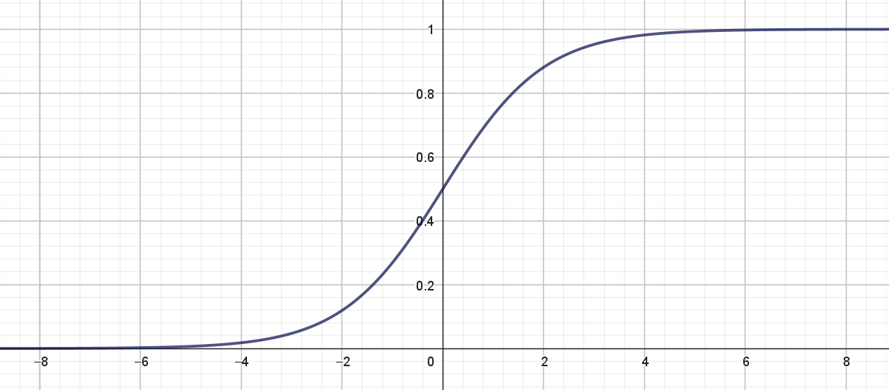

Hvis du har læst nogle af vores andre noter om kunstige neurale netværk, så har de alle handlet om **klassifikation**. Det kunne for eksempel være: aktiverer en kunde et tilbud i en app? (ja/nej), bliver det regnvejr i morgen? (ja/nej), har en patient en bestemt sygdom? (ja/nej), hvilket af fire valg skal jeg træffe? De tre første eksempler er eksempler på det, som man kalder for **binær klassifikation** (fordi der kun er to muligheder), mens det sidste eksempel er et eksempel på **multipel klassifikation** (fordi der er mere end to muligheder). I denne note vil vi se på, hvordan man kan bruge kunstige neurale netværk til at forudsige en såkaldt numerisk variabel -- mere konkret vil vi her se på, hvordan man kan lave et kunstigt neuralt netværk, som kan bruges til at prædiktere antal brugere af delecykler.

## Må jeg låne en cykel?

Vi forestiller os helt generelt en række inputvariable eller features: $x_1, x_2, \dots, x_n$ på baggrund af hvilke vi gerne vil kunne forudsige en targetvariabel $t$, som her er antal brugere af delecykler. 


::: {#exm-cykel1}

## Bike Sharing datasættet


På [kaggle.com](https://www.kaggle.com/) kan man downloade et utal af forskellige datasæt. Vi vil her se nærmere på datasættet [Bike Sharing Dataset](https://www.kaggle.com/datasets/lakshmi25npathi/bike-sharing-dataset), som du kan downloade som [Excel fil her](data/Housing.xlsx).
{style='float:right;' width='40%'}

Datasættet indeholder oplysninger om det daglige[^3] antal lejede cykler i årene 2011 og 2012 (i alt data fra $731$ dage). 

[^3]: Der findes også et datasæt, hvor antallet af lejede cykler er opgjort på timebasis, men det datasæt vil vi ikke bruge her.


Targetvariablen $t$ står i kolonnen `cnt` og angiver det totale antallet udlejede cykler på en given dag. Derudover indeholder datasættet en lang række features, som angiver oplysninger om blandt andet datoen, årstiden, arbejdsdag eller ej, vejrforhold, temperatur, oplevet temperatur, luftfugtighed og vindstyrke.

Vi vil specielt se på følgende features:

* `instant`: angiver egentlig bare rækkenummeret, men fordi datasættet er sorteret efter dato, svarer `instant` til antal dage siden 31. december 2010 ($x_1$)
* `atemp`: normaliseret oplevet temperatur i Celsius ($x_2$) 
* `hum`: normaliseret luftfugtighed ($x_3$)
* `windspeed`: normaliseret vindhastighed ($x_4$)

Hvordan data helt præcist er normaliseret, kan du læse mere om [her](https://www.kaggle.com/datasets/lakshmi25npathi/bike-sharing-dataset).

Vi vil lade targetvariablen $t$ være 

* $t$: det totale antallet udlejede cykler på en given dag målt i tusinder -- altså fås $t$ ved `cnt`/1000.


:::


Lad os starte simpelt og opstille en kunstig neuron til formålet. Så vil vi sige, at vores prædiktion af husprisen skal være en outputværdi $o$, som helt generelt er den vægtede sum af vores inputvariable:

$$
o = w_0 + w_1 \cdot x_1 + w_2 \cdot x_2 + \cdots + w_n \cdot x_n
$$

Her kaldes $w_0, w_1, w_2, \dots, w_n$ for vægte.

Hvis du har læst noten om [kunstige neuroner](../kunstige_neuroner/kunstige_neuroner.qmd), så er den eneste forskel her, at vi ikke længere bruger sigmoid-funktionen som aktiveringsfunktion[^1], fordi vi ikke her har brug for at få en outputværdi, som ligger mellem $0$ og $1$.

[^1]: Vi bruger sådan set stadig en aktiveringsfunktion -- det bare den funktion, som kaldes for *identiteten* med forskrift $f(x)=x$.

Vi ønsker nu, at bestemme vægtene $w_0, w_1, w_2, \dots, w_n$ sådan at vores prædikterede huspris $o$ kommer så tæt som muligt på den faktiske huspris $t$.

Det vil sige, at vi ønsker, at forskellen

$$
t-o = t - \left ( w_0 + w_1 \cdot x_1 + w_2 \cdot x_2 + \cdots + w_n \cdot x_n \right )
$$

bliver så lille som mulig.

Da denne differens både kan være positiv og negativ, men vi egentlig ikke er interesseret i fortegnet -- blot om differensen er lille eller stor, så vælger vi i stedet at se på den kvadrerede forskel:

$$
\left ( t - \left ( w_0 + w_1 \cdot x_1 + w_2 \cdot x_2 + \cdots + w_n \cdot x_n \right ) \right )^2
$$

Vi får en sådan kvadreret differens for hvert eneste hus i vores træningsdatasæt, og vi vælger derfor blot at lægge alle disse størrelser sammen:

$$
E = \frac{1}{2}\sum \left ( t - \left ( w_0 + w_1 \cdot x_1 + w_2 \cdot x_2 + \cdots + w_n \cdot x_n \right ) \right )^2
$$

Størrelsen $E$ kaldes for en **tabsfunktion**. Læg mærke til, at hvis vores kunstige neuron er god til at forudsige huspriser, så får vi en lille værdi af tabsfunktionen, mens vi får en stor værdi af $E$, hvis modellen er dårlig til at forudsige huspriser. Vi har her valgt at gange med $\frac{1}{2}$, fordi det senere kommer til at forkorte ud, men det er faktisk ikke så afgørende.

Idéen er så bare at bestemme værdier af vægtene $w_0, w_1, w_2, \dots, w_n$, sådan at tabsfunktionen minimeres.

Inden vi forklarer, hvordan det gøres, så lad os lige blive lidt mere specifikke i forhold til notationen af vores træningsdata. Vi forestiller os, at vi har information om $M$ huspriser (i eksemplet er $M=545$). Så vil vi nummerer vores træningsdata på denne måde:

$$
\begin{aligned}
&\text{Træningseksempel 1:} \quad (x_1^{(1)}, x_2^{(1)}, \dots, x_n^{(1)}, t^{(1)}) \\
&  \quad \quad \quad \quad \vdots \\
&\text{Træningseksempel m:} \quad (x_1^{(m)}, x_2^{(m)}, \dots, x_n^{(m)}, t^{(m)}) \\
&  \quad \quad \quad \quad \vdots \\
&\text{Træningseksempel M:} \quad (x_1^{(M)}, x_2^{(M)}, \dots, x_n^{(M)}, t^{(M)}) \\
\end{aligned}
$$

Gør vi det, bliver tabsfunktionen:

$$
\begin{aligned}
E(w_0, w_1, &\dots, w_n) \\ &= \frac{1}{2} \sum_{m=1}^{M} \left (t^{(m)}-
(w_0 + w_1 \cdot x_1^{(m)} + \cdots + w_n \cdot x_n^{(m)}) \right)^2.
\end{aligned}
$$

Hvis vi samtidig indfører, at vi kalder outputværdien for det $m$'te træningseksempel for $o^{(m)}$:

$$
o^{(m)} = w_0 + w_1 \cdot x_1^{(m)} + \cdots + w_n \cdot x_n^{(m)}
$$
Så kan tabsfunktionen udtrykkes kort på denne måde:

$$
\begin{aligned}
E(w_0, w_1, &\dots, w_n) \\ &= \frac{1}{2} \sum_{m=1}^{M} \left (t^{(m)}-
o^{(m)} \right)^2
\end{aligned}
$$

hvor det nu så bare ikke er helt så tydeligt, at $E$ jo faktisk afhænger af alle vægtene.

For at bestemme de værdier af vægtene, som minimerer tabsfunktionen, vil vi bruge en metode, som kaldes for gradientnedstigning. Vi har lavet videoer om både [funktioner af to variable](https://youtu.be/tlq2UYWF2Rw){target="blank"} og [gradientnedstigning](https://youtu.be/WcM8aEoPzf8){target="blank"}, hvis du vil vide mere.

Idéen i gradientnedstigning er, at vi opdaterer alle vægtene ved at gå et lille stykke i den negative gradients retning. Det kommer til at se sådan her ud:

$$
\begin{aligned}
w_0^{(\textrm{ny})} \leftarrow & w_0 - \eta \cdot \frac{\partial E }{\partial w_0} \\
w_1^{(\textrm{ny})} \leftarrow & w_1 - \eta \cdot \frac{\partial E }{\partial w_1} \\
&\vdots  \\
w_n^{(\textrm{ny})} \leftarrow & w_n - \eta \cdot \frac{\partial E }{\partial w_n} \\
\end{aligned}
$$

hvor $\eta$ kaldes for en **learning rate**.

Vi får derfor brug for alle de partielle afledede af $E$ med hensyn til $w_i$ for $i \in \{0, 1, 2, \dots, n\}$. Det er ikke svært at vise, at

$$
\begin{aligned}
\frac{\partial E}{\partial w_i} &= - \sum_{m=1}^M \left (t^{(m)}-
(w_0 + w_1 \cdot x_1^{(m)} + \cdots + w_n \cdot x_n^{(m)}) \right) \cdot x_i^{(m)} \\
&= - \sum_{m=1}^M \left (t^{(m)}- o^{(m)} \right) \cdot x_i^{(m)}
\end{aligned}
$$
for $i \in \{1, 2, \dots, n\}$ og 

$$
\frac{\partial E}{\partial w_0} = - \sum_{m=1}^M \left (t^{(m)}- o^{(m)} \right)
$$
Opdateringsreglerne for vægtene bliver derfor:

::: {.callout-note collapse="false" appearance="minimal"} 
## Opdateringsregler for kunstige neuroner til regression
$$
\begin{aligned}
w_0^{(\textrm{ny})} \leftarrow & w_0 + \eta \cdot \sum_{m=1}^{M} \left (t^{(m)}-o^{(m)} \right)\\
w_1^{(\textrm{ny})} \leftarrow & w_1 + \eta \cdot \sum_{m=1}^{M} \left (t^{(m)}-o^{(m)} \right)\cdot x_1^{(m)}\\
&\vdots  \\
w_n^{(\textrm{ny})} \leftarrow & w_n + \eta \cdot \sum_{m=1}^{M} \left (t^{(m)}-o^{(m)} \right)\cdot x_n^{(m)}
\end{aligned}
$$

hvor $o^{(m)} = w_0 + w_1 \cdot x_1^{(m)} + \cdots + w_n \cdot x_n^{(m)}$.

:::

At opstille en kunstig neuron til regression, som vi har gjort her, svarer til det man kalder for **multipel lineær regression**, som egentlig bare er en udvidelse af lineær regression, som I kender det, blot med flere inputvariable/features.

Det gode ved at opstille en kunstig neuron til regression, som vi her har gjort det, er, at man kan give en fortolkning af vægtene. 

### Fortolkning af vægtene

Lad os sige, at vi har bestemt vægtene $w_0, w_1, \dots, w_n$, så tabsfunktionen er blevet minimeret, og at $x_1$ fortsat angiver boligarealet. Vi vil her forklare, hvordan vi kan fortolke $w_1$.

Vi forstiller os, at vi har to hus med præcis samme værdier af de $n$ features $x_1, x_2, \dots, x_n$ bortset fra, at det ene hus er præcis $1$ *square feet* større end det andet. Så det ene hus har en størrelse på $x_1$ *square feet*, mens det andet har en størrelse på $x_1+1$ *square feet* -- de resterende features er ens.

Det giver følgende prædikterede boligpriser $o_1$ og $o_2$ for de to huse:

$$
\begin{aligned}
o_1 &= w_0 + w_1 \cdot x_1 + w_2 \cdot x_2 + \cdots + w_n \cdot x_n \\
\\
o_2 &= w_0 + w_1 \cdot (x_1 + 1) + w_2 \cdot x_2 + \cdots + w_n \cdot x_n \\ 
&= w_0 + w_1 \cdot x_1 + w_1 + w_2 \cdot x_2 + \cdots + w_n \cdot x_n
\end{aligned}
$$

Da bliver forskellen mellem de to prædikterede boligpriser:

$$
\begin{aligned}
o_2 - o_1 &= w_0 + w_1 \cdot x_1 + w_1 + w_2 \cdot x_2 + \cdots + w_n \cdot x_n \\
& \quad \quad - \left ( w_0 + w_1 \cdot x_1 + w_2 \cdot x_2 + \cdots + w_n \cdot x_n \right) \\
&= w_0 + w_1 \cdot x_1 + w_1 + w_2 \cdot x_2 + \cdots + w_n \cdot x_n \\ & \quad \quad - w_0 - w_1 \cdot x_1 - w_2 \cdot x_2 - \cdots - w_n \cdot x_n \\
& = w_1
\end{aligned}
$$

Det vil sige, at hvis alt andet er holdt ens, så vil en forøgelse i boligarealet på én *square feet* give en forøgelse i den prædikterede boligpris på $w_1$ kroner.

Da $x_4$ angiver, om boligen har kælder eller ej (hvor $x_4=1$ svarer til at boligen har kælder og $x_4=0$ svarer til, at boligen ikke har kælder), så vil $w_4$ helt tilsvarende kunne fortolkes som den størrelse, den prædikterede boligpris vil stige med, hvis en bolig har kælder sammenlignet med en helt tilsvarende bolig uden kælder.

Vi illustrerer dette med et eksempel:

::: {#exm-cykel2}

## Fortolkning af vægtene

Træner vi en kunstig neuron på datasættet om huspriser, hvor vi sætter alle startvægte til $0$, vælger en learning rate på $0.0001$ og antal iterationer til $500$, får vi følgende værdier af vægtene

|  $w_0$  <br>  <br> |  $w_1$ <br> (`area`)  |  $w_2$  <br>(`bedrooms`)  | $w_3$ <br>  (`bathrooms`)  |  $w_4$ <br>  (`basement`) |
|:---:|:---:|:---:|:---:|:---:|
| $-221293$ | $376$ | $387529$ | $1355118$ | $447659$ | 
: {.bordered}

For eksempel kan vi se, at $w_1 = 376$. Det vil sige, at ifølge modellen vil husprisen på et hus, som er præcis én *square feet* større end et andet tilsvarende[^2] hus, være $376 \, \$$ højere.

[^2]: Et tilsvarende hus vil her mere præcist betyde et hus med det samme antal soveværelser, badeværelser og kælder (ja/nej).

Vi ser også, at $w_4=447659$, som betyder, at hvis vi står med to tilsvarende huse, hvor det ene er med kælder, og det andet er uden kælder, så vil huset med kælder ifølge vores model koste $447659 \, \$$ mere end huset uden kælder.

```{r}
#| echo: false
#| fig-cap: Tekst...
#| label: fig-pred_versus_price
library(aimat)
dat <- readxl::read_excel(here::here("noter/simple_neurale_net_regression/data/Housing.xlsx"))
fit <- nn_fun(price ~ area + bedrooms + bathrooms + basement, data = dat, n_hidden = c(0, 0), iter = 500, type = "regression", lossfun = "squared", eta = .0001, weights=0)
w <- as.vector(fit$params$W1)
b <- as.vector(fit$params$b1)
if(!is.null(fit$scale_val)){
  w <- w / fit$scale_val
  b <- b - sum(w * fit$center_val)
}
pred <- predict(fit, dat, type = "response")
plot(dat$price,pred)
abline(0,1)
```


:::

## Vurdering af modellens anvendelighed

Når man træner en kunstig neuron, har man brug for et mål for hvor god modellen er. Du kender nok allerede $R^2$-værdien fra lineær regression, som et tal mellem $0$ og $1$, hvor vi gerne vil have tallet så tæt på $1$ som muligt (og så alligevel ikke helt -- det kan du læse mere om i noten [Overfitting, modeludvælgelse og krydsvalidering](../krydsvalidering/krydsvalidering.qmd){target="_blank"}). Et andet mål, som kan bruges til at sammenligne modeller, er **root mean squared error (RMSE)**. For at forstå målet starter vi med at se på alle de kvadrerede fejl:

$$
 \left (t^{(m)}-o^{(m)} \right)^2
$$
Det er **squared error (SE)**. Så udregner vi den gennemsnitlige værdi af alle disse kvadrerede fejl:

$$
\frac{1}{M} \sum_{m=1}^{M} \left (t^{(m)}-o^{(m)} \right)^2
$$
Det er **mean squared error (MSE)**. Endelig tager vi kvadratroden af det (for at få målet ned på samme skala, som vores targetværdi):

$$
\mathrm{RMSE} = \sqrt{\frac{1}{M} \sum_{m=1}^{M} \left (t^{(m)}-o^{(m)} \right)^2}
$$

Det er altså denne størrelse, som er **root mean squared error (RMSE)**.

::: {#exm-cykel3}

## RMSE og $R^2$

Ser vi på den kunstige neuron fra @exm-cykel2 kan man udregne RMSE. Gør man det får man

$$
\mathrm{RMSE} = 1321452
$$

Uden sammenligning med andre modeller er det svært at vide, om det tal er godt eller skidt. Til gengæld kan vi udregne $R^2$-værdien, som er

$$
R^2 = 0.5
$$
Så den er i hvert tilfælde ikke imponerende stor!

:::


## Prædiktion af huspriser -- nu med skjulte lag!

Der skal helst ikke være skjulte fejl og mangler, når man skal sælge sit hus. Til gengæld kan det være en super god idé med nogle skjulte lag, når man skal prædiktere huspriser!

I det ovenstående kommer de prædikterede huspriser til at afhænge lineært af inputvariablene. Men verden er sjældent lineær -- og en af styrkerne ved kunstige neurale netværk er netop, at de kan prædiktere størrelser eller kategorier ved hjælp af funktioner, som ikke er lineære. Vi skal derfor nu opstille et simpelt kunstigt neuralt netværk til prædiktion af huspriser. Vi vil lave et netværk med fire features $x_1, x_2, x_3, x_4$, men nu med noget, som vi vil kalde for et skjult lag, som her består af to såkaldte neuroner. Det kan illustreres, som vist i @fig-neuralt_net_regression:

{#fig-neuralt_net_regression width=80% fig-align='center'}

Som det ses i @fig-neuralt_net_regression, er der til hver pil knyttet en vægt (for eksempel $v_1, u_1, w_1$ og så videre), som skal bruges til at udregne outputværdien $o$. Hvis vi for en stund forestiller os, at vi kender alle vægtene, så udregner vi outputværdien $o$ på følgende måde:

Ved hjælp af inputvariablene og $v$-vægtene (de lysegrønne pile på @fig-neuralt_net_regression) beregner vi $z_1$:

$$
z_1 = \sigma (v_0 + v_1 \cdot x_1 + v_2 \cdot x_2 + v_3 \cdot x_3 + v_4 \cdot x_4)
$$
som selvfølgelig kan generaliseres til

$$
z_1 = \sigma (v_0 + v_1 \cdot x_1 + \cdots + v_n \cdot x_n)
$$

Her er $\sigma(x)$ **sigmoid-funktionen** med forskrift

$$
\sigma(x)=\frac{1}{1+\mathrm{e}^{-x}}
$$ {#eq-sigmoid} 

Grafen for sigmoid-funktionen ses i @fig-sigmoid:

{width=75% #fig-sigmoid}

Sigmoid-funktionen kaldes også for en **aktiveringsfunktion**, og det er den, der gør, at vi ender med at prædiktere huspriserne på en ikke-lineær måde.

På tilsvarende vis udregner vi $z_2$ ved at bruge $u$-vægtene (de mørkegrønne pile på @fig-neuralt_net_regression):

$$
z_2 = \sigma (u_0 + u_1 \cdot x_1 + u_2 \cdot x_2 + u_3 \cdot x_3 + u_4 \cdot x_4)
$$


Når vi nu har $z_1$ og $z_2$ beregnes outputværdien $o$, som vi gjorde det tidligere (her er $w$-vægtene vist som de lyseblå pile på @fig-neuralt_net_regression):

$$
o = w_0 + w_1 \cdot z_1 + w_2 \cdot z_2
$$ 

Ovenstående udtryk for beregning af $z_1$, $z_2$ og $o$ kaldes for **feedforward** ligninger, fordi man laver beregninger \"fremad\" i netværket fra venstre mod højre. Hvis vi samtidig holder styr på hvilket træningseksempel vi står med, får vi følgende:

::: {.callout-note collapse="false" appearance="minimal"} 
## Feedforward-udtryk

På baggrund af inputværdierne $x_1, x_2, x_3, x_4$ beregnes outputværdien $o$ på følgende måde.

Først beregnes:

$$
z_1^{(m)} = \sigma \left (v_0 + v_1 \cdot x_1^{(m)} + v_2 \cdot x_2^{(m)}+ v_3 \cdot x_3^{(m)} + v_4 \cdot x_4^{(m)} \right)
$$ {#eq-z_1}

og

$$
z_2^{(m)} = \sigma \left (u_0 + u_1 \cdot x_1^{(m)} + u_2 \cdot x_2^{(m)} + u_3 \cdot x_3^{(m)} + u_4 \cdot x_4^{(m)} \right)
$$ {#eq-z_2}

Herefter beregnes outputværdien:

$$
o^{(m)} = w_0 + w_1 \cdot z_1^{(m)} + w_2 \cdot z_2^{(m)}
$$ {#eq-o}

:::

Tabsfunktionen definerer vi nu som før

$$
\begin{aligned}
E(v_0, v_1, \dots, v_4, & u_0, u_1, \dots, u_u,w_0, w_1, w_2) \\ &= \frac{1}{2} \sum_{m=1}^{M} \left (t^{(m)}-
o^{(m)} \right)^2
\end{aligned}
$$

hvor $o^{(m)}$ er givet ved udtrykket i (@eq-o). Læg mærke til, at tabsfunktionen afhænger af alle $u$-, $v$- og $w$-vægte, men for nemheds skyld vil vi blot skrive $E$ i det følgende.

Man kan nu igen bruge gradientnedstigning til at bestemme de værdier er $v$-, $u$- og $w$-vægtene, som minimerer tabsfunktionen. Det er her en vigtig beregningsfinte, at man bevæger sig \"bagud\" i netværket og først opdaterer $w$-vægtene (som er tættest på outputlaget) og dernæst $u$- og $v$-vægtene, som er tættest på inputlaget. Dette kaldes for **backpropagation**.

Gør man det ender, man med følgende opdateringsregler:

::: {.callout-note collapse="false" appearance="minimal"} 
## Backpropagation

Backpropagation foregår samlet set på denne måde:

1) Sæt alle vægtene til en tilfældig værdi og vælg en værdi for learning raten $\eta$.

2) For alle træningsdataeksempler udregnes $z_1^{(m)}$, $z_2^{(m)}$ og $o^{(m)}$ ved hjælp af feedforward-udtrykkene:

   $$
   \begin{aligned}
   z_1^{(m)} &= \sigma \left (v_0 + v_1 \cdot x_1^{(m)} + v_2 \cdot x_2^{(m)} + v_3 \cdot x_3^{(m)} +  v_4 \cdot x_4^{(m)} \right ) \\
   z_2^{(m)} &= \sigma \left (u_0 + u_1 \cdot x_1^{(m)} + u_2 \cdot x_2^{(m)} + u_3 \cdot x_3^{(m)} + u_4 \cdot x_4^{(m)} \right ) \\
   o^{(m)} &= w_0 + w_1 \cdot z_1^{(m)} + w_2 \cdot z_2^{(m)}
   \end{aligned}
$$ 

3) Vægtene opdatereres:

   **$w$-vægtene:**
   $$
   \begin{aligned}
   w_0^{\textrm{(ny)}} &\leftarrow w_0 + \eta \cdot \sum_{m=1}^{M} \delta^{(m)} \\
   w_1^{\textrm{(ny)}} &\leftarrow w_1 + \eta \cdot \sum_{m=1}^{M} \delta^{(m)} \cdot z_1^{(m)} \\
   w_2^{\textrm{(ny)}} &\leftarrow w_2 + \eta \cdot \sum_{m=1}^{M} \delta^{(m)} \cdot z_2^{(m)} 
   \end{aligned}
   $$
   hvor
   
   $$
   \delta^{(m)} = t^{(m)}-o^{(m)}
   $$
   **$v$-vægtene:**
   $$
   \begin{aligned}
   v_0^{\textrm{(ny)}} &\leftarrow v_0 + \eta \cdot \sum_{m=1}^{M} \delta^{(m)} \cdot w_1 \cdot z_1^{(m)} \cdot \left ( 1- z_1^{(m)} \right) \\
   v_i^{\textrm{(ny)}} &\leftarrow v_i + \eta \cdot \sum_{m=1}^{M} \delta^{(m)} \cdot w_1 \cdot z_1^{(m)} \cdot \left ( 1- z_1^{(m)} \right) \cdot x_i^{(m)}\\
   \end{aligned}
   $$
   for $i \in \{1, 2, 3, 4\}$.
   
   **$u$-vægtene:**
   $$
   \begin{aligned}
   u_0^{\textrm{(ny)}} &\leftarrow u_0 + \eta \cdot \sum_{m=1}^{M} \delta^{(m)} \cdot w_2 \cdot z_2^{(m)} \cdot \left ( 1- z_2^{(m)} \right) \\
   u_i^{\textrm{(ny)}} &\leftarrow u_i + \eta \cdot \sum_{m=1}^{M} \delta^{(m)} \cdot w_2 \cdot z_2^{(m)} \cdot \left ( 1- z_2^{(m)} \right) \cdot x_i^{(m)}\\
   \end{aligned}
   $$
   for $i \in \{1, 2, 3, 4\}$.
   
Alle vægtene er nu opdateret, og vi kan gentage punkt 2 og 3, hvor feedforward i 2 hver gang er baseret på de netop opdaterede vægte fra det foregående gennemløb. Opdateringen af vægtene fortsætter, indtil værdien af tabsfunktionen næsten ikke ændrer sig. Håbet er nu, at vi har fundet et minimum (eventuelt kun lokalt) for tabsfunktionen.

:::

   Bemærk her, at vi kender $z_1^{(m)}$, $z_2^{(m)}$ og $o^{(m)}$ på grund af feedforward, mens alle $u-$, $v-$ og $w-$værdierne er de nuværende værdier af vægtene (*inden* opdatering). 

I alle opdateringsreglerne indgår altså faktoren 

$$
 \delta^{(m)} = t^{(m)}-o^{(m)}
$$

Denne størrelse er et udtryk for den fejl, netværket begår med de nuværende værdier af vægtene (nemlig forskellen på den ønskede targetværdi $t^{(m)}$ og den prædikterede outputværdi $o^{(m)}$). Der er to ting, som er værd at bemærke i den forbindelse:

* Hvis fejlen er stor, bliver vægtene opdateret forholdsvis meget -- og omvendt hvis fejlen er lille.
* Når vi har opdateret $w$-vægtene, har vi allerede beregnet fejlen $\delta^{(m)}$. Denne \"fejlfaktor\" indgår også i opdateringsreglerne for $v$- og $u$-vægtene, og den allerede beregnede fejl kan altså genbruges, når $v$- og $u$-vægtene skal opdateres.

Det kan her virke fuldstændig ligegyldigt, om vi skal beregne fejlen et par ekstra gange eller ej, men i virkelighedens anvendelser af kunstige neurale netværk, er det lige præcis denne beregningsmæssige finte, som gør, at det overhovedet kan lade sig gøre at bruge gradientnedstigning. Det sparer nemlig både tid og lagringsplads på computeren, at tidligere beregnede størrelser kan genbruges i de næste opdateringer.  

Hvis du gerne vil bevise ovenstående, er der lidt hjælp at hente i nedenstående boks.

::: {.callout-tip collapse="true" appearance="minimal"}

## Hjælp til at udlede opdateringsreglerne

Husk på, at vores tabsfunktion ser sådan her ud:

$$
\begin{aligned}
E &= \frac{1}{2} \sum_{m=1}^{M} \left (t^{(m)}-
o^{(m)} \right)^2 \\
&= \sum_{m=1}^{M} \frac{1}{2} \left (t^{(m)}-
(w_0 + w_1 \cdot z_1^{(m)} + w_2 \cdot z_2^{(m)}) \right)^2 \\
&= \sum_{m=1}^{M} E^{(m)},
\end{aligned}
$$

hvor vi her har sat

$$
E^{(m)}= \frac{1}{2} \left (t^{(m)}-
(w_0 + w_1 \cdot z_1^{(m)} + w_2 \cdot z_2^{(m)}) \right)^2
$$ {#eq-Em}


Vi ved fra sumreglen, at vi skal differentiere ledvist. Det vil sige, når $E$ skal differentieres med hensyn til én af vægtene, så kan vi bare differentiere $E^{(m)}$ med hensyn til den pågældende vægt og lægge alle disse partielle afledede sammen. For eksempel er

$$
\frac{\partial E}{\partial w_i} = \sum_{m=1}^M \frac{\partial E^{(m)}}{\partial w_i}
$$
I det følgende får du derfor hints til at differentiere $E^{(m)}$.

Når du skal bestemme

$$
\frac{\partial E^{(m)}}{\partial w_i}
$$

så skal du gøre fuldstændig, som vi gjorde i afsnittet [Hvad koster mit hus?](#hvad-koster-mit-hus).

Når du skal finde

$$
\frac{\partial E^{(m)}}{\partial v_i}
$$

skal man egentlig bruge kædereglen for funktioner af flere variable, fordi $E^{(m)}$ både afhænger af $z_1^{(m)}(v_i)$ og $z_2^{(m)}(v_i)$:

$$
\frac{\partial E^{(m)}}{\partial v_i} = \frac{\partial E^{(m)}}{\partial z_1^{(m)}}\cdot\frac{\partial z_1^{(m)}}{\partial v_i} + \frac{\partial E^{(m)}}{\partial z_2^{(m)}}\cdot\frac{\partial z_2^{(m)}}{\partial v_i} 
$$

Men vi ved fra feedforward udtrykkene, at

$$
z_1^{(m)} = \sigma \left (v_0 + v_1 \cdot x_1^{(m)} + v_2 \cdot x_2^{(m)} + v_3 \cdot x_3^{(m)} + \cdots + v_4 \cdot x_4^{(m)} \right ) 
$$ {#eq-z_1m}

og

$$
z_2^{(m)} = \sigma \left (u_0 + u_1 \cdot x_1^{(m)} + u_2 \cdot x_2^{(m)} + u_3 \cdot x_3^{(m)} + u_4 \cdot x_4^{(m)} \right ) 
$$ 


og her kan vi se, at det kun er $z_1^{(m)}$, som afhænger af $v_i$. Det betyder, at

$$
\frac{\partial z_2^{(m)}}{\partial v_i} = 0 
$$

og derfor er

$$
\frac{\partial E^{(m)}}{\partial v_i} = \frac{\partial E^{(m)}}{\partial z_1^{(m)}}\cdot\frac{\partial z_1^{(m)}}{\partial v_i}
$$

Hvis du har brug for lidt mere information om kædereglen og den notation, som vi har anvendt ovenfor, kan du eventuelt se [denne video](https://www.youtube.com/watch?v=nVaAIVXiUjs).

Når du skal bestemme 

$$
\frac{\partial E^{(m)}}{\partial z_1^{(m)}}
$$

skal du bruge udtrykket for $E^{(m)}$ i (@eq-Em). Og når $z_1^{(m)}$ skal differentieres med hensyn til $v_i$, skal du bruge udtrykket i (@eq-z_1m). Derudover får du brug for en særlig egenskab ved sigmoid-funktionen. Nemlig, at

$$
\sigma'(x) = \sigma(x) \cdot (1-\sigma(x)) 
$$

På helt tilsvarende vis kan 

$$\frac{\partial E^{(m)}}{\partial u_i}
$$ 

findes.


:::

