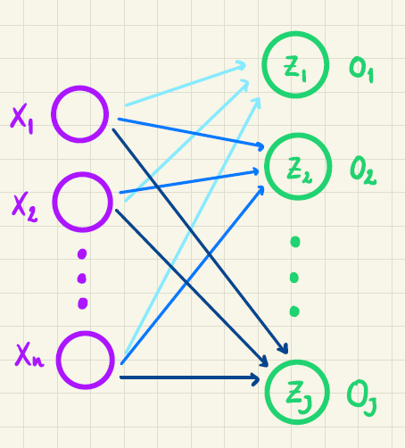
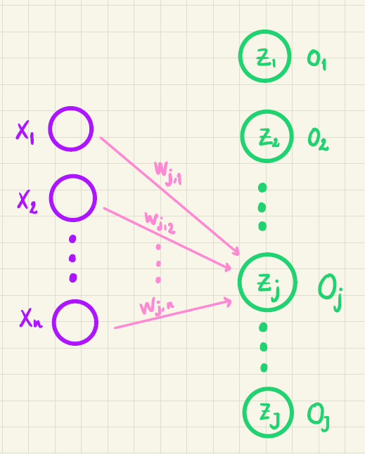
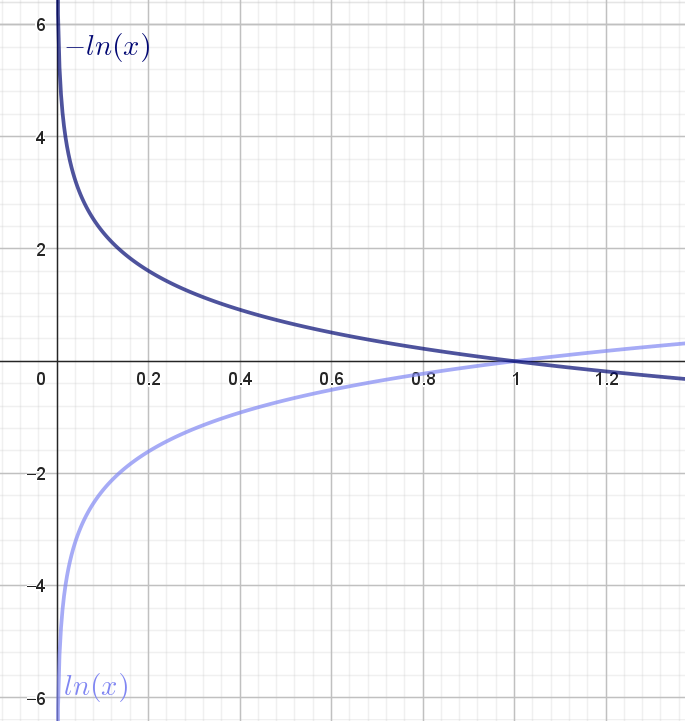
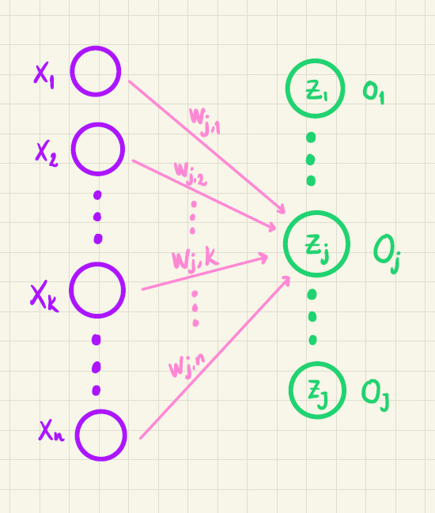
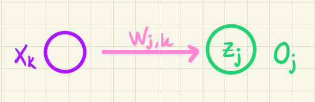

Et kunstigt neuralt netværk fungerer på den måde, at man på baggrund af en række forskellige informationer gerne vil kunne forudsige en eller anden ting. Det kan være, at man på baggrund af en række forskellige blodprøveværdier vil forudsige, om en patient har en bestemt sygdom. Det kunne også være, at man baseret på svarene fra en række forskellige spørgsmål vil vurdere, om en person vil stemme på rød eller blå blok. De nævnte eksempler kalder man for *binær klassifikation* -- fordi der i hvert tilfælde er to muligheder: *syg*/*ikke syg* og *rød blok*/*blå blok*. Men det er ikke svært at forestille sig scenarier, hvor der kan være mere end to klasser. For eksempel er eksemplet med rød og blå nok tvivlsomt. Her ville det måske være bedre at prøve at forudsige et bestemt parti. Denne note handler om, hvordan man udvider en simpel [kunstig neuron](../kunstige_neuroner/kunstige_neuroner.qmd), så den ikke kun kan bruges til binær klassifikation, men derimod til at forudsige, hvilken af flere klasser et givent tilfælde befinder sig i. Lad os starte med et eksempel.

## Hvor hårdt skal du arbejde i matematiktimerne?

Du kender det sikkert godt. Der er gruppearbejde i matematiktimen, og du gider egentlig ikke. Det er nemmere bare at snige sin mobiltelefon ned i lommen og drible i kantinen. På den anden side er du også ambitiøs og vil gerne have en god karakter til eksamen. Din lærer er også frustreret. Hun vil gerne være over de elever, som ellers ville stikke af, så de får lært noget sjovt matematik. What to do? Svaret er selvfølgelig, at vi skal have udviklet en AI assistent til din lærer, så hun får hjælp til at hjælpe jer!

{width=50% fig-align='center'}

Lad os sige at du svarer på følgende tre spørgsmål på en skala fra 1 til 10:

* $x_1$: Hvor godt har jeg sovet i nat? (1=\"Elendigt\", 10=\"Fantastisk\").

* $x_2$: Hvor spændende er det emne, vi er i gang med lige nu? (1=\"Mega kedeligt\", 10=\"Det er awesome\").

* $x_3$: Hvor godt vil jeg gerne klare mig til eksamen? (1=\"Jeg er ligeglad\", 10=\"Det skal gå så godt som muligt\").

Baseret på disse tre spørgsmål er der nu følgende fire valg, du kan træffe (eller som din lærer måske bare i stilhed observerer):

1. Jeg bliver i klassen, hvor læreren kan hjælpe mig, og regner alt det, jeg kan.
2. Jeg sætter mig ud og regner opgaverne, så godt jeg kan.
3. Jeg går i kantinen og sniger min telefon med -- jeg prøver at regne nogle få opgaver.
4. Jeg går hjem (og håber på ikke at få fravær)!

Det valg du træffer, skal vi have oversat til matematik (beklager, men nu er det jo en matematik tekst, du er i gang med at læse!). Det gør vi ved at definere fire forskellige værdier $t_1, t_2, t_3, t_4$.

Hvis du vælger 1. sætter vi:
$$
t_1 = 1, \quad t_2=0, \quad t_3=0, \quad t_4=0.
$$

Hvis du vælger 2. sætter vi:
$$
t_1 = 0, \quad t_2=1, \quad t_3=0, \quad t_4=0.
$$

Hvis du vælger 3. sætter vi:
$$
t_1 = 0, \quad t_2=0, \quad t_3=1, \quad t_4=0.
$$

Hvis du vælger 4. sætter vi:
$$
t_1 = 0, \quad t_2=0, \quad t_3=0, \quad t_4=1.
$$

Det kan man repræsentere lidt smart ved hjælp af en vektor i fire dimensioner:

$$
\vec{t}=
\begin{pmatrix}
t_1 \\
t_2 \\
t_3 \\
t_4 \\
\end{pmatrix}
$$

Vektoren $\vec t$ kaldes for **targetværdien** eller **targetvektoren**.

Læg mærke til, at der altid gælder følgende

$$
t_1 + t_2 + t_3 + t_4 = 1.
$$ {#eq-one_not}

Da netop én af koordinaterne i $\vec t$ er $1$, mens resten er $0$, kalder man også $\vec{t}$ for en **one hot vektor**. Det får vi brug for senere.

## Træningsdata

Vi forestiller os nu, at vi har stillet 12 elever de tre spørgsmål ovenfor. Derefter har vi observeret hvilket af de fire valg, de træffer. Det kunne se sådan her ud:

::: {#tbl-trainingdata}
|Elev nr.| $x_1$ (søvn) | $x_2$ (emne) | $x_3$ (eksamen) | Valg |
|:---:|:---:|:---:|:---:|:---:|
|$1$ |$10$ | $10$ | $10$  | ${\color{#020873} 1}$  |
|$2$ |$8$ | $7$ | $8$  |${\color{#020873} 1}$  | 
|$3$ |$9$ | $6$ | $10$  |${\color{#020873} 1}$  |
|$4$ |$4$ | $10$ | $10$  |${\color{#020873} 1}$  |
|$5$ |$5$ | $8$ | $7$ | ${\color{#8086F2} 2}$ |
|$6$ |$10$ | $7$ | $4$ | ${\color{#8086F2} 2}$ |
|$7$ |$7$ | $7$ | $10$ | ${\color{#8086F2} 2}$ |
|$8$ |$8$ | $3$ | $4$ | ${\color{#F2B33D} 3}$ |
|$9$ |$6$ | $2$ | $5$ | ${\color{#F2B33D} 3}$ |
|$10$ |$10$ | $2$ | $2$ | ${\color{#F2B33D} 3}$ |
|$11$ |$1$ | $1$ | $3$ | ${\color{#F288B9} 4}$ |
|$12$ |$5$ | $2$ | $2$ | ${\color{#F288B9} 4}$ |
Træningsdata fra 12 elever.
:::
 

For eksempel har elev nummer 1 sovet fantastisk, eleven synes, at emnet er vildt spændende, og eleven vil gerne klare sig rigtig godt til eksamen -- denne elev vælger derfor at blive i klassen. Targetværdien for denne elev er:

$$
\vec{t}=
\begin{pmatrix}
1 \\
0 \\
0 \\
0 \\
\end{pmatrix}
$$

Eleven nummer 12 har derimod sovet semi godt, til gengæld synes eleven ikke at emnet er særlig spændende, og er også ligeglad med at klare sig godt til eksamen. Denne elev laver derfor en \"sniger\" og går hjem. Targetværdien for eleven er derfor:

$$
\vec{t}=
\begin{pmatrix}
0 \\
0 \\
0 \\
1 \\
\end{pmatrix}
$$

Data i @tbl-trainingdata kaldes for **træningsdata**.

I @fig-trainingdata er træningsdata indtegnet i et tre-dimensionelt koordinatsystem. Punkterne har koordinatsæt $(x_1, x_2, x_3)$ og punktets farve angiver valget (mørkeblå svarer til 1, lyseblå svarer til 2, gul svarer til 3 og lyserød svarer til 4).



::: {#fig-trainingdata}
::: {.ggbContainer style='width:100%; margin: auto'}
::: {#ggbApplet_trainingdata}
:::
:::
Punktplot af træningsdata fra @tbl-trainingdata. Punkternes farve angiver valget (mørkeblå svarer til 1, lyseblå svarer til 2, gul svarer til 3 og lyserød svarer til 4).
:::

Det, vi gerne vil nu, er at lave et meget simpelt kunstigt neuralt netværk, som vi fremover kan bruge til at forudsige, hvilket valg du skal træffe baseret på svaret på de tre spørgsmål. Så idéen er altså, at du i et fremtidsscenarie svarer på de tre spørgsmål, og så fortæller din nye AI assistent dig, hvilket valg du skal træffe. Det er da smart -- eller måske lidt dumt, men nu er det jo også bare et eksempel!

Lad os forklare, hvordan man kan gøre det -- blot i et lidt mere generelt tilfælde.

## Feedforward

Vi forestiller os, at vi generelt har $n$ inputvariable

$$
x_1, x_2, \dots, x_n.
$$

I eksemplet ovenfor var $n=3$, fordi vi svarede på tre spørgsmål.

Disse $n$ inputvariable er vist i @fig-netvaerk_generelt som lilla cirkler. De grønne cirkler repræsenterer $J$ output neuroner (i vores eksempel er $J=4$, fordi der skal træffes et valg blandt 4 muligheder). 

{width=50% #fig-netvaerk_generelt}

Vi ønsker at træne netværket, så $o_1$ bliver sandsynligheden for at et givent træningseksempel tilhører klasse $1$, $o_2$ skal være sandsynligheden for at træningseksemplet tilhører klasse $2$ og så videre. Hvis man vil skrive det lidt kompakt op, kan man samle alle outputværdierne i en vektor:

$$
\vec{o} = 
\begin{pmatrix}
o_1 \\
o_2 \\
\vdots \\
o_J
\end{pmatrix}
$$

I vores eksempel vil det svare til, at $o_1$ skal være sandsynligheden for, at du bliver i klassen og regner opgaver (mulighed 1), $o_2$ skal være sandsynligheden for, at du sætter dig ud og regner opgaver og så videre.

Det vil sige, at det skal være sådan, at

$$
o_1 + o_2 + \cdots + o_J = 1
$$ {#eq-sum_o_1}

fordi sandsynlighederne for de $J$ forskellige muligheder til sammen skal give 1.

Vi vil starte med at se på, hvordan vi på baggrund af inputvariablene $x_1, x_2, \cdots, x_n$ kan beregne de $J$ outputværdier, så ovenstående er opfyldt. På @fig-netvaerk_generelt illustrerer de forskelligt farvede pile, at alle $n$ inputvariable sendes frem i netværket til alle $J$ outputværdier. Så for eksempel sendes $x_1, x_2, \cdots, x_n$ frem til $o_1$ (vist ved de lyseblå pile), ligesom de også sendes frem til $o_2$ (vist ved de mellemblå pile) og så videre. 

For at forklare den beregning der så foregår, har vi i @fig-netvaerk_generelt_wj kun vist de pile, som går fra inputvariablene frem til den $j$'te outputværdi.

{width=50% #fig-netvaerk_generelt_wj}

Før $o_j$ bestemmes, beregner vi først en værdi $z_j$ på denne måde:

$$
z_j = w_{j,0} + w_{j,1} \cdot x_1 + w_{j,2} \cdot x_2 + \cdots + w_{j,n} \cdot x_n.
$$

Tallene $w_{j,0}, w_{j,1}, w_{j,2}, \cdots, w_{j,n}$ kaldes for **vægte**. 

Værdien $z_j$ er vist i @fig-netvaerk_generelt_wj inde i den grønne cirkel. På tilsvarende vis beregnes $z_1, z_2, \cdots, z_J$. Bemærk her, at vægtene er forskellige. For eksempel er

$$
z_2 = w_{2,0} + w_{2,1} \cdot x_1 + w_{2,2} \cdot x_2 + \cdots + w_{2,n} \cdot x_n
$$

så vægtene er her $w_{2,0}, w_{2,1}, w_{2,2}, \cdots, w_{2,n}$. 

I alt er der $(n+1)\cdot J$ forskellige vægte (det vil sige i vores eksempel vil der være $(3+1)\cdot4=16$ vægte).

Alle $z$-værdierne kan antage et hvilket som helst reelt tal og kan alene af den grund ikke fortolkes som en sandsynlighed. Vi bruger derfor en såkaldt **aktiveringsfunktion** $\alpha$ på alle $z$-værdierne, så vi kan få beregnet en outputværdi, som kan fortolkes som en sandsynlighed:

$$
o_j = \alpha(z_1, z_2, \dots, z_J),
$$

hvor

$$
0 \leq \alpha(z_1, z_2, \dots, z_J) \leq 1.
$$

Som aktiveringsfunktion $\alpha$ vil vi bruge en funktion, som kaldes for **softmax**, fordi den præcis har de egenskaber, som vi efterspørger -- det ser vi lige om lidt. På baggrund af alle $z$-værdierne beregnes $o_j$ ved hjælp af **softmax** på denne måde:

$$
o_j = \alpha(z_1, z_2, \dots, z_J) = \frac{\mathrm{e}^{z_j}}{\sum_{i=1}^J \mathrm{e}^{z_i}}.
$$ {#eq-o_j_softmax}

For det første kan vi se, at både tæller og nævner er positive. Derfor må $o_j>0$. For det andet er $\mathrm{e}^{z_j} < \sum_{i=1}^J \mathrm{e}^{z_i}$ (når $J>1$) og derfor er

$$
o_j =  \frac{\mathrm{e}^{z_j}}{\sum_{i=1}^J \mathrm{e}^{z_i}} < \frac{\sum_{i=1}^J \mathrm{e}^{z_i}}{\sum_{i=1}^J \mathrm{e}^{z_i}} = 1.
$$

Altså er

$$
0<o_j<1
$$

hvilket betyder, at $o_j$ kan opfattes som en sandsynlighed. Endelig er

$$
\begin{aligned}
o_1 + o_2 + \cdots + o_J &= \frac{\mathrm{e}^{z_1}}{\sum_{i=1}^J \mathrm{e}^{z_i}} + \frac{\mathrm{e}^{z_2}}{\sum_{i=1}^J \mathrm{e}^{z_i}} + \cdots + \frac{\mathrm{e}^{z_J}}{\sum_{i=1}^J \mathrm{e}^{z_i}} \\
&= \frac{\mathrm{e}^{z_1} + \mathrm{e}^{z_2} + \cdots + \mathrm{e}^{z_J}}{\sum_{i=1}^J \mathrm{e}^{z_i}} \\ 
&= \frac{\sum_{i=1}^J \mathrm{e}^{z_i}}{\sum_{i=1}^J \mathrm{e}^{z_i}} = 1,
\end{aligned}
$$

hvilket også var det krav, vi stillede til de beregnede outputværdier i (@eq-sum_o_1).

I det helt specielle tilfælde, hvor der kun er to output neuroner, vil softmax-funktionen for $o_1$ blot være en funktion af to variable:

$$
o_1 = \frac{\mathrm{e}^{z_1}}{\mathrm{e}^{z_1} + \mathrm{e}^{z_2}}
$$

Grafen for denne funktion er vist i @fig-softmax. Her ses det tydeligt, at værdien af $o_1$ ligger i intervallet $]0,1[$.

::: {#fig-softmax}
::: {.ggbContainer style='width:100%; margin: auto'}
::: {#ggbApplet_softmax}
:::
:::
Grafen for softmax funktionen $o_1 = \frac{\mathrm{e}^{z_1}}{\mathrm{e}^{z_1} + \mathrm{e}^{z_2}}$.
:::

Det betyder, at hvis $o$-værdierne beregnes som defineret i (@eq-o_j_softmax), er der altså tale om en sandsynlighedsfordeling. Beregningen af alle $z$- og $o$-værdier kan udføres, hvis bare man kender alle vægtene. I et neuralt netværk kaldes disse udregninger for **feedforward** og er opsummeret herunder.

::: {.callout-note collapse="false" appearance="minimal"} 
## Feedforward-udtryk

På baggrund af inputværdierne $x_1, x_2, \cdots, x_n$ beregnes først $z$-værdier:

$$
\begin{aligned}
z_1 &= w_{1,0} + w_{1,1} \cdot x_1 + w_{1,2} \cdot x_2 + \cdots + w_{1,n} \cdot x_n \\
& \,\,\, \vdots \\
z_j &= w_{j,0} + w_{j,1} \cdot x_1 + w_{j,2} \cdot x_2 + \cdots + w_{j,n} \cdot x_n \\
& \,\,\, \vdots \\
z_J &= w_{J,0} + w_{J,1} \cdot x_1 + w_{J,2} \cdot x_2 + \cdots + w_{J,n} \cdot x_n \\
\end{aligned}
$$ {#eq-z_j}

Herefter beregnes outputværdierne:

$$
\begin{aligned}
o_1 &= \frac{\mathrm{e}^{z_1}}{\sum_{i=1}^J \mathrm{e}^{z_i}} \\
& \,\,\, \vdots \\
o_j &= \frac{\mathrm{e}^{z_j}}{\sum_{i=1}^J \mathrm{e}^{z_i}} \\
& \,\,\, \vdots \\
o_J &= \frac{\mathrm{e}^{z_J}}{\sum_{i=1}^J \mathrm{e}^{z_i}} \\
\end{aligned}
$$ {#eq-o_j}
:::

### VIDEO: Introduktion og softmax

I videoen her forklarer vi om softmax og feedforward-udtrykkene.



Vi har indtil videre skrevet, at outputværdierne kan fortolkes som sandsynligheder. Men bare fordi at en række tal ($o_1, o_2, \dots, o_J$) alle ligger mellem 0 og 1 og alle summerer til 1, så er det jo ikke sikkert, at de på en fornuftig måde angiver sandsynligheden for de fire forskellige muligheder, som de enkelte elever har. For eksempel kunne de fleste lærere nok ønske sig, at

$$
o_1 = 0.5, \quad o_2 = 0.5, \quad o_3=0, \quad o_4=0
$$
fuldstændig uafhængig af svarene på de tre spørgsmål.

Det svarer til, at cirka halvdelen af elever bliver i klassen og regner opgaver, mens den anden halvdel sætter sig ud og regner. Til gengæld er der *ingen*, som går i kantinen og feder den, ligesom der heller ikke er nogen, som bare går hjem. 

For at vores nye AI assistent skal give et nogenlunde retvisende billede af virkeligheden (det vil sige elevernes valg og ikke lærerens ønsker!) skal vi have fundet nogle outputværdier, som for det første afhænger af inputværdierne (man kan jo se på @fig-trainingdata at inputværdierne har indflydelse), og som for det andet rent faktisk giver en realistisk sandsynlighed for hver af de fire muligheder. Det gør vi ved at blive ved med at \"skrue\" på alle vægtene indtil, at de beregnede outputværdier i (@eq-o_j) giver et godt bud på sandsynlighederne for de 4 muligheder.

Hvordan, det rent faktisk lader sig gøre, kommer her.

## Cross-entropy tabsfunktionen

Forestil dig, at vi bare har valgt nogle tilfældige værdier af vægtene. På den baggrund kan vi for et givent sæt af inputværdier beregne outputværdierne ved hjælp af feedforward-udtrykkene i (@eq-o_j). Vi vil som eksempel se på elev nummer 7 fra @tbl-trainingdata. Denne elev har  valgt mulighed 2 (gå uden for klassen for at regne opgaver) og har derfor targetværdi

$$
\vec t = 
\begin{pmatrix}
0 \\
1 \\
0 \\
0 \\
\end{pmatrix}
$$ {#eq-target}

En bestemt \"indstilling\" af vægtene kunne for eksempel give denne outputvektor:

$$
\vec o = 
\begin{pmatrix}
0.85 \\
0.10 \\
0.03 \\
0.02 \\
\end{pmatrix}
$$ {#eq-o_bad}

Det svarer til, at vægtene ikke har fået nogle \"gode\" værdier, fordi denne outputvektor svarer til, at der kun er $10 \%$ chance for at eleven vælger mulighed 2. Hvis vægtene i stedet havde haft værdier, som ville resultere i denne outputvektor

$$
\vec o = 
\begin{pmatrix}
0.10 \\
0.85 \\
0.03 \\
0.02 \\
\end{pmatrix}
$$ {#eq-o_good}

så vil vi straks være mere tilfredse med vores AI assistent, fordi sandsynligheden for mulighed 2 nu er steget til $85 \%$. Faktisk vil vi allerhelst kunne vælge vægtene, så outputvektoren for elev nummer 7 kommer så tæt som muligt på targetvektoren i (@eq-target) -- og noget tilsvarende skal gerne gøre sig gældende for de øvrige 11 elever i træningsdata.

Vi har derfor brug for en metode til at vælge vægtene, så outputvektoren i (@eq-o_good) bliver \"belønnet\" fremfor outputvektoren i (@eq-o_bad). For at gøre det definerer man en såkaldt **tabsfunktion**. Vi vil her bruge en tabsfunktion, som kaldes for **cross-entropy**.

For at holde tingene simple starter vi med at se på ét træningseksempel ad gangen (til sidst generaliserer vi). *Cross-entropy* tabsfunktionen er defineret sådan her:

$$
E = - \sum_{j=1}^J t_j \cdot \ln(o_j) 
$$

Det ser måske lige lidt mærkeligt ud, men vi skal nok forklare det. Vi kan prøve at skrive summen ud:

$$
E = - \left (t_1 \cdot \ln(o_1)  + t_2 \cdot \ln(o_2) + \cdots + t_j \cdot \ln(o_j) + \cdots + t_J \cdot \ln(o_J) \right)
$$

Vi husker nu på, at $\vec t$ er en *one hot vektor*. Det vil sige, at det kun er ét af $t_j$'erne i ovenstående, der er 1 -- resten er 0. Lad os sige at det er $t_j$, der er 1. Så er

$$
E = - t_j \cdot \ln(o_j) = - \ln(o_j).
$$

I @fig-natural_ln har vi tegnet grafen for den naturlige logaritme-funktion samt grafen for minus den naturlige logaritme-funktion:

{width=50% fig-align='center' #fig-natural_ln}

Da $0<o_j<1$ kan vi for det første se, at $-\ln(o_j) >0$. Det vil sige, at tabsfunktionen er positiv.

Husk nu på, at $t_j=1$. Hvis vægtene i vores neurale netværk er \"indstillet\" godt, så skal $o_j$ være tæt på 1. I @fig-natural_ln kan vi se, at det svarer til, at $-\ln(o_j)$ er tæt på $0$. Det betyder, at værdien af tabsfunktionen er lille. 
Omvendt hvis vægtene er \"indstillet\" dårligt, så $o_j$ er tæt på $0$ (selvom $t_j=1$), så vil $-\ln(o_j)$ være et stort positivt tal. Altså er værdien af tabsfunktionen stor.

Det betyder, at tabsfunktionen på den måde måler \"kvaliteten\" af netværket:

* For et godt netværk (med gode indstillinger af vægtene) vil tabsfunktionen have en lille, men positiv værdi.

* For et dårligt netværk (med dårlige indstillinger af vægtene) vil tabsfunktionen have en stor positiv værdi.

Lad os illustrere det med det tidligere eksempel. Hvis

$$
\vec t = 
\begin{pmatrix}
0 \\
1 \\
0 \\
0 \\
\end{pmatrix}
\quad \textrm{og} \quad
\vec o = 
\begin{pmatrix}
0.85 \\
0.10 \\
0.03 \\
0.02 \\
\end{pmatrix}
$$

så har vi et dårligt netværk og værdien af tabsfunktionen bliver

$$
\begin{aligned}
E &= - \left( 0 \cdot \ln(0.85) + 1 \cdot \ln(0.10) + 0 \cdot \ln(0.03) + 0 \cdot \ln(0.02)\right) \\ &= - \ln(0.10) \approx 2.30.
\end{aligned}
$$

Har vi derimod et bedre netværk, som i stedet giver følgende outputvektor:

$$
\vec t = 
\begin{pmatrix}
0 \\
1 \\
0 \\
0 \\
\end{pmatrix}
\quad \textrm{og} \quad
\vec o = 
\begin{pmatrix}
0.10 \\
0.85 \\
0.03 \\
0.02 \\
\end{pmatrix}
$$

så vil værdien af tabsfunktionen være

$$
\begin{aligned}
E &= - \left( 0 \cdot \ln(0.10) + 1 \cdot \ln(0.85) + 0 \cdot \ln(0.03) + 0 \cdot \ln(0.02)\right) \\ 
&= - \ln(0.85) \approx 0.16.
\end{aligned}
$$

Altså kan vi her se, at det netværk, som er bedre, også har en lavere værdi af tabsfunktionen. Hele idéen er derfor, at vi for et givent træningsdatasæt vil bestemme de værdier af vægtene, som minimerer tabsfunktionen. Hvordan det gøres forklares i det næste afsnit.

### VIDEO: Cross-entropy tabsfunktion

I videoen her forklarer vi om cross-entropy tabsfunktionen.



## Opdatering af vægtene

Vi skal bestemme de værdier af vægtene, som minimerer tabsfunktionen

$$
E = - \sum_{i=1}^J t_i \cdot \ln(o_i) 
$$ {#eq-cross_entropy}

Husk på at outputværdierne $o_i$ afhænger af $z$-værdierne via (@eq-o_j), mens $z$-værdierne afhænger af vægtene via (@eq-z_j). Altså afhænger tabsfunktionen også indirekte af alle vægtene. 

Når man skal minimere [en funktion, som afhænger af flere variable](../funktioner_af_flere_variable/funktioner_af_flere_variable.qmd) (her vægtene), kan man finde alle de partielle afledede og sætte dem lig med $0$ (ligesom du sikkert er vant til, at løse $f'(x)=0$, hvis du skal bestemme minimum for funktionen $f$). Det vil give lige så mange ligninger, som der er vægte, og desuden vil ligningerne være koblet med hinanden. Det betyder, at denne fremgangsmåde er  beregningsmæssig tung og/eller vil kræve alt for meget plads på en computer. Derfor vælger man i stedet at bruge en approksimativ metode, som kaldes for [gradientnedstigning](../gradientnedstigning/gradientnedstigning.qmd). Vi vil her kort forklare, hvad det går ud på.

Hvis en funktion $f$ afhænger af $x_1, x_2, \dots, x_n$ så kaldes den vektor, som består af alle de partielle afledede for gradienten:

$$
\nabla f(x_1, x_2, \dots, x_n) = 
\begin{pmatrix}
\frac{\partial f}{\partial x_1} \\ 
\frac{\partial f}{\partial x_2} \\
\vdots \\
\frac{\partial f}{\partial x_n}
 \end{pmatrix}.
$$

Det viser sig, at denne gradient peger i den retning, hvor funktionsværdien *vokser mest*. Omvendt vil minus gradienten $-\nabla f(x_1, x_2, \dots, x_n)$ pege i den retning, hvor funktionsværdien *aftager mest*. Hvis vi derfor står et vilkårligt sted på grafen for $f$ og går et lille skridt i den negative gradientens retning, så vil vi være på vej ned mod et minimum (eventuelt kun lokalt). Når vi har gået det lille skridt, udregner vi gradienten igen og bevæger os igen et lille skridt i den negative gradients retning[^1]. Sådan fortsætter man indtil funktionsværdien ikke ændrer sig ret meget -- det svarer forhåbentlig til, at vi har fundet et (lokalt) minimum.

Vi har lavet videoer om [funktioner af to variable](https://youtu.be/tlq2UYWF2Rw){target="blank"} og [gradientnedstigning](https://youtu.be/WcM8aEoPzf8){target="blank"}, hvis du vil vide mere.   

[^1]: Du kan tænke på *minus* gradienten som et kompas, der hele tiden viser dig, hvilken vej du skal gå for at bevæge dig ned mod et minimum.

Nu hedder vores funktion ikke $f$, men $E$, og $E$ afhænger af alle vægtene $w_{j,k}$. Derfor, når vægten $w_{j,k}$ skal opdateres, så gør vi følgende:

$$
w_{j,k}^{\textrm{(ny)}} \leftarrow w_{j,k} - \eta \cdot \frac{\partial E}{\partial w_{j,k}}.
$$ {#eq-w_jk-opdatering_grad}

Tallet $\eta$ kaldes for en **learning rate** og er typisk et lille tal mellem $0$ og $1$. Det svarer til den skridtlængde vi bruger, når vi går i den negative gradients retning. 

Det vil sige for at opdatere $w_{j,k}$-vægten, skal vi have udregnet den partielle afledede

$$
\frac{\partial E}{\partial w_{j,k}}.
$$

Hvis vi ser på @fig-netvaerk_generelt_wjk og (@eq-z_j) kan vi se, at $w_{j,k}$ kun har indflydelse på $z_j$. Til gengæld har alle $z$-værdierne indflydelse på alle $o$-værdierne på grund af udtrykket i (@eq-o_j).

{width=50% #fig-netvaerk_generelt_wjk}

Derfor kan vi ved hjælp af kædereglen for flere variable finde den partielle afledede af $E$ med hensyn til $w_{j,k}$ på denne måde

$$
\frac{\partial E}{\partial w_{j,k}} = \sum_{i=1}^J \frac{\partial E}{\partial z_i} \cdot \frac{\partial z_i}{\partial w_{j,k}}
$$

Men da $w_{j,k}$ kun har indflydelse på $z_j$ (jævnfør @fig-netvaerk_generelt_wjk og (@eq-z_j)), så vil

$$
\frac{\partial z_i}{\partial w_{j,k}}=0 \qquad \text{når} \qquad i \neq j
$$ 

og derfor kan vi nøjes med følgende forsimplede udtryk:

$$
\frac{\partial E}{\partial w_{j,k}} = \frac{\partial E}{\partial z_j} \cdot \frac{\partial z_j}{\partial w_{j,k}}
$$ {#eq-partialE_w_jk}

Vi starter med at regne på den sidste faktor $\frac{\partial z_j}{\partial w_{j,k}}$ (fordi den er nemmest!). Ifølge (@eq-z_j) er

$$
\begin{aligned}
\frac{\partial z_j}{\partial w_{j,k}} &= \frac{\partial }{\partial w_{j,k}} \left ( w_{j,0} + w_{j,1} \cdot x_1 + w_{j,2} \cdot x_2 + \cdots +  w_{j,k} \cdot x_k + \cdots +  w_{j,n} \cdot x_n \right) \\ 
&= x_k
\end{aligned}
$$ {#eq-partial_z_j_w_jk}

Bemærk, at hvis vi differentierer med hensyn til $w_{j,0}$ så er

$$
\frac{\partial z_j}{\partial w_{j,0}} = 1.
$$
Men definerer vi en ekstra inputværdi $x_0$, som altid er $1$, så gælder udtrykket i (@eq-partial_z_j_w_jk) stadigvæk -- også når $k=0$.

For at bestemme den første faktor $\frac{\partial E}{\partial z_j}$ bruger vi definitionen af tabsfunktionen i (@eq-cross_entropy) og differentierer ledvist:

$$
\frac{\partial E}{\partial z_j} = - \sum_{i=1}^J t_i \cdot \frac{1}{o_i} \cdot \frac{\partial o_i}{\partial z_j},
$$ {#eq-partialE_z_j}

hvor vi har brugt kædereglen og, at $\ln(o_i)$ differentieret er $\frac{1}{o_i}$.

Nu er

$$
o_i = \frac{\mathrm{e}^{z_i}}{\sum_{l=1}^J \mathrm{e}^{z_l}}.
$$

Da $o_i$ er udtrykt ved en brøk, får vi brug for kvotientreglen, når vi skal differentiere $o_i$:

$$
\left ( \frac{f}{g} \right )'(x)= \frac{f'(x)  \cdot g(x) - f(x) \cdot g'(x)}{(g(x))^2}
$$

Når $o_i$ skal differentieres med hensyn til $z_j$, er der to muligheder alt efter om $i=j$ eller $i \neq j$. 

Hvis $i \neq j$, får vi

$$
\begin{aligned}
\frac{\partial o_i}{\partial z_j} &= \frac{0 \cdot (\sum_{l=1}^J \mathrm{e}^{z_l}) - \mathrm{e}^{z_i} \cdot \mathrm{e}^{z_j}}{\left ( \sum_{l=1}^J \mathrm{e}^{z_l} \right )^2} \\
&= - \frac{\mathrm{e}^{z_i}}{\sum_{l=1}^J \mathrm{e}^{z_l}} \cdot \frac{\mathrm{e}^{z_j}}{\sum_{l=1}^J \mathrm{e}^{z_l}} = - o_i \cdot o_j, \quad \quad i \neq j
\end{aligned}
$$

hvor sidste lighedstegn følger af definitionen i (@eq-o_j). 

Hvis $i=j$, får vi

$$
\begin{aligned}
\frac{\partial o_i}{\partial z_j} &= \frac{\partial o_j}{\partial z_j} = \frac{\mathrm{e}^{z_j} \cdot (\sum_{l=1}^J \mathrm{e}^{z_l}) - \mathrm{e}^{z_j} \cdot \mathrm{e}^{z_j}}{\left ( \sum_{l=1}^J \mathrm{e}^{z_l} \right )^2} \\
&= \frac{\mathrm{e}^{z_j} \cdot (\sum_{l=1}^J \mathrm{e}^{z_l})}{\left ( \sum_{l=1}^J \mathrm{e}^{z_l} \right )^2} - \frac{(\mathrm{e}^{z_j})^2}{\left ( \sum_{l=1}^J \mathrm{e}^{z_l} \right )^2} \\
&= \frac{\mathrm{e}^{z_j}}{\sum_{l=1}^J \mathrm{e}^{z_l}} - \left ( \frac{\mathrm{e}^{z_j}}{\sum_{l=1}^J \mathrm{e}^{z_l}} \right)^2 \\
& = o_j-o_j^2 = o_j(1-o_j), \quad \quad i = j
\end{aligned}
$$

Vi kan nu indsætte i (@eq-partialE_z_j):

$$
\begin{aligned}
\frac{\partial E}{\partial z_j} &= - \left ( \sum_{\substack{i=1 \\ i \neq j }}^J t_i \cdot \frac{1}{o_i} \cdot (-o_i \cdot o_j) \right ) - t_j \cdot \frac{1}{o_j} \cdot o_j \cdot (1-o_j) \\
&=  - \left ( \sum_{\substack{i=1 \\ i \neq j }}^J t_i \cdot (-o_j) \right ) - t_j \cdot (1-o_j) \\
&=  \left ( \sum_{\substack{i=1 \\ i \neq j }}^J t_i \cdot o_j \right ) - t_j + t_j \cdot o_j 
\end{aligned}
$$

Vi kan nu se, at det led $t_j \cdot o_j$, som ikke er med i den første sum (hvor $i \neq j$), fremkommer som sidste led i ovenstående udtryk. Derfor kan vi inkludere dette led i den første sum og få:

$$
\begin{aligned}
\frac{\partial E}{\partial z_j} &= \left (\sum_{i=1}^J t_i \cdot o_j  \right ) - t_j \\ 
& =  \left (o_j \cdot  \sum_{i=1}^J t_i  \right ) - t_j,
\end{aligned}
$$

hvor sidste lighedstegn følger af, at $o_j$ ikke afhænger af det indeks, vi summerer over, og derfor kan $o_j$ sættes ud foran summen (det svarer til at sætte en fællesfaktor ud foran en parentes).

Vi udnytter nu, at $\vec t$ er en *one hot vektor* -- det vil sige, at $\sum_{i=1}^J t_i = 1$. Derfor ender vi med det meget simple udtryk

$$
\frac{\partial E}{\partial z_j} = o_j - t_j = -(t_j-o_j)
$$

Vi indsætter i (@eq-partialE_w_jk) og får

$$
\frac{\partial E}{\partial w_{j,k}} = \underbrace{-(t_j - o_j)}_{\frac{\partial E}{\partial z_j}} \cdot \underbrace{x_k}_{\frac{\partial z_j}{\partial w_{j,k}}}
$$ {#eq-partialE_partial_wjk_final}

Bruger vi opdateringsreglen for $w_{j,k}$-vægten i (@eq-w_jk-opdatering_grad), ender vi med følgende:

::: {.callout-note collapse="false" appearance="minimal"} 
## Opdateringsregel for $w_{j,k}$-vægten (baseret på ét træningseksempel)

Vægten fra det $k$'te input $x_k$ til den $j$'te outputneuron opdateres således:

$$
w_{j,k}^{(\textrm{ny})} \leftarrow w_{j,k} + \eta \cdot (t_j - o_j) \cdot x_k
$$

hvor $x_k=1$, hvis $k=0$.

{width=50% fig-align='center'}
:::

### VIDEO: Opdateringsregel

I videoen her forklarer vi ovenstående opdateringsregel.



### Opdatering ved hjælp af hele træningsdatasættet

I det ovenstående har vi udledt opdateringsreglen for $w_{j,k}$-vægten baseret ét enkelt træningseksempel ad gangen ved at finde minimum for tabsfunktionen:

$$
E = - \sum_{i=1}^J t_i \cdot \ln(o_i) 
$$

I virkeligheden definerer man tabsfunktionen baseret på hele træningsdatasættet. Vi starter med at nummerere træningsdata fra $1$ til $M$ og kalder targetværdien og outputværdien hørende til det $m$'te træningseksempel for $\vec t^{(m)}$ og $\vec o^{(m)}$:

$$
\vec t^{(m)} = 
\begin{pmatrix}
t_1^{(m)} \\
t_2^{(m)} \\
\vdots \\
t_J^{(m)} \\
\end{pmatrix} \quad \quad \textrm{og} \quad \quad 
\vec o^{(m)} = 
\begin{pmatrix}
o_1^{(m)} \\
o_2^{(m)} \\
\vdots \\
o_J^{(m)} \\
\end{pmatrix}
$$

Så definerer man tabsfunktionen på denne måde:

$$
E = \sum_{m=1}^M \left (- \sum_{i=1}^J t_i^{(m)} \cdot \ln(o_i^{(m)}) \right )
$$
Og sætter vi

$$
E^{(m)} = - \sum_{i=1}^J t_i^{(m)} \cdot \ln(o_i^{(m)})
$$
så bliver tabsfunktionen bare en sum over de individuelle bidrag til tabsfunktionen fra hvert træningseksempel:

$$
E = \sum_{m=1}^M E^{(m)}
$$
Vi kan heldigvis differentiere ledvist og får derfor

$$
\frac{\partial E}{\partial w_{j,k}} = \sum_{m=1}^M \frac{\partial E^{(m)}}{\partial w_{j,k}}
$$
I det foregående afsnit var det netop $\frac{\partial E^{(m)}}{\partial w_{j,k}}$ vi udledte i (@eq-partialE_partial_wjk_final) -- dog uden at specificere nummeret på træningseksemplet:

$$
\frac{\partial E^{(m)}}{\partial w_{j,k}} = -(t_j^{(m)} - o_j^{(m)}) \cdot x_k^{(m)}
$$

Derfor bliver
$$
\frac{\partial E}{\partial w_{j,k}} = \sum_{m=1}^M \frac{\partial E^{(m)}}{\partial w_{j,k}} = - \sum_{m=1}^M (t_j^{(m)} - o_j^{(m)}) \cdot x_k^{(m)} 
$$
Opdateringsreglen for $w_{j,k}$-vægten bliver i det tilfælde:

::: {.callout-note collapse="false" appearance="minimal"} 
## Opdateringsregel for $w_{j,k}$-vægten (baseret på hele træningsdatasættet)

Vægten fra det $k$'te input $x_k$ til den $j$'te outputneuron opdateres således:

$$
w_{j,k}^{(\textrm{ny})} \leftarrow w_{j,k} + \eta \cdot \sum_{m=1}^M (t_j^{(m)} - o_j^{(m)}) \cdot x_k^{(m)}
$$

hvor $x_k^{(m)}=1$, hvis $k=0$.

{width=50% fig-align='center'}
:::

Samlet set trænes netværket på denne måde:

1) Sæt alle vægtene til en tilfældig værdi og vælg en værdi for learning raten $\eta$.

2) For alle træningseksempler udregnes $z_j^{(m)}$ og $o_j^{(m)}$ ved hjælp af feedforward-udtrykkene:

   $$
   z_j^{(m)} = w_{j,0} + w_{j,1} \cdot x_1^{(m)} + w_{j,2} \cdot x_2^{(m)} + \cdots + w_{j,n} \cdot x_n^{(m)} 
   $$

   og

   $$
   o_j^{(m)} = \frac{\mathrm{e}^{z_j^{(m)}}}{\sum_{i=1}^J \mathrm{e}^{z_i^{(m)}}} 
   $$ 

   for $j=1, 2, \dots, J$.

3) Opdatér alle vægtene:

   $$
   w_{j,k}^{(\textrm{ny})} \leftarrow w_{j,k} + \eta \cdot \sum_{m=1}^M (t_j^{(m)} -    o_j^{(m)}) \cdot x_k^{(m)}
   $$

Alle vægtene er nu opdateret, og vi kan gentage punkt 2 og 3, hvor feedforward i 2 hver gang er baseret på de netop opdaterede vægte fra det foregående gennemløb. Opdateringen af vægtene fortsætter indtil værdien af tabsfunktionen næsten ikke ændrer sig. Håbet er nu, at vi har fundet et minimum (eventuelt kun lokalt) for tabsfunktionen.

## Tilbage til eksemplet

Vi har nu fået udledt opdateringsreglerne for alle vægtene, og vi vil derfor prøve at træne et netværk ved hjælp af træningsdata i @tbl-trainingdata. Hvis vi til start sætter alle vægtene til $0$, vælger en learning rate på $0.1$ og laver i alt $100000$ iterationer (det vil sige, at vægtene alt i alt opdateres $100000$ gange), så nærmer vi os et minimum for tabsfunktionen. Du kan selv prøve [app'en her](https://apps01.math.aau.dk/ai/multi-neuron/). Data fra @tbl-trainingdata kan downloades [her](data/elevdata.xlsx).

Alle outputværdierne kan nu beregnes ved hjælp af (@eq-o_j). Gør vi det for alle data i træningsdatasættet, får vi følgende[^4]:

::: {#tbl-prediction}

| Elev nr.| $x_1$ (søvn) | $x_2$ (emne) |$x_3$ (eksamen) | Valg| $o_1$ | $o_2$ | $o_3$ | $o_4$ |
|------:|--:|--:|--:|----:|-----:|-----:|--:|--:|
|      $1$| $10$| $10$| $10$|    ${\color{#020873} 1}$| $1.000$| $0.000$|  $0.000$|  $0.000$|
|      $2$|  $8$|  $7$|  $8$|    ${\color{#020873} 1}$| $0.354$| $0.646$|  $0.000$|  $0.000$|
|      $3$|  $9$|  $6$| $10$|    ${\color{#020873} 1}$| $0.996$| $0.004$|  $0.000$|  $0.000$|
|      $4$|  $4$| $10$| $10$|    ${\color{#020873} 1}$| $0.998$| $0.002$|  $0.000$|  $0.000$|
|      $5$|  $5$|  $8$|  $7$|    ${\color{#8086F2} 2}$| $0.000$| $1.000$|  $0.000$|  $0.000$|
|      $6$| $10$|  $7$|  $4$|    ${\color{#8086F2} 2}$| $0.216$| $0.784$|  $0.000$|  $0.000$|
|      $7$|  $7$|  $7$| $10$|    ${\color{#8086F2} 2}$| $0.437$| $0.563$|  $0.000$|  $0.000$|
|      $8$|  $8$|  $3$|  $4$|    ${\color{#F2B33D} 3}$| $0.000$| $0.000$|  $1.000$|  $0.000$|
|      $9$|  $6$|  $2$|  $5$|    ${\color{#F2B33D} 3}$| $0.000$| $0.000$|  $1.000$|  $0.000$|
|     $10$| $10$|  $2$|  $2$|    ${\color{#F2B33D} 3}$| $0.000$| $0.000$|  $1.000$|  $0.000$|
|     $11$|  $1$|  $1$|  $3$|    ${\color{#F288B9} 4}$| $0.000$| $0.000$|  $0.000$|  $1.000$|
|     $12$|  $5$|  $2$|  $2$|    ${\color{#F288B9} 4}$| $0.000$| $0.000$|  $0.000$|  $1.000$|

Træningsdata fra 12 elever inklusiv de beregnede outputværdier.
:::

[^4]: Bemærk, at hvis $o_1+o_2+o_3+ o_4$ ikke giver $1$, så skyldes det afrunding.

Et netværk vil altid være forholdsvis god til at prædiktere korrekt på de data, som netværket er trænet på. Det kan du læse mere om i noten om [Overfitting, modeludvælgelse og krydsvalidering](../krydsvalidering/krydsvalidering.qmd). Med det i baghovedet kan vi alligevel se fra @tbl-prediction, at den prædikterede sandsynlighed for det valg, som hver elev træffer, er høj. For eksempel vælger elev nr. 1 også valg 1 (at blive i klassen), og den prædikterede sandsynlighed for dette valg er $o_1 = 1.000$. 

For elev nr. 2 kan vi se, at vores AI assistent vil prædiktere valg 2 ($o_2 = 0.646$), selvom eleven egentlig har valgt 1. De resterende anbefalinger er korrekte.

På @fig-trainingdata_prediction_wrong er elev nr. 2 fremhævet ved, at det tilhørende punkt er tegnet større. Hvis man drejer lidt rundt på figuren, kan man se, at lige præcis det punkt ligger lidt lavere på $x_3$-aksen end de øvrige mørkeblå punkter, som kan forklare, hvorfor prædiktionen bliver forkert.

::: {#fig-trainingdata_prediction_wrong}
::: {.ggbContainer style='width:100%; margin: auto'}
::: {#ggbApplet_trainingdata_prediction_wrong}
:::
:::
Punktplot af træningsdata fra @tbl-prediction. Punkternes farve angiver valget (mørkeblå svarer til 1, lyseblå svarer til 2, gul svarer til 3 og lyserød svarer til 4). Det punkt, som er tegnet større, svarer til elev 2, hvor netværket ikke prædikterer korrekt.
:::

Nu er idéen jo ikke at komme med et godt råd til de elever, som allerede har truffet et valg (svarende til at prædiktere på træningsdata), men derimod at læreren får et værktøj til at vejlede kommende elever.

Byd derfor velkommen til tre nye elever:

* Den første elev, som træder ind ad døren er Anton. Anton har sovet fuldstændig fantastisk ($x_1=10$), han synes, at det emne, vi er i gang med, er pænt kedeligt ($x_2=2$). Til gengæld har Anton høje ambitioner om at klare sig godt til eksamen ($x_3=9$).

* Herefter følger Signe. Signe bøvler lidt med sin søvn ($x_1=4$), hun synes, at emnet vi er i gang med er semi godt $x_2=5$, og så har Signe skyhøje forventninger til eksamen ($x_3=10$).

* Til sidst kommer Mads -- lidt for sent i øvrigt... Mads har nemlig spillet computer den halve nat ($x_1=3$), han synes, at emnet er ret interessant ($x_2=8$), men han er pænt ligeglad med, hvordan det går til eksamen ($x_3=2$).

Ved timens start svarer alle tre elever straks på de tre spørgsmål, som læreren indtaster i sin AI assistent. Her er, hvad der kommer ud af det:

| Elev | $x_1$ | $x_2$ | $x_3$ | $o_1$ | $o_2$ | $o_3$ | $o_4$ | Valg | 
|:---:|:---:|:---:|:---:|:---:|:---:|:---:|:---:|:---:| 
|Anton |$10$ | $2$ | $9$ | $0.000$ |  $0.000$ |  $1.000$ |  $0.000$ | ${\color{#F2B33D} 3}$ |
|Signe |$4$ | $5$ | $10$ |  $0.000$ |  $1.000$ |  $0.000$ |  $0.000$ | ${\color{#8086F2} 2}$ |
|Mads |$3$ | $8$ | $2$  |  $0.000$ |  $0.000$ |  $0.000$ |  $1.000$ | ${\color{#F288B9} 4}$ |
: {.bordered}

Vejledning til udregning af outputværdierne for Anton kan du se i boksen herunder.

::: {.callout-tip collapse="true" appearance="minimal"}

## Beregning af outputværdier for Anton

Fra [app'en](https://apps01.math.aau.dk/ai/multi-neuron/) fås følgende vægte:

| Feature | Valg 1 | Valg 2 | Valg 3 | Valg 4 | 
|:---:|:---:|:---:|:---:|:---:|
| $w_0$ (bias) | $-135.06$ | $32.151$ | $35.383$ | $67.531$ |
| $w_1$ ($x_1$) | $5.7802$ | $-2.1277$ | $0.47934$ | $-4.1319$ |
| $w_2$ ($x_2$) | $9.1981$ | $-0.85005$ | $-6.3908$ | $-1.9573$ |
| $w_3$ ($x_3$) | $4.1583$ | $0.031569$ | $0.24091$ | $-4.4308$ |
: {.bordered}

For Anton er $x_1=10$, $x_2=2$ og $x_3=9$. Vi kan nu udregne $z_1$, $z_2$, $z_3$ og $z_4$ for Anton:

$$
\begin{aligned}
z_1 &= -135.06 + 5.7802 \cdot 10 + 9.1981 \cdot 2 + 4.1583 \cdot 9 \approx -21.4371 \\
z_2 &=  32.151 - 2.1277 \cdot 10 -0.85005 \cdot 2 + 0.031569 \cdot 9 \approx 9.458021 \\
z_3 &=  35.383 +  0.47934 \cdot 10 -6.3908 \cdot 2 + 0.24091 \cdot 9 \approx 29.56299 \\
z_4 &=  67.531 - 4.1319  \cdot 10 -1.9573 \cdot 2 - 4.4308 \cdot 9 \approx -17.5798
\end{aligned}
$$

Disse værdier bruges som input til softmax-funktionen, og vi får:

$$
\begin{aligned}
o_1 & = \frac{\mathrm{e}^{-21.4371}}{\mathrm{e}^{-21.4371}+\mathrm{e}^{9.458021}+\mathrm{e}^{29.56299}+\mathrm{e}^{-17.5798}} \approx 0.000 \\
\\
o_2 & = \frac{\mathrm{e}^{9.458021}}{\mathrm{e}^{-21.4371}+\mathrm{e}^{9.458021}+\mathrm{e}^{29.56299}+\mathrm{e}^{-17.5798}} \approx 0.000 \\
\\
o_3 & = \frac{\mathrm{e}^{29.56299}}{\mathrm{e}^{-21.4371}+\mathrm{e}^{9.458021}+\mathrm{e}^{29.56299}+\mathrm{e}^{-17.5798}} \approx 1.000 \\
\\
o_4 & = \frac{\mathrm{e}^{-17.5798}}{\mathrm{e}^{-21.4371}+\mathrm{e}^{9.458021}+\mathrm{e}^{29.56299}+\mathrm{e}^{-17.5798}} \approx 0.000 \\
\end{aligned}
$$

:::
 
Det prædikteres, at Anton vil gå i kantinen (valg 3), Signe vil gå ud for at regne opgaver (valg 2), mens Mads bare vil gå hjem. Læreren ved derfor nu, at hun skal være ekstra opmærksom på Anton og sørge for at fange Mads, inden han er stukket af! 

Det kan godt se ud som om, at $x_2$ (interessen for emnet) er forholdsvis afgørende for den endelig anbefaling. Hvis du tager et kig på @fig-trainingdata, vil du også opdage, at hvis $x_2<5$, så er alle punkter lyserøde eller gule (svarende til valg 3 og 4), mens alle punkter, hvor $x_2 \geq 5$ er lyse- eller mørkeblå (valg 1 og 2). Det kunne jo få en til at tænke, om det i virkeligheden ville være nok at svare på spørgsmål 2, uden at det går udover klassifikationsnøjagtigheden. Det vil man kunne undersøge ved at lave en model med kun $x_2$ som inputvariabel og en anden model med alle tre inputvariable og så for eksempel vurdere de to modellers klassifikationsnøjagtighed ved hjælp af [krydsvalidering](../krydsvalidering/krydsvalidering.qmd), men det ligger uden for formålet med denne note.

I @fig-trainingdata_tre_nye_elever er de tre nye elever indtegnet sammen med træningsdata. Når man ser, hvordan de tre nye elever ligger i forhold til de andre punkter i træningsdata, så giver det faktisk god mening, at Anton bliver \"farvet\" gul, mens Signe bliver \"farvet\" lyseblå. Mads bliver farvet lyserød, hvilket nok ikke virker helt så oplagt, men det skyldes Mads' lave værdier af $x_1$ og $x_3$ (prøv for eksempel at dreje på figuren, så $x_2$-aksen peger direkte \"ud af skærmen\" -- fra denne vinkel giver det god mening, at Mads bliver farvet lyserød).

::: {#fig-trainingdata_tre_nye_elever fig-align='center'}
::: {.ggbContainer style='width:100%; margin: auto'}
::: {#ggbApplet_trainingdata_tre_nye_elever}
:::
:::
Punktplot af træningsdata fra @tbl-trainingdata. Punkternes farve angiver valget (mørkeblå svarer til 1, lyseblå svarer til 2, gul svarer til 3 og lyserød svarer til 4). Derudover er de tre nye elever indtegnet (punkterne er farvet grå).
:::

## Relaterede forløb

* [Det lyder som dig!](../../undervisningsforlob/Det_lyder_som_dig.qmd){target="_blank"}
* [Sengetester i IKEA](../../undervisningsforlob/sengetester.qmd){target="_blank"}.
* [Opklar et mord!](../../undervisningsforlob/opklar_et_mord.qmd){target="_blank"}

