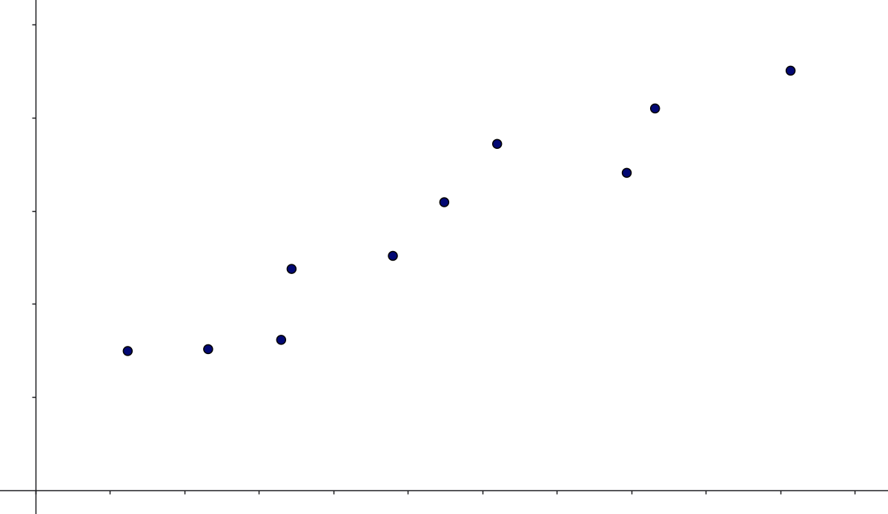
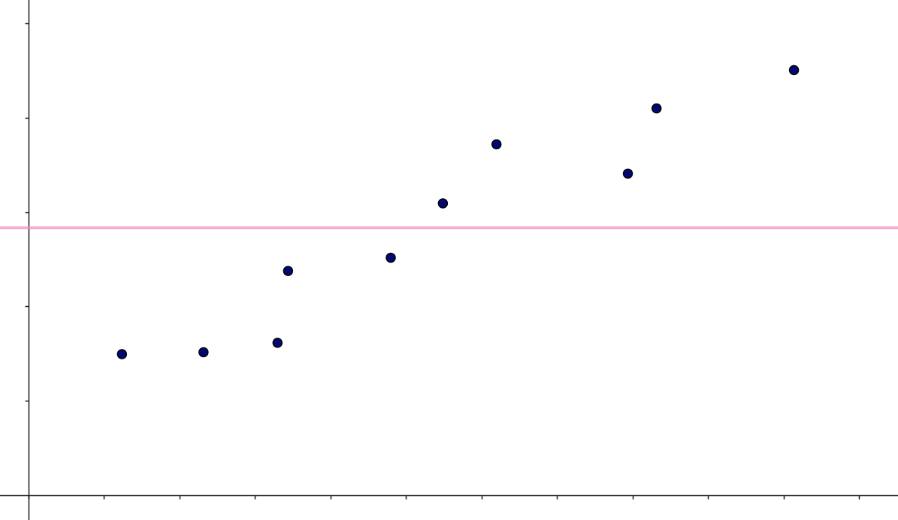
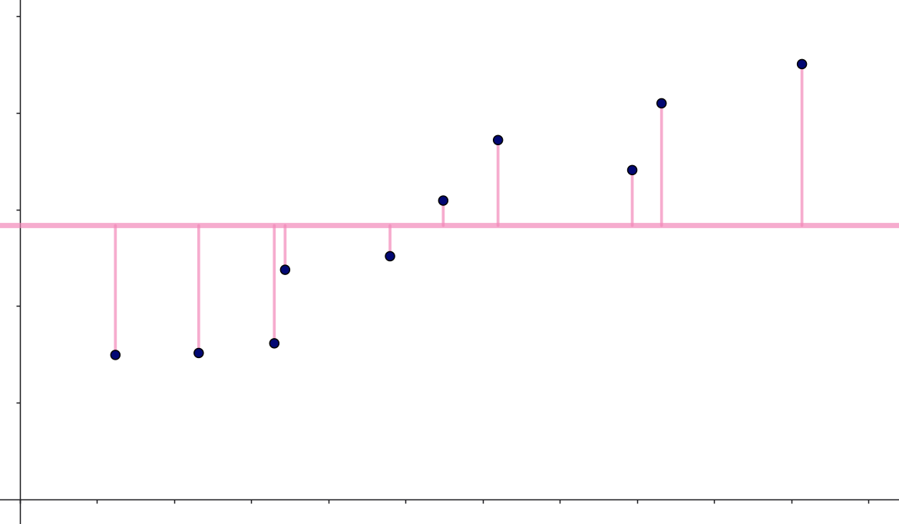
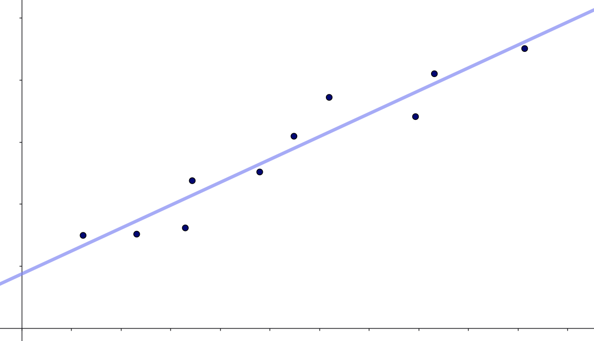
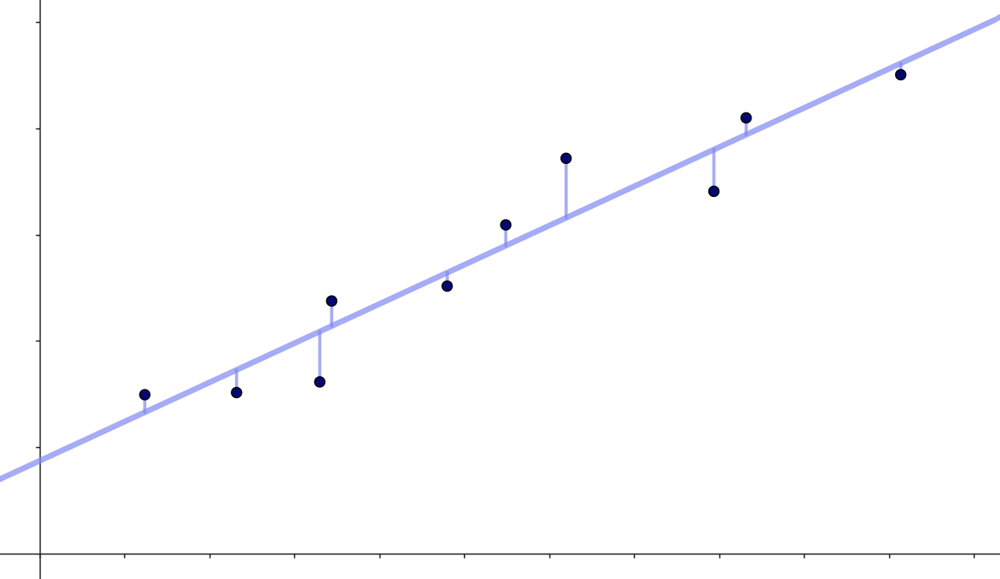
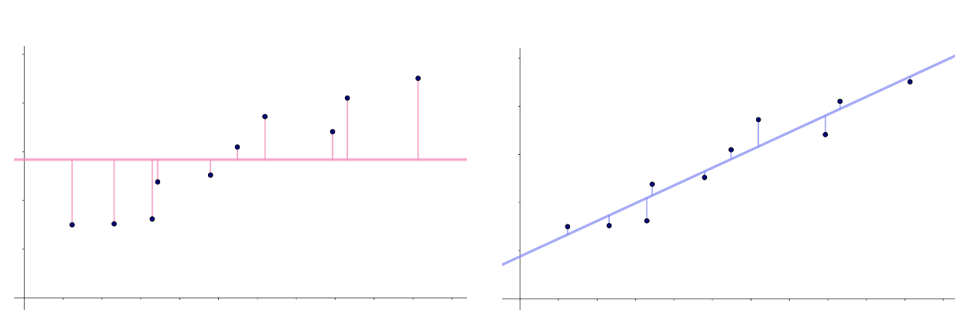

Når man bruger en model (det kan være en kunstig neuron, et neuralt netværk, logistisk regression eller noget helt fjerde) til at forudsige en størrelse, så vil man altid være interesseret i at sige noget om, hvor god modellen er. Denne note handler om præcis det: Forskellige mål som kan bruges til at vurdere en models nøjagtighed.

Der er forskel på om den model, man har trænet, skal bruges til klassifikation eller til prædiktion af numeriske værdier. Med klassifikation mener vi modeller, som for eksempel kan bruges til at prædiktere, om en patient har en bestemt sygdom eller ej (binær klassifikation), eller hvilket parti en borger stemmer på (multipel klassifikation). Når vi taler om modeller til pærdiktion af numeriske værdier, kunne det for eksempel være modeller som kan forudsige huspriser.

For alle mål gælder det, at man skal være opmærksom på overfitting, og det vil ofte give mening at udregne målene baseret på krydsvalidering. Det kan du læse meget mere om i noten [Overfitting, modeludvælgelse og krydsvalidering](../krydsvalidering/krydsvalidering.qmd){target="_blank"}).

## Modeller til klassifikation

I forbindelse med modeller til klassifikation vil man ofte opstille en såkaldt confusion matrix og på den baggrund udregne en klassifikationsnøjagtighed:

### Klassifikationsnøjagtighed

Begrebet **klassifikationsnøjagtighed** -- eller på engelsk classification accuracy (CA) -- dækker over hvor stor en andel af data, som på baggrund af en given model klassificeres korrekt. 

Lad os illustrere det med et eksempel. Vi forestiller os, at vi har en model, som for en given person kan skelne mellem, om personen tilhører en af to klasser A eller B baseret på en række features, vi har fået oplyst om personen. På baggrund af denne model har vi følgende:

|  | Forudsagt A  | Forudsagt B | I alt |
|:---:|:---:|:---:|:---:|
| **Faktisk A** | $84$ | $16$ | $100$ |
| **Faktisk B** | $20$ | $80$ | $100$ |
| **I alt** | $105$ | $95$ | $200$ |
: Confusion matrix i et tænkt eksempel, hvor $50 \%$ af data tilhører klasse A. {#tbl-cm1 .bordered}

Denne tabel kaldes for en **confusion matrix**.

Vi kan her se, at $100$ personer faktisk tilhører klasse A, og at vores model kan forudsige, at $84$ af disse personer tilhører denne klasse. Desuden ser vi, at $100$ personer faktisk tilhører klasse B, hvilket, modellen forudsiger, er tilfældet for $80$ af disse personer. Det betyder, at modellen klassificerer

$$
84+80 = 164
$$
personer korrekt. Det svarer til, at

$$
\frac{164}{200} = 82 \%
$$
af personerne klassificeres korrekt. Det er denne størrelse, som kaldes for klassifikationsnøjagtigheden. I @tbl-cm1 kan vi se, at $50 \%$ af personerne faktisk tilhører klasse A. Hvis vi havde valgt en naiv model, som altid vil gætte på, at en person tilhører klasse A, så vil vi få en klassifikationsnøjagtighed på $50 \%$. Med en klassifikationsnøjagtighed på $82 \%$ er den forhåndenværende model altså bedre end et naivt gæt.

Lad os se på et nyt eksempel med følgende confusion matrix:

|  | Klassificeret som A  | Klassificeret som B | I alt |
|:---:|:---:|:---:|:---:|
| **Faktisk A** | $132$ | $32$ | $164$ |
| **Faktisk B** | $4$ | $32$ | $36$ |
| **I alt** | $136$ | $64$ | $200$ |
: Confusion matrix i et tænkt eksempel, hvor $82 \%$ af data tilhører klasse A. {#tbl-cm2 .bordered}

Her kan vi se, at vi får en klassifikationsnøjagtighed på 

$$
\frac{132+32}{200}= 82 \%
$$

Altså det samme som før. Så kunne man jo tænke -- fedt! Denne model er lige så god som den, der ligger til grund for @tbl-cm1. Men det faktisk ikke helt tilfældet. Hvis vi her laver en naiv model, hvor vi altid gætter på, at en person tilhører klasse A, så vil vi gætte rigtigt i $164$ ud af $200$ tilfælde. Altså igen i $82 \%$ af tilfældene. Modellen, som ligger til grund for @tbl-cm2, er altså ikke bedre end et naivt gæt. Det betyder, at det er vigtigt, at vurdere en models klassifikationsnøjagtighed i forhold til hvordan klasserne fordeler sig i data.

## Modeller til prædiktion af numeriske værdier

Har man trænet modeller til prædiktion af numeriske værdier, kan det for eksempel give mening af udregne forklaringsgraden og root mean squared error:

### Forklaringsgraden ($R^2$-værdien)

Vi forestiller os, at vi har målt sammenhørende værdier af en uafhængig variabel $x$ og en afhængig variabel $y$, og vi ønsker ud fra en given $x$-værdi, at kunne prædiktere en tilhørende $y$-værdi. Vi antager, at vi har målt følgende sammenhørende værdier:

$$
(x_1, y_1), (x_2,y_2), \cdots, (x_n,y_n)
$$

Et eksempel ses her:

{#fig-data width='80%'}

Et helt naivt bud på sammenhængen mellem $x$ og $y$ kunne være, at der ikke er nogen sammenhæng! Den naive model vil derfor være, at vores bedste bud på en $y$-værdi bare er gennemsnittet af alle $y$-værdierne. Et sådant gennemsnit betegner man ofte med $\bar y$:

$$
\bar{y} = \frac{y_1+y_2+\cdots+y_n}{n}=\frac{1}{n} \sum_{i=1}^n y_i
$$

Det betyder, at uanset hvilken $x$-værdi vi står med, så vil vi prædiktere, at den tilhørende $y$-værdi er $\bar y$. Det svarer til, at vi har fittet linjen med ligning $y=\bar y$ til data:

{#fig-ybar width='80%'}

Hvis vi vil se på, hvor god denne model er, kan vi starte med at se på afvigelsen fra de observerede $y$-værdier til de prædikterede:

$$
y_i - \bar y
$$

Disse forskelle er indtegnet på figuren herunder:

{#fig-R2_1 width='80%'}

Ser vi på @fig-R2_1, kan vi se, at disse forskelle for de første punkter er negative og herefter er de positive. For at slippe for fortegn (en forskel på $-5.4$ har for eksempel præcis samme betydning som en forskel på $5.4$) sætter vi forskellene i anden:

$$
(y_i - \bar y)^2
$$
Summerer vi nu over alle de observerede $y$-værdier:

$$
\sum_{i=1}^n (y_i - \bar y)^2
$$
får vi et samlet mål for, hvor stor en fejl vi begår med den naive model ($y= \bar y$).

I stedet for den naive model $y= \bar y$ kunne vi også fitte den bedste rette linje til data -- altså lave lineær regression. Det giver os en linje med ligning

$$
y = a \cdot x + b
$$

I vores eksempel giver det denne linje:

{#fig-ybar width='80%'}

Hvis vi her skal komme med et bud på en $y$-værdi ud fra en given $x$-værdi, så vil vi indsætte vores $x$-værdi i $y=a \cdot x +b$ og beregne $y$-værdien. Det vil sige, hvis vi for den målte værdi $x_i$ skal komme med et bud på en tilhørende $y$-værdi (som man nogle gange kalder for $\hat y_i$), så vil det være:

$$
\hat y_i = a \cdot x_i + b
$$

Forskellen mellem de faktiske $y$-værdier og de prædikterede $y$-værdier

$$
y_i- \hat y_i = y_i -(a \cdot x_i + b)
$$

er indtegnet på figuren herunder:

{#fig-R2_2 width='80%'}

De kvadrerede fejl bliver derfor nu

$$
(y_i- \hat y_i)^2 = (y_i -(a \cdot x_i + b))^2
$$
og summen af disse er:

$$
\sum_{i=1}^n (y_i- \hat y_i)^2
$$

Vi sammenligner @fig-R2_1 og @fig-R2_2 her:

{#fig-R2_sammenligning width='100%'}

Det ses tydeligt i @fig-R2_sammenligning, at i vores eksempel er den samlede kvadrerede fejl langt større for den naive model end for modellen baseret på lineær regression. 

$R^2$-værdien er hvor stor en procentdel af data, der bliver forklaret af en given model -- målt som summen af de kvadrerede fejl -- sammenlignet med den naive model $y= \bar y$. **EGE: Hvordan skal det her forklares?**

Det vil sige, at

$$
R^2 = \frac{\sum_{i=1}^n (y_i - \bar y)^2 - \sum_{i=1}^n (y_i- \hat y_i)^2}{\sum_{i=1}^n (y_i - \bar y)^2}
$$

Læg her mærke til, at hvis modellen er lige så dårlig, som den naive model ($y=\bar y$), så summen af de kvadrerede fejl er lige store:

$$\sum_{i=1}^n (y_i - \bar y)^2 = \sum_{i=1}^n (y_i- \hat y_i)^2$$ 

Da er 

$$
R^2 = \frac{0}{\sum_{i=1}^n (y_i - \bar y)^2} = 0
$$

Hvis modellen derimod perfekt kan prædiktere alle $y$-værdierne, det vil sige $y_i = \hat y_i$, så er

$$
R^2 = \frac{\sum_{i=1}^n (y_i - \bar y)^2 - 0}{\sum_{i=1}^n (y_i - \bar y)^2} = 1
$$

$R^2$-værdien kaldes derfor også nogle gange for forklaringsgraden. Hvis $R^2$ er tæt på $0$ betyder det, at vi har fittet en model, som ikke er meget bedre end den naive model $y = \bar y$. Er $R^2$ derimod tæt på $1$ betyder det, at vi har fittet en model, som beskriver data langt bedre end den naive model.

En god model har altså en $R^2$-værdi tæt på $1$.

### Root Mean Squared Error (RMSE)

Et andet mål, som kan bruges til at sammenligne modeller, er **root mean squared error (RMSE)**. Vi ser igen på de observerede $y$-værdier ($y_i$) og nogle prædikterede $y$-værdier $\hat y_i$, som er baseret på en eller anden model. De kvadrerede fejl:

$$
 \left (y_i - \hat y_i \right)^2
$$
kaldes for **squared error (SE)**. Udregner vi den gennemsnitlige værdi af alle disse kvadrerede fejl:

$$
\frac{1}{n} \sum_{i=1}^{n} \left ( y_i - \hat y_i \right)^2
$$
får vi et mål, som ikke er afhængig af datasættets størrelse. Det er **mean squared error (MSE)**. Endelig tager vi kvadratroden af MSE (for at få målet ned på samme skala, som vores $y$-værdier er på):

$$
\mathrm{RMSE} = \sqrt{\frac{1}{n} \sum_{i=1}^{n} \left ( y_i - \hat y_i \right)^2}
$$

Det er altså denne størrelse, som er **root mean squared error (RMSE)**. Da vi ønsker så lille en fejl som muligt, vil vi gerne have, at RMSE er så tæt på $0$ som muligt.

En god model har altså en RMSE tæt på $0$.
