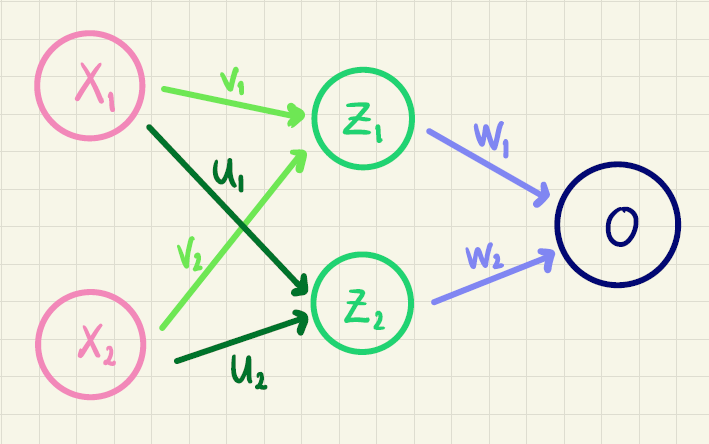
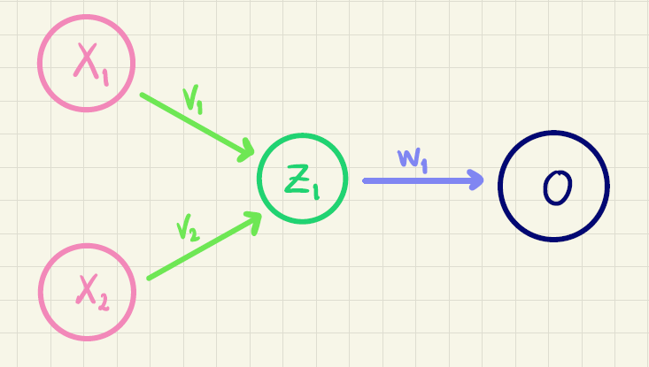

::: {.callout-caution collapse="true" appearance="minimal"}
### Forudsætninger og tidsforbrug
Forløbet kræver kendskab til:

+ Lineære funktioner.
+ Differentialregning herunder differentiation af sammensatte funktioner.

**Tidsforbrug:** Ca. 1-2 x 90 minutter.

:::

::: {.purpose}

### Formål

I opbygningen af kunstige neurale netværk er aktiveringsfunktioner helt centrale. Hvis ikke man bruger aktiveringsfunktioner i et kunstigt neuralt netværk, vil man faktisk bare bygge en stor lineær funktion af inputværdierne. Og lineære funktioner kan man ikke prædiktere ret meget med!

En ofte anvendt aktiveringsfunktion i de skjulte lag er ReLu-funktionen. Den er *næsten* lineær og så alligevel slet ikke. Det skal vi se nærmere på i dette forløb.

:::

## Introduktion

Start med at se denne video, hvor vi kort forklarer, hvad det der kunstig intelligens egentlig handler om:



Når man træner kunstig intelligens opbygger man lidt forsimplet sagt bare en kæmpe stor sammensat funktion. Når man sætter funktioner sammen, bruger man en klasse af funktioner, som kaldes for aktiveringsfunktioner. 

Vi vil illustrere det med et eksempel med det, som man kalder for et kunstigt neuralt netværk med et skjult lag:

{#fig-neuralt_net width=70% fig-align='center'}

Alle pilene i @fig-neuralt_net kaldes for vægte.

Idéen er, at man beregner en outputværdi $o$ baseret på to inputvariable (eller features) $x_1$ og $x_2$. Det foregår på følgende måde.

Ved hjælp af inputvariablene og $v$-vægtene (de lysegrønne pile på @fig-neuralt_net) beregner vi $z_1$:

$$
z_1 = f(v_0 + v_1 \cdot x_1 + v_2 \cdot x_2)
$$ {#eq-z1}

Her er $f$ en funktion, som kaldes for en **aktiveringsfunktion**, og det er den, vi skal se nærmere på i det følgende.

På tilsvarende vis udregner vi $z_2$ ved at bruge $u$-vægtene (de mørkegrønne pile på @fig-neuralt_net):

$$
z_2 = f(u_0 + u_1 \cdot x_1 + u_2 \cdot x_2)
$$ {#eq-z2}

Når vi nu har $z_1$ og $z_2$ kan outputværdien $o$ for eksempel beregnes på denne måde (her er $w$-vægtene vist som de lyseblå pile på @fig-neuralt_net):

$$
o = w_0 + w_1 \cdot z_1 + w_2 \cdot z_2
$$ 

Den første opgave handler om, at hvis man bare sammensætter lineære funktioner, så får man bare nye lineære funktioner. Opgaven kan eventuelt springes over.

::: {.callout-note collapse="false" appearance="minimal"}

### Opgave 1: Sammensætning af lineære funktioner (valgfri)

Antag, at aktiveringsfunktionen $f$ i (@eq-z1) og (@eq-z2) er den simple funktion:

$$
f(x)=x
$$

Denne funktion kalder man også for *identiteten*.

* Vis, at outputværdien $o$ kommer til at afhænge lineært af $x_1$ og $x_2$. Det vil sige, at $o$ kan skrives på formen

   $$
   o = a + b \cdot x_1 + c \cdot x_2
   $$
:::

## Sigmoid

En anden aktiveringsfunktion, som ofte bruges, hvis outputværdien $o$ skal kunne fortolkes som en sandsynlighed er sigmoid-funktionen $\sigma$ med forskrift:

$$
\sigma (x) = \frac{1}{1+\textrm{e}^{-x}}
$$

::: {.callout-note collapse="false" appearance="minimal"}

### Opgave 2: Graf for sigmoid-funktionen

* Tegn grafen for sigmoid-funktionen og se på grafen, at værdimængden er $]0,1[$.

:::

## ReLu

I de skjulte lag i et neuralt netværk, kan man godt bruge sigmoid-funktionen som aktiveringsfunktion. Det har bare vist sig, at den ikke altid er super god! Det er til gengæld ReLu-funktionen, som er opdrejningspunktet for resten af opgaverne.

ReLu-funktionen[^relu] er defineret således:

[^relu]: ReLU står for **Rectified Linear Unit**.

$$
\textrm{ReLu}(x) = 
\begin{cases}
0 & \textrm {hvis } x \leq 0 \\
x & \textrm {hvis } x > 0
\end{cases}
$$

::: {.callout-note collapse="false" appearance="minimal"}

### Opgave 3: Graf for ReLu-funktionen

+ Tegn grafen for ReLu-funktionen.

 Sådan gør du i GeoGebra 

Skriv i input-feltet: `ReLu(x) = Hvis(x < 0, 0, x)`

+ Grafen har et knæk -- hvor er det?

+ Grafen består af to rette linjer. Hvad er hældningen af de to linjer?

+ Er ReLu-funktionen kontinuert?

+ Er ReLu-funktionen differentiabel i alle $x$-værdier?

:::

Du har lige opdaget, at ReLu-funktionen ikke er differentiabel i $x=0$. Men det definerer os ud af og beslutter, at tangenthældningen i $0$ er $0$. Det vil sige, at vi sætter simpelthen $\textrm{ReLu}'(0)=0$. Altså siger vi

$$
\textrm{ReLu}'(x) =
\begin{cases}
0 & \textrm{hvis } x \leq 0 \\
1 & \textrm{hvis } x > 0
\end{cases}
$$ {#eq-diffReLu}

Bemærk for øvrigt, at den afledede ReLu-funktion ikke er kontinuert i $0$. Det møder du ikke så tit!

Vi prøver nu, at sætte ReLu-funktioner sammen med lineære funktioner. For at holde tingene simple ser vi på det tilfælde, hvor vi har én inputvariabel, som vi bare vil kalde for $x$

::: {.callout-note collapse="false" appearance="minimal"}

### Opgave 4: Sammensat ReLu

Vi ser på funktionen

$$
f(x)=w_0 + w_1 \cdot \textrm{ReLu}(v_0 + x)
$$

+ Tegn grafen for $f$ (du kan bruge den definitionn af ReLu, som du lavede i opgave 3). Indtast forskriften, som den står ovenfor, og når GeoGebra spørger om du vil oprette skydere for $w_0$, $w_1$ og $v_0$, vælger du ja.

+ Hvad er betydning af $w_0$?

+ Hvad hældningen af den ikke vandrette del af grafen?

+ I hvilken $x$-værdi knækker grafen?

Lad os regne lidt:

+ Brug (@eq-diffReLu) til at bestemme $f'$. Stemmer det med det, du fandt ovenfor?

+ Beregn den $x$-værdi, hvor grafen knækker. Hint: Det sker, når inputtet til ReLu-funktionen er $0$.

:::

::: {.callout-note collapse="false" appearance="minimal"}

### Opgave 5: Byg selv ReLu

Vi ser fortsat på funktioner med en forskrift på formen
$$
f(x)=w_0 + w_1 \cdot \textrm{ReLu}(v_0 + x)
$$

+ Brug din viden fra opgave 4 og bestem $w_0$, $w_1$ og $v_0$ så grafen for 
  - den vandrette del af $f$ har ligning $y=3$
  - den ikke vandrette del har en hældning på $1.5$
  - $f$ knækker i  $x=3$. 
  
+ Tegn grafen, så du kan kontrollere dit resultat.

+ Bestem $w_0$, $w_1$ og $v_0$ så grafen for 
  - den vandrette del af $f$ har ligning $y=5.6$
  - den ikke vandrette del har en hældning på $-2$
  - $f$ knækker i  $x=-5$. 
  
+ Tegn grafen, så du kan kontrollere dit resultat.

:::

### Sammenhæng med kunstigt neuralt netværk

Vi kan nu passende spørge os selv, hvad ReLu-funktionen i opgave 4 og 5 har at gøre med et kunstigt neuralt netværk. En hel del faktisk!

Betragt følgende netværk:

{#fig-simpelt_NN width=70% fig-align='center'}

Beregner vi $z_1$ ved at bruge ReLu-funktionen som aktiveringsfunktion, får vi

$$
z_1 = \textrm{ReLu}(v_0 + \underbrace{v_1 \cdot x_1 + v_2 \cdot x_2}_{x}) = \textrm{ReLu}(v_0 + x),
$$
hvor vi har sagt, at $x$ bare er linear kombinationen af de to features: $x=v_1 \cdot x_1 + v_2 \cdot x_2$. Så er outputværdien $o$:

$$
o = w_0 + w_1 \cdot z_1 = w_0 + w_1 \cdot \textrm{ReLu}(v_0 + x),
$$

som præcis svarer til den funktion, som vi har set på i opgave 4 og 5.

I den næste opgave, vil vi se på tilfældet, som svarer til @fig-neuralt_net.

**SPG: Men først er $x=v_1 \cdot x_1 + v_2 \cdot x_2$ og dernæst er $x=u_1 \cdot x_1 + u_2 \cdot x_2$, så $x$ har ikke helt samme betydning. Hvordan forklarer vi lige det...?**

::: {.callout-note collapse="false" appearance="minimal"}

### Opgave 6: Endnu mere sammensat ReLu

Vi ser på funktionen

$$
f(x)=w_0 + w_1 \cdot \textrm{ReLu}(v_0 + x) + w_2 \cdot \textrm{ReLu}(u_0 + x)
$$

+ Tegn grafen for $f$ (du kan bruge den definitionn af ReLu, som du lavede i opgave 3). Igen opretter du skydere for $w_0$, $w_1$, $w_2$, $v_0$ og $u_0$.

+ Hvad er betydning af $w_0$?

Det er nemmest at forstå, hvad der sker, hvis vi sørger for, at den første ReLu-funktionen definerer det første knæk, mens den anden ReLu-funktion definerer det andet knæk. Det kan vi opnå, hvis vi sørger for, at

$$
- v_0 < - u_0
$$

Det vil sige, at

$$
u_0 < v_0
$$

Derfor:

+ Klik på skyderen for $u_0$ og vælg egenskaber. Sæt maks-værdien af skyderen til $v_0$.

+ I hvilke to $x$-værdier knækker grafen?

+ Hvad hældningen af den *første* ikke vandrette del af grafen?

+ Hvad hældningen af den *anden* ikke vandrette del af grafen? Tænk dig om her! 

:::

::: {.callout-note collapse="false" appearance="minimal"}

### Opgave 7: Endnu mere sammensat ReLu

Vi ser på funktionen

$$
f(x)=w_0 + w_1 \cdot \textrm{ReLu}(v_0 + x) + w_2 \cdot \textrm{ReLu}(u_0 + x)
$$

+ Bestem $w_0$, $w_1$, $v_0$, $w_2$ og $u_0$ så grafen for 
  - den vandrette del af $f$ har ligning $y=-1$
  - den første ikke vandrette del har en hældning på $3$
  - den anden ikke vandrette del har en hældning på $4$
  - $f$ knækker i  $x=-4$ og $x=1$. 
  
+ Tegn grafen, så du kan kontrollere dit resultat.

+ Bestem $w_0$, $w_1$, $v_0$, $w_2$ og $u_0$ så grafen for 
  - den vandrette del af $f$ har ligning $y=7$
  - den første ikke vandrette del har en hældning på $-2$
  - den anden ikke vandrette del har en hældning på $0$
  - $f$ knækker i  $x=3$ og $x=6$. 
  
+ Tegn grafen, så du kan kontrollere dit resultat.

:::

### Modellering af ikke-lineære sammenhænge

Pointen med at sammensætte ReLu-funktioner er, at vi gerne vil kunne modellere ikke-lineære sammenhænge i data. De næste opgaver går ud på, at bestemme en sammensat ReLu-funktion, som kan bruges til at modellere en parabel.

::: {.callout-note collapse="false" appearance="minimal"}

### Opgave 8: Sammensat ReLu og parabel (eksperimentér!)

Vi vil se på andengradspolyomiet

$$
g(x)=\frac{3}{4}x^2+2, \quad -4 \leq x \leq 4
$$

og undersøge, om vi kan bestemme en sammensat ReLu-funktion på formen

$$
f(x)=w_0 + w_1 \cdot \textrm{ReLu}(v_0 + x) + w_2 \cdot \textrm{ReLu}(u_0 + x)
$$

som en approksimation (det vil sige en tilnærmelse) til $g$.

* Tegn grafen for $g$ i GeoGebra.

* Tegn grafen for $f$ ved at indsætte skydere for vægtene $w_0$, $w_1$, $v_0$, $w_2$ og $u_0$.

* Prøv dig frem. Kan du finde nogle værdier af vægtene, så grafen for $f$ er tæt på grafen for $g$?

:::

::: {.callout-note collapse="false" appearance="minimal"}

### Opgave 9: Sammensat ReLu og parabel (regn!)

Vi ser fortsat på funktionerne $f$ og $g$ fra opgave 8. Vi vil opstille nogle kriterier for $f$ og på den måde beregne værdien af vægtene.

Den overordnede idé er, at vi vil approksimere $g$ med en aftagende lineær funktion i intervallet $[-4,0]$ og en voksende lineær funktion i intervallet $[0,4]$. Derfor gør vi følgende:

* Bestem $v_0$ og $u_0$, så grafen for $f$ knækker i $x=-4$ og i $x=0$.

* Grafen for $f$ skal gå igennem parablens toppunkt. Bestem på den baggrund en sammenhæng mellem $w_0$ og $w_1$.

* Endelig vil vi på grund af parablens symmetri kræve, at hældningen af de to lineære funktioner er numerisk lige store. Bestem på den baggrund en sammenhæng mellem $w_1$ og $w_2$.

* Opstil et udtryk for forskriften for $f$, som kun afhænger af $w_1$. 

Bemærk, at hvis vi skal have en rimelig approksimation, så må vi kræve, at $w_1<0$.

* Tegn i GeoGebra grafen for $g$ og $f$, hvor $f$ nu kun afhænger af $w_1$-vægten (som du repræsenterer ved hjælp af en skyder). Juster på din skyder for $w_1$. Hvad er en rimelig værdi af $w_1$, hvis $f$ skal være en god approksimation til $g$?

:::

I opgave 9 kan du se, at grafen for $f$ og $g$ skærer hinanden i intervallet $[-4,0]$.

## Delvis facitliste

[Facitliste](ReLu/ReLu_facit.qmd){target="_blank"}.
