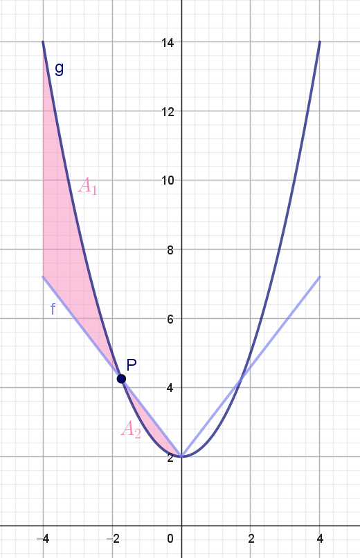

::: {.callout-caution collapse="true" appearance="minimal"}
### Forudsætninger og tidsforbrug
Forløbet kræver kendskab til:

+ Lineære funktioner.
+ Differentialregning herunder differentiation af sammensatte funktioner.
+ Integralregning (fra opgave 13 og frem).

Man behøver ikke at lade alle elever arbejde med opgave 1, 13 og 14. Disse opgaver kan i stedet bruges som undervisningsdifferentiering, så det kun er de dygtigste eller mest engagerede elever, som arbejder med dem.

**Tidsforbrug:** Ca. 1-2 x 90 minutter.

:::

::: {.purpose}

### Formål

I opbygningen af kunstige neurale netværk er aktiveringsfunktioner helt centrale. Hvis ikke man bruger aktiveringsfunktioner i et kunstigt neuralt netværk, ender man i praksis med blot at bygge en stor lineær funktion af inputværdierne. Og verden er sjældent lineær -- derfor har man brug for aktiveringsfunktioner.

En ofte anvendt aktiveringsfunktion i de skjulte lag er ReLU-funktionen. Den er *næsten* lineær, men alligevel slet ikke. I dette forløb skal vi se på, hvordan man kan sammensætte ReLU-funktioner og på den måde modellere ikke-lineære funktioner.

:::

## Introduktion

Start med at se denne video, hvor vi kort forklarer, hvad kunstig intelligens handler om:



Når man træner kunstig intelligens opbygger man, lidt forsimplet, bare en kæmpestor sammensat funktion! Når funktioner sammensættes i neurale netværk, bruger man en klasse af funktioner, som kaldes for aktiveringsfunktioner. 

Vi vil illustrere det med et simpelt eksempel, som kaldes for et kunstigt neuralt netværk med ét skjult lag. Det kan tegnes sådan her:

{#fig-neuralt_net width=70% fig-align='center'}

Alle pilene i @fig-neuralt_net kaldes for vægte. I netværket her, er der overordnet set $v$-, $u$- og $w$-vægte.

Idéen er, at man beregner en outputværdi $o$ baseret på to inputvariable (eller features) kaldet for $x_1$ og $x_2$. Det foregår på følgende måde:

Ved hjælp af inputvariablene og $v$-vægtene (de lysegrønne pile på @fig-neuralt_net) beregner vi $z_1$:

$$
z_1 = f(v_0 + v_1 \cdot x_1 + v_2 \cdot x_2)
$$ {#eq-z1}

Her er $f$ et eksempel på en **aktiveringsfunktion**, og det er den, vi skal se nærmere på i det følgende.

På tilsvarende vis udregner vi $z_2$ ved at bruge $u$-vægtene (de mørkegrønne pile på @fig-neuralt_net):

$$
z_2 = f(u_0 + u_1 \cdot x_1 + u_2 \cdot x_2)
$$ {#eq-z2}

Når vi nu har $z_1$ og $z_2$ kan outputværdien $o$ for eksempel beregnes på denne måde (her er $w$-vægtene vist som de lyseblå pile på @fig-neuralt_net):

$$
o = w_0 + w_1 \cdot z_1 + w_2 \cdot z_2
$$ 

Nogle gange bruger man også en aktiveringsfunktion, når outputværdien $o$ skal beregnes. Det vender vi kort tilbage til i opgave 2.

Den første opgave handler om, at hvis man kun sammensætter lineære funktioner, så får man kun nye lineære funktioner. Opgaven kan eventuelt springes over -- spørg din lærer.

::: {.callout-note collapse="false" appearance="minimal"}

### Opgave 1: Sammensætning af lineære funktioner (valgfri)

Antag, at aktiveringsfunktionen $f$ i (@eq-z1) og (@eq-z2) er den simple funktion:

$$
f(x)=x
$$

Denne funktion kalder man også for *identiteten*, og den svarer reelt til ikke at bruge nogen aktiveringsfunktion.

* Vis, at outputværdien $o$ kommer til at afhænge lineært af $x_1$ og $x_2$. Det vil sige, at $o$ kan skrives på formen

   $$
   o = a \cdot x_1 + b \cdot x_2 + c
   $$
:::

## Sigmoid

En anden aktiveringsfunktion, som ofte bruges, hvis outputværdien $o$ skal kunne fortolkes som en sandsynlighed, er sigmoid-funktionen $\sigma$ med forskrift:

$$
\sigma (x) = \frac{1}{1+\textrm{e}^{-x}}
$$

hvor outputværdien $o$ så beregnes på denne måde:

$$
o = \sigma(w_0 + w_1 \cdot z_1 + w_2 \cdot z_2)
$$ 

::: {.callout-note collapse="false" appearance="minimal"}

### Opgave 2: Graf for sigmoid-funktionen

* Tegn grafen for sigmoid-funktionen og se på grafen, at værdimængden er $]0,1[$.

:::

## ReLU

I de skjulte lag i et neuralt netværk kan man godt bruge sigmoid-funktionen som aktiveringsfunktion. Det har bare vist sig, at den ikke altid er super god! Det er til gengæld ReLU-funktionen, som er omdrejningspunktet for resten af opgaverne.

ReLU-funktionen[^relu] er defineret således:

[^relu]: ReLU står for **Rectified Linear Unit**.

$$
\textrm{ReLU}(x) = 
\begin{cases}
0 & \textrm {hvis } x \leq 0 \\
x & \textrm {hvis } x > 0
\end{cases}
$$

::: {.callout-note collapse="false" appearance="minimal"}

### Opgave 3: Graf for ReLU-funktionen

+ Tegn grafen for ReLU-funktionen.

 Sådan gør du i GeoGebra 

Skriv i input-feltet: `ReLU(x) = Hvis(x < 0, 0, x)`

+ Grafen har et knæk -- hvor er det?

+ Grafen består af to rette linjer. Hvad er hældningen af de to linjer?

+ Er ReLU-funktionen kontinuert?

+ Er ReLU-funktionen differentiabel i alle $x$-værdier?

:::

Vi har lige set, at

$$
\textrm{ReLU}'(x) =
\begin{cases}
0 & \textrm{hvis } x < 0 \\
1 & \textrm{hvis } x > 0
\end{cases}
$$ {#eq-diffReLU}

Og vi har opdaget, at ReLU-funktionen ikke er differentiabel i $x=0$, fordi grafen har et knæk her. Det er selvfølgelig uheldigt, når man skal implementere et kunstigt neuralt netværk. Heldigvis vil det utrolig sjældent ske, at inputværdien til ReLU er præcis $0$, og hvis det alligevel sker, så vil vi vælge at sætte tangenthældningen i $0$ til at være $0$. 

Vi prøver nu at sætte ReLU-funktioner sammen med lineære funktioner. Hvad det har at gøre med kunstige neurale netværk kommer vi tilbage til i det næste afsnit.

For at holde tingene simple ser vi på det tilfælde, hvor vi har én inputvariabel, som vi bare vil kalde for $x$.

::: {.callout-note collapse="false" appearance="minimal"}

### Opgave 4: Sammensat ReLU

Vi ser på funktionen

$$
f(x)=w_0 + w_1 \cdot \textrm{ReLU}(v_0 + x)
$$

+ Tegn grafen for $f$ (du kan bruge den definition af ReLU, som du lavede i opgave 3). Indtast forskriften, som den står ovenfor, og når GeoGebra spørger, om du vil oprette skydere for $w_0$, $w_1$ og $v_0$, vælger du ja.

+ Hvad er betydningen af $w_0$?

+ Hvad er hældningen af den ikke vandrette del af grafen?

+ I hvilken $x$-værdi knækker grafen?

Lad os regne lidt:

+ Beregn den $x$-værdi, hvor grafen knækker. Hint: Det sker, når inputtet til ReLU-funktionen er $0$.

+ Brug (@eq-diffReLU) til at bestemme $f'$. Stemmer det med det, du fandt ovenfor?

:::

::: {.callout-note collapse="false" appearance="minimal"}

### Opgave 5: Byg selv ReLU

Vi ser fortsat på funktioner med en forskrift på formen
$$
f(x)=w_0 + w_1 \cdot \textrm{ReLU}(v_0 + x)
$$

+ Brug din viden fra opgave 4 og bestem $w_0$, $w_1$ og $v_0$ så grafen for 
  - den vandrette del af $f$ har ligning $y=3$.
  - den ikke vandrette del har en hældning på $1.5$.
  - $f$ knækker i  $x=3$. 
  
+ Tegn grafen, så du kan kontrollere dit resultat.

+ Bestem $w_0$, $w_1$ og $v_0$ så grafen for 
  - den vandrette del af $f$ har ligning $y=5.6$.
  - den ikke vandrette del har en hældning på $-2$.
  - $f$ knækker i  $x=-5$. 
  
+ Tegn grafen, så du kan kontrollere dit resultat.

:::

### Sammenhæng med kunstigt neuralt netværk

Vi kan nu passende spørge os selv, hvad ReLU-funktionen i opgave 4 og 5 har at gøre med et kunstigt neuralt netværk. En hel del faktisk!

Betragt følgende netværk, hvor det skjute lag kun består af én neuron:

{#fig-simpelt_NN width=70% fig-align='center'}

Beregner vi $z_1$ ved at bruge ReLU-funktionen som aktiveringsfunktion, får vi

$$
z_1 = \textrm{ReLU}(v_0 + \underbrace{v_1 \cdot x_1 + v_2 \cdot x_2}_{x}) = \textrm{ReLU}(v_0 + x),
$$
hvor vi har sagt, at $x$ bare er en linear kombinationen af de to features: $x=v_1 \cdot x_1 + v_2 \cdot x_2$. Så er outputværdien $o$:

$$
o = w_0 + w_1 \cdot z_1 = w_0 + w_1 \cdot \textrm{ReLU}(v_0 + x),
$$

som præcis svarer til den funktion, som vi har set på i opgave 4 og 5.

I de næste opgaver skal vi se på, hvad der sker, hvis vi sætter flere ReLU-funktioner sammen.

::: {.callout-note collapse="false" appearance="minimal"}

### Opgave 6: Endnu mere sammensat ReLU

Vi ser på funktionen

$$
f(x)=w_0 + w_1 \cdot \textrm{ReLU}(v_0 + x) + w_2 \cdot \textrm{ReLU}(u_0 + x)
$$

+ Tegn grafen for $f$ (du kan bruge den definition af ReLU, som du lavede i opgave 3). Igen opretter du skydere for $w_0$, $w_1$, $w_2$, $v_0$ og $u_0$.

+ Hvad er betydningen af $w_0$?

Det er nemmest at forstå, hvad der sker, hvis vi sørger for, at den første ReLU-funktion definerer det første knæk, mens den anden ReLU-funktion definerer det andet knæk. Det kan vi opnå, hvis vi sørger for, at

$$
- v_0 < - u_0
$$
(Det kan du jo lige overveje!)

Det vil sige, at

$$
u_0 < v_0
$$

Derfor:

+ Klik på skyderen for $u_0$ og vælg egenskaber. Sæt maks-værdien af skyderen til $v_0$.

+ I hvilke to $x$-værdier knækker grafen?

+ Hvad er hældningen af den *første* ikke vandrette del af grafen?

+ Hvad er hældningen af den *anden* ikke vandrette del af grafen? Tænk dig om her! 

:::

Funktionen $f$ fra ovenstående opgave svarer *næsten* til det netværk, som vi har illustreret i @fig-neuralt_net. Men vi har lavet en forsimpling i opgaven. Skulle vi modellere netværket i @fig-neuralt_net, skulle vi have set på funktionen

$$
\begin{aligned}
f(x_1,x_2)=w_0 &+ w_1 \cdot \textrm{ReLU}(v_0 + \underbrace{v_1 \cdot x_1 + v_2 \cdot x_2}_{x}) \\ &+ w_2 \cdot \textrm{ReLU}(u_0 + \underbrace{u_1 \cdot x_1 + u_2 \cdot x_2}_{\textrm{noget andet end } x})
\end{aligned}
$$

Som det fremgår af ovenstående, kan vi ikke bare tænke på $f$ som en funktion af én variabel $x$, men den forsimplede funktion fra opgave 6 er glimrende til at forstå, hvordan sammensætninger af ReLU-funktioner kan bruges til at modellere ikke-lineære funktioner.

::: {.callout-note collapse="false" appearance="minimal"}

### Opgave 7: Stadig sammensat ReLU

Vi ser igen på funktionen

$$
f(x)=w_0 + w_1 \cdot \textrm{ReLU}(v_0 + x) + w_2 \cdot \textrm{ReLU}(u_0 + x)
$$

+ Bestem $w_0$, $w_1$, $w_2$, $v_0$ og $u_0$ så grafen for 
  - den vandrette del af $f$ har ligning $y=-1$
  - den første ikke vandrette del har en hældning på $3$
  - den anden ikke vandrette del har en hældning på $4$
  - $f$ knækker i  $x=-4$ og $x=1$. 
  
+ Tegn grafen, så du kan kontrollere dit resultat.

+ Bestem $w_0$, $w_1$, $w_2$, $v_0$ og $u_0$ så grafen for 
  - den vandrette del af $f$ har ligning $y=7$
  - den første ikke vandrette del har en hældning på $-2$
  - den anden ikke vandrette del har en hældning på $0$
  - $f$ knækker i  $x=3$ og $x=6$. 
  
+ Tegn grafen, så du kan kontrollere dit resultat.

:::

### Modellering af ikke-lineære sammenhænge

Pointen med at sammensætte ReLU-funktioner er, at vi gerne vil kunne modellere ikke-lineære sammenhænge i data. De næste opgaver går ud på at bestemme en sammensat ReLU-funktion, som kan bruges til at modellere en parabel.

::: {.callout-note collapse="false" appearance="minimal"}

### Opgave 8: Sammensat ReLU og parabel (eksperimentér!)

Vi vil se på andengradspolynomiet

$$
g(x)=\frac{3}{4}x^2+2, \quad -4 \leq x \leq 4
$$

og undersøge, om vi kan bestemme en sammensat ReLU-funktion på formen

$$
f(x)=w_0 + w_1 \cdot \textrm{ReLU}(v_0 + x) + w_2 \cdot \textrm{ReLU}(u_0 + x)
$$

som en approksimation (det vil sige en tilnærmelse) til $g$.

* Tegn grafen for $g$ i GeoGebra.

* Tegn grafen for $f$ ved at indsætte skydere for vægtene $w_0$, $w_1$, $w_2$, $v_0$ og $u_0$.

* Prøv dig frem. Kan du finde nogle værdier af vægtene, så grafen for $f$ er tæt på grafen for $g$?

:::

::: {.callout-note collapse="false" appearance="minimal"}

### Opgave 9: Sammensat ReLU og parabel (regn!)

Vi ser fortsat på funktionerne $f$ og $g$ fra opgave 8. Vi vil opstille nogle kriterier for $f$ og på den måde beregne værdien af vægtene.

Den overordnede idé er, at vi vil approksimere $g$ med en aftagende lineær funktion i intervallet $[-4,0]$ og en voksende lineær funktion i intervallet $[0,4]$. Derfor gør vi følgende:

* Bestem $v_0$ og $u_0$, så grafen for $f$ knækker i $x=-4$ og i $x=0$.

* Grafen for $f$ skal gå igennem parablens toppunkt. Bestem på den baggrund en sammenhæng mellem $w_0$ og $w_1$.

* Endelig vil vi på grund af parablens symmetri kræve, at hældningen af de to lineære funktioner er numerisk lige store. Bestem på den baggrund en sammenhæng mellem $w_1$ og $w_2$.

* Opstil et udtryk for forskriften for $f$, som kun afhænger af $w_1$. 

Bemærk, at hvis den første lineære funktion skal være aftagende, så må vi kræve, at $w_1<0$.

* Tegn i GeoGebra grafen for $g$ og $f$, hvor $f$ nu kun afhænger af $w_1$-vægten (som du repræsenterer ved hjælp af en skyder, som kun har negative værdier). Juster på din skyder for $w_1$. Hvad er en rimelig værdi af $w_1$, hvis $f$ skal være en god approksimation til $g$?

:::

Da grafen for både $f$ og $g$ er symmetriske omkring $y$-aksen i intervallet $[-4,4]$ vil vi i det følgende nøjes med at se på de to grafer i intervallet $[-4,0]$.

::: {.callout-note collapse="false" appearance="minimal"}

### Opgave 10: Forsimplet udtryk for $f$ i $[-4,0]$

Da grafen for $f$ kun knækker i $x=-4$ og i $x=0$, så er grafen for $f$ i intervallet $[-4,0]$ en ret linje.

* Bestem en ligning for den rette linje, som grafen for $f$ er sammenfaldende med i intervallet $[-4,0]$.

:::

I opgave 9 kan du se, at grafen for $f$ og $g$ skærer hinanden én gang i intervallet $]-4,0[$.  Og ændrer du på værdien af $w_1$, så flytter skæringspunktet sig. 

::: {.callout-note collapse="false" appearance="minimal"}

### Opgave 11: Skæringspunkt

+ Beregn førstekoordinaten til skæringspunktet mellem graferne for $f$ og $g$ i intervallet $]-4,0[$.

*OBS! Førstekoordinaten kommer til at afhænge af $w_1$*.

:::

En idé til at bestemme den værdi af $w_1$, som giver en god approksimation, vil være at bestemme den værdi, som minimerer arealet af det område, som grafen for $f$ og $g$ afgrænser i $[-4,0]$. Dette er illustreret i figuren herunder:

{#fig-areal_mellem width=50% fig-align='center'}

Hvis vi kalder skæringspunktet $P$'s førstekoordinat for $x_1$, kan vi se, at i intervallet $[-4,x_1]$ ligger grafen for $g$ over grafen for $f$. Det vil sige, at arealet $A_1$ af det område, som de to grafer afgrænser i dette interval, er:

$$
A_1 =  \int_{-4}^{x_1} g(x)-f(x) \, dx
$$
Omvendt ligger grafen for $f$ over grafen for $g$ i intervallet $[x_1,0]$ og arealet $A_2$ af det område, som de to grafer afgrænser her, er:

$$
A_2 =  \int_{x_1}^{0} f(x)-g(x) \, dx
$$

En idé kunne derfor være, at bestemme $w_1$ så det samlede areal

$$
A_1 + A_2 = \int_{-4}^{x_1} g(x)-f(x) \, dx + \int_{x_1}^{0} f(x)-g(x) \, dx
$$

bliver så lille som mulig. 

::: {.callout-note collapse="false" appearance="minimal"}

### Opgave 12: Minimer areal (eksperimentér!)

Tag udgangspunkt i den GeoGebra figur, som du lavede i opgave 9.

+ Bestem ved hjælp af skæringsværktøjet skæringen mellem grafen for $f$ og $g$ i intervallet $]-4,0[$ og kald dette skæringspunkt for $P$.

+ Beregn ved hjælp af GeoGebra arealet $A_1$. Skriv sådan her i GeoGebra: 

   `A_1=IntegralMellem(g, f, -4, x(P))`.
   
   *Forklaring! Når man skriver  `x(P)` får man punktet $P$'s $x$-koordinat*. 

+ Beregn på tilsvarende vis arealet $A_2$.

+ Beregn i GeoGebra summen af $A_1 + A_2$. Kald for eksempel denne sum for `sum`.

+ Justér på skyderen for $w_1$. Hvilken værdi skal $w_1$ have, så $A_1+A_2$ bliver mindst?

:::

::: {.callout-note collapse="false" appearance="minimal"}

### Opgave 13: Minimer areal (regn!)

+ Beregn ved hjælp af dit CAS værktøj den værdi af $w_1$, som minimerer $A_1+A_2$. Husk at kontrollere, at det er et minimumssted, du har fundet!

+ Stemmer dit resultat med det du fandt i opgave 12?

:::

Det sidste afsnit her er valgfrit -- spørg din lærer, om du skal springe det over!

### Andre muligheder

I opgave 13 fandt du den værdi af $w_1$, som minimerer arealet

$$
A_1 + A_2 = \int_{-4}^{x_1} g(x)-f(x) \, dx + \int_{x_1}^{0} f(x)-g(x) \, dx
$$ {#eq-A1A2}

Vi minder lige om, at den numeriske værdi af et tal fjerner eventuelle negative fortegn. For eksempel er

$$
|7| = 7 \quad \quad \textrm{og} \quad \quad |-7| = 7.
$$

Det betyder, at vi kan omskrive udtrykket i (@eq-A1A2) til

$$
A_1 + A_2 = \int_{-4}^{x_1} |f(x)-g(x)| \, dx + \int_{x_1}^{0} |f(x)-g(x)| \, dx
$$

og bruger vi indskudsreglen for bestemte integraler, ser vi, at

$$
A_1 + A_2 = \int_{-4}^{0} |f(x)-g(x)| \, dx
$$
Husk på, at enhver kontinuert funktion har en stamfunktion, så selvom integraden $|f(x)-g(x)|$ måske ikke er differentiabel, så er det altså nok, at den er kontinuert. 

I opgaven 13 fandt du så faktisk den værdi af $w_1$, som minimerer

$$
 \int_{-4}^{0} |f(x)-g(x)| \, dx
$$

En anden måde at fjerne negative fortegn er ved at opløfte i anden. Så en anden idé kunne være, at bestemme $w_1$ så

$$
 \int_{-4}^{0} \left (f(x)-g(x) \right )^2 \, dx
$$

minimeres. 

::: {.callout-note collapse="false" appearance="minimal"}

### Opgave 14: En anden måde at bestemme $w_1$ på

+ Beregn ved hjælp af dit CAS værktøj den værdi af $w_1$, som minimerer 

   $$
    \int_{-4}^{0} \left (f(x)-g(x) \right )^2 \, dx
   $$

   Husk at kontrollere, at det er et minimumssted, du har fundet!

+ Er der stor forskel på den værdi af $w_1$, som du finder her, sammenlignet med den værdi, som du fandt i opgave 13?

:::

Faktisk kan man vise, at man kan approksimere enhver kontinuert funktion defineret på et begrænset interval med et neuralt netværk med ét skjult lag inden for en vilkårlig lille fejlmargin.

## Delvis facitliste

[Facitliste](ReLu/ReLu_facit.qmd){target="_blank"}.
