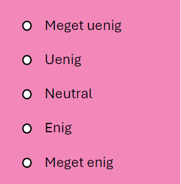
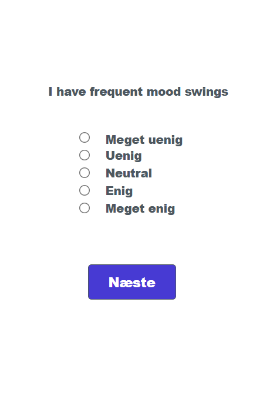

I denne del er formålet at lave en app, hvor man kan læse om Cambridge Analytica skandalen, OCEAN-modellen og tage en OCEAN test.

## Udsagn fra OCEAN personlighedstest

Du har tidligere i [Fælles - opgave 3](../cambridge_analytica.qmd){target="_blank"} taget en personlighedstest, hvor du har forholdt dig til følgende 20 udsagn:


<table class="tabel-kanter">
  <tr>
    <td> *I keep in the background.* </td> 
    <td> *I have frequent mood swings.* </td> 
    <td> *I am not interested in other people's problems.* </td> 
    <td> *I talk to a lot of different people at parties.* </td> 
  </tr>
  <tr>
    <td> *I am not interested in abstract ideas.* </td>  
    <td> *I make a mess of things.* </td> 
    <td> *I sympathize with others' feelings.* </td> 
    <td> *I have a vivid imagination.* </td>
  </tr>
  <tr>
    <td> *I feel others' emotions.* </td>
    <td> *I am relaxed most of the time.* </td>
    <td> *I get chores done right away.* </td>
    <td> *I am not really interested in others.* </td>
  </tr>
  <tr>
    <td> *I do not have a good imagination.* </td>
    <td> *I am the life of the party.* </td>
    <td> *I often forget to put things back in their proper place.* </td>
    <td> *I don't talk a lot.* </td>
  </tr>
  <tr>
    <td> *I like order.* </td>
    <td> *I have difficulty understanding abstract ideas.* </td>
    <td> *I get upset easily.* </td>
    <td> *I seldom feel blue.* </td>
  </tr>
</table>

::: {.callout-note collapse="false" appearance="minimal"}
### Opgave 1: Gruppering af udsagn

- Gruppér ovenstående 20 udsagn i de fem kategorier: **O**penness, **C**onscientiousness, **E**xtraversion, **A**greeableness og **N**euroticism.

- Kontrollér dit resultat med facitlisten, inden du går videre.

:::

Du har nu fire udsagn i hver kategori. Til hvert udsagn kan man svare:

{width="30%" fig-align="center"}

Et udsagn kan være enten \"+keyed\" eller \"-keyed\". Det betyder følgende: 

::: {.fremhaev2}
For + keyed items, the response \"Very Inaccurate\" is assigned a value of 1, Moderately     Inaccurate\" a value of 2, \"Neither Inaccurate nor Accurate\" a 3, Moderately Accurate\" a     4, and \"Very Accurate\" a value of 5.
 
For - keyed items, the response \"Very Inaccurate\" is assigned a value of 5, Moderately     Inaccurate\" a value of 4, \"Neither Inaccurate nor Accurate\" a 3, Moderately Accurate\" a     2, and \"Very Accurate\" a value of 1.
 
Once numbers are assigned for all of the items in the scale, just sum all the values to   obtain a total scale score.
    
Kilde: [Converting IPIP Item Responses to Scale Scores](https://ipip.ori.org/newScoringInstructions.htm){target="_blank"}

:::

Det vil sige, hvis man har et \"+keyed\" udsagn i kategorien \"Openness\", så vil det trække op i den samlede \"openness\"-score, hvis man svarer \"meget enig\". Og omvendt hvis man har et \"-keyed\" udsagn i kategorien \"Openness\", så vil det trække ned i den samlede \"openness\"-score, hvis man svarer \"meget enig\".


::: {.callout-note collapse="false" appearance="minimal"}
### Opgave 2: \"+keyed\" eller \"-keyed\" udsagn

* Du skal nu for hvert udsagn overveje, om det er \"+keyed\" eller \"-keyed\".

* Kontrollér dit resultat med facitlisten, inden du går videre.

:::

## Implementation af app

::: {.callout-note collapse="false" appearance="minimal"}
### Opgave 3: I gang med app

* Lav en app i [App Lab](https://code.org). På forsiden skal der være tre knapper, som leder hen til tre forskellige sider, hvor man kan:

   * Læse om Cambridge Analytica skandalen (brug det I har skrevet i [Fælles - opgave 1](../cambridge_analytica.qmd){target="_blank"}).

   * Læse om OCEAN-modellen (brug det I har skrevet i [Fælles - opgave 2](../cambridge_analytica.qmd){target="_blank"}).

   * Tage en OCEAN test (indtil videre skal siden her bare være tom).

:::

Du skal nu have udvidet din app, så man rent faktisk kan tage en OCEAN test (bestående af de 20 spørgsmål).

Se denne video:



::: {.callout-note collapse="false" appearance="minimal" style="overflow: auto;"}
### Opgave 4: Implementation af OCEAN test - del 1

[Link til app (OCEAN - del 1)](https://studio.code.org/projects/applab/Nz5SgH-020M9g5-BQ4A-tfozcqkvG0WqulbC8xOw1xg){target="_blank"}

*	Åbn app'en og tryk på \"Vis kode\" og dernæst \"Vis tekst\" og kopier koden over i din egen app.

*	Lav en tabel, som hedder \"OCEAN\", og som har kolonnerne \"spg\", \"kat\" og \"type\" ligesom tabellen i videoen. Indsæt de fem spørgsmål, som hører til \"Neuroticism\". Husk, at værdien i kolonnen \"kat\" skal være \"N\".

{style='float:right; margin-left:1rem; border:1px solid black' width="30%"}

*	Lav en skærm som den i videoen $\longrightarrow$ 
   
    Der skal være en label (med id \"label_spg\") med plads til spørgsmålet og de fem radio buttons. Sørg for, at \"group_id\" på alle radio buttons sættes til \"radio_group1\" (på den måde kommer de til at høre sammen). Id'et på hver af de fem radios buttons skal være henholdsvis \"radio_meget_uenig\", \"radio_uenig\", \"radio_neutral\", \"radio_enig\" og \"radio_meget_enig\".

*	Ret din kode til (så resten af id'erne passer med koden) og tjek, at du kan få vist de fire spørgsmål på skærmen.

*	Udvid din tabel, så den dækker alle 20 spørgsmål. Tjek, at det virker.

*	Sørg for -- når alle spørgsmål er blevet vist -- at brugeren kommer over på en ny skærm, hvor der står, at testen er slut.

:::

Se denne video:



::: {.callout-note collapse="false" appearance="minimal" style="overflow: auto;"}
### Opgave 5: Implementation af OCEAN test - del 2

[Link til app (OCEAN - del 2)](https://studio.code.org/projects/applab/XXBb-mkbw4AY2M-OsTZPl0c0Lph6d23YsohD4IHOsNA){target="_blank"}

*	Åbn app'en og tryk på \"Vis kode\" og dernæst \"Vis tekst\" og kopier den nye del af koden over i din egen app. Tjek, at det virker.

*	Udvid din app, så den også kan beregne en score for **O**, **C**, **E** og **A**.

*	Sørg for, at [gennemsnittet]{.fremhaev2} af de fem scores vises på den side, hvor der står, at testen er slut (vær opmærksom på, at I videoen udregnes gennemsnittet ikke, men da der i hver kategori er fire spørgsmål, skal den beregnede score blot divideres med $4$).

:::

Den næste opgave kan eventuelt springes over.

::: {.callout-note collapse="false" appearance="minimal" style="overflow: auto;"}
### Opgave 6 (ekstra udfordring): Login side

*	Lav en login side til din app.
*	Sørg for at den person, som er logget ind, kan få gemt resultatet af sin OCEAN test i en tabel.

:::

## Ekstra udfordring (bruger matematik)

I denne del indgår der lidt matematik. Man behøver ikke at forstå det hele, men man får brug for at lave et par beregninger i App Lab ved hjælp af nogle formler.

Scoren for **O**, **C**, **E**, **A** og **N** bliver et tal mellem $4$ og $20$. Og gennemsnittet af scoren bliver et tal mellem $1$ og $5$. Når man tager [OCEAN personlighedstesten](https://discovermyprofile.com/tests) (\"Short Personality Test\") på Cambridge Universitets hjemmeside, så vises resultatet til sidst som en procentsats. For eksempel får man $50 \%$, hvis ens score rammer middelværdien. Det skal vi prøve at efterligne. 

Vi gør nu følgende:

* Antag, at hver af de fem gennemsnitlige scores er normalfordelte:

$$ 
X \sim N(\mu, \sigma) 
$$   

I artiklen [The Mini-IPIP Scales: Tiny-yet-Effective Measures of the Big Five Factors of
Personality](https://www.researchgate.net/publication/7014171_The_Mini-IPIP_Scales_Tiny-Yet-Effective_Measures_of_the_Big_Five_Factors_of_Personality) kan man finde følgende bud på middelværdien $\mu$ og spredningen $\sigma$ for hver af de fem scores (Table 1. Mini-IPIP (20-items)):

| Kategori | Middelværdi $\mu$ | Spredning $\sigma$ |
|:---:|:---:|:---:|
| **O** | $3.70$ | $0.73$ |
| **C** | $3.42$ | $0.78$ |
| **E** | $3.28$ | $0.90$ |
| **A** | $4.01$ | $0.69$ |
| **N** | $2.54$ | $0.80$ |
: Middelværdi og spredning for hver af de fem OCEAN scores. {#tbl-ocean_mean .bordered}

Man kan nu bruge disse middelværdier og spredninger til at standardisere hver af de fem scores:

$$
Z = \frac{X-\mu}{\sigma}
$$ {#eq-stand}

Disse scores vil nu være standard normalfordelte:

$$ 
Z \sim N(0, 1) 
$$   

::: {.callout-note collapse="false" appearance="minimal" style="overflow: auto;"}
### Opgave 7 (ekstra udfordring): Fra score til sandsynlighed

* Brug @tbl-ocean_mean og (@eq-stand) så du i app'en standardiserer hver af de fem scores.

:::

Denne stump JavaScript kode 

::: {.lyseblaa_boks}
```text

function GFG(x) { 
    var T = 1 / (1 + 0.2316419 * Math.abs(x)); 
    var D = 0.3989423 * Math.exp(-x * x / 2); 
    var cd = D * T * (0.3193815 + T * (-0.3565638 + T * 
                (1.781478 +   
                 T * (-1.821256 + T * 1.330274)))); 
    if (x > 0){ 
      return 1 - cd;
      } 
    return cd; 
}


```
:::

\

stammer fra [geeksforgeeks]( https://www.geeksforgeeks.org/javascript-program-for-normal-cdf-calculator) (\"Approach 2: Using Taylor Series Expansion\") og kan bruges til at beregne sandsynligheden for, at en standard normalfordelt stokastisk variabel $Z$ er mindre end eller lig med $z$. Det vil sige sandsynligheden

$$
P(Z \leq z)
$$

hvor $Z$ er standard normalfordelt.

::: {.callout-note collapse="false" appearance="minimal" style="overflow: auto;"}
### Opgave 7, fortsat

* Indsæt koden i App Lab og bruge den til at beregne den ønskede procentsats. Du kan eventuelt bruge en slider til at vise resultatet for hver af de fem kategorier.

:::

## Delvis facitliste

[Facitliste](ca_informatik_facit.qmd){target="_blank"}.

