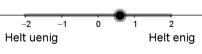

::: {.callout-caution collapse="true" appearance="minimal"}
### Forudsætninger og tidsforbrug

+ Eksponentialfunktioner, herunder $\mathrm{e}^x$.
+ Sandsynlighedsfelter.
+ Linjens ligning i planen på formen $a \cdot x + b \cdot y + c = 0$.
+ Planens ligning i rummet på formen $a \cdot x + b \cdot y + c \cdot z+d= 0$.

Hvis man forinden har arbejdet med det korte forløb [Sengetester i IKEA](https://aimat.dk/undervisningsforlob/sengetester.html), de første dele af det lange forløb om [Kunstige neuroner](https://aimat.dk/undervisningsforlob/kunstige_neuroner_langt_forlob/kunstige_neuroner_forside.html) eller det korte forløb [Hvilken politiker er du mest enig med](https://aimat.dk/undervisningsforlob/hvem_ligner_du_mest.html), kan konteksten være mere tydelig, men det er ikke en forudsætning.

**Tidsforbrug:** Ca. 150 minutter.

:::

::: {.purpose}

### Formål

Formålet med dette forløb er 

* at lære **softmax** at kende som et værktøj til **multipel klassifikation**.
* at lære lidt om **kunstige neuroner**, samt at anvende en app til at træne en kunstig neuron.
* at undersøge, hvordan en kunstig neuron til multipel klassifikation kan bruges til at forudsige, hvilket parti man vil stemme på ud fra svar på en række spørgsmål, som det for eksempel gøres i kandidattests.

:::

## Softmax modellen

Vi vil gerne lave en model, som kan forudsige, hvilket parti man vil stemme på, baseret på svarene fra en række spørgsmål. Det er for eksempel noget lignende, der sker, når diverse medier laver kandidattests i forbindelse med valg. Testene fungerer som regel på
den måde, at man bliver stillet en række forskellige spørgsmål, og så
skal man svare på en skala fra \"helt uenig\" til \"helt enig\". Disse
kategorier af svar kan for eksempel oversættes til matematik[^overs] på denne måde:

| Helt uenig | Uenig | Hverken/eller | Enig | Helt enig |
|:---:|:---:|:---:|:---:|:---:|
| $-2$ | $-1$ | $0$ | $1$ | $2$ |
: {.bordered}

[^overs]: I nogle kandidattests kan man ikke vælge \"Hverken/eller\", men de resterende kategorier oversættes stadig til negative og positive værdier, som det er eksemplificeret i tabellen.

Vi starter med et meget lille fiktivt eksempel, hvor fire personer: Andy, Bella, Charlie og Doresa, har svaret på to spørgsmål samt angivet, hvilket parti de stemmer på. 

Vi forestiller os, at de to spørgsmål er:

* Spørgsmål 1:  Topskatten skal sættes op.

* Spørgsmål 2:  Danske virksomheder skal pålægges en CO2-afgift.

Vi vil så indføre to variable $x_1$ og $x_2$, hvor

- $x_1$: svaret på \"Topskatten skal sættes op\" angivet
på en skala fra $-2$ til $2$.

- $x_2$: svaret på \"Danske virksomheder skal pålægges en CO2-afgift\" angivet på en skala fra $-2$ til $2$.

Vi lader som om, at partierne er **S** (Socialdemokratiet), **E** (Enhedslisten) og **V** (Venstre). Det parti, som en given person vil stemme på, vil vi kalde for $t$ (som står for **targetværdi**). Andy, Bella, Charlie og Doresa har nu svaret følgende:

| Navn | Spørgsmål 1 $(x_1)$ | Spørgsmål 2 $(x_2)$ | Parti ($t$) |
|-------|:----:|:----:|:----:|
| Andy | $\color{#8086F2}{\textrm{Helt uenig } (-2)}$ |  $\color{#8086F2}{\textrm{ Helt uenig } (-2)}$ | **V** |
| Bella | $\color{#8086F2}{\textrm{Uenig } (-1)}$ | $\color{#F288B9}{\textrm{Enig } (1)}$ | **S** |
| Charlie | $\color{#8086F2}{\textrm{Uenig } (-1)}$ |  $\color{#8086F2}{\textrm{Uenig } (-1)}$ | **S** |
| Doresa | $\color{#F288B9}{\textrm{Enig } (1)}$ |  $\color{#F288B9}{\textrm{Helt enig } (2)}$ | **E**|
: {.bordered}

Bemærk her, at svarene \"Helt uenig\" og \"Uenig\" er farvet lyseblå, mens \"Helt enig\" og \"Enig\" er farvet lyserøde.

Vi vil nu lave en model, hvor man ud fra de svar, man giver på de to spørgsmål, kan forudsige, hvor sandsynligt det er, at man stemmer på hvert af de tre partier. Vi vil træne modellen, så den passer godt til svarene fra de fire personer og derefter håbe, at den også vil passe godt til andre personer. Naturligvis er to spørgsmål og fire personer alt for lidt, men det gør vi noget ved senere.

Vi udregner så for enhver kombination af person og parti en score:

$$
\textrm{score}(\textrm{person, parti}) = w_0 + w_1 \cdot x_1+ w_2 \cdot x_2
$$

hvor $w_0$ kaldes for bias og $w_1$ og $w_2$ kaldes for vægte.

Bias og vægte kan være forskellige for hvert parti, så vi kalder dem for $s_0, s_1, s_2$ (Socialdemokratiet), $e_0, e_1, e_2$ (Enhedslisten) og $v_0, v_1, v_2$ (Venstre). 

Vi sætter disse bias og vægte til nogle lidt tilfældige værdier til at starte med.

| Parti | $w_0$ | $w_1$ | $w_2$ |
|:---:|:---:|:---:|:---:|
| **V** | $v_0 = 0$ | $v_1 = -1$ | $v_2 = 0$ | 
| **S** | $s_0 = 0$ | $s_1 = 1$ | $s_2 = 0$ |
| **E**| $e_0 = 0$ | $e_1 = 0$ | $e_2 = 0$ |
: {.bordered}

For Andy kan vi så udregne:

$$
\begin{aligned}
&\textrm{score}(\textrm{Andy, V}) = 0 + (-1) \cdot (-2) + 0 \cdot (-2) = 2 \\
&\textrm{score}(\textrm{Andy, S}) = 0 + 1 \cdot (-2) + 0 \cdot (-2) = -2 \\
&\textrm{score}(\textrm{Andy, E}) = 0 + 0 \cdot (-2) + 0 \cdot (-2) = 0
\end{aligned}
$$

Så lige nu er den højeste score for Andy for **V**, hvilket er godt, da han faktisk stemmer på Venstre. 

Men modellen skulle jo ikke kun give en score, men faktisk give en sandsynlighed for hvert parti. Så vi skal have fundet en metode til at få sandsynligheder i stedet for scores. Om sandsynlighederne ved vi, at de skal være positive, ligge mellem $0$ og $1$ og tilsammen give $1.$

En simpel måde at få tallene positive på er at opløfte $\mathrm{e}$ i scoren: 

$$
\begin{aligned}
\mathrm{e}^2 & \approx  7.389 \\ 
\mathrm{e}^{-2} & \approx 0.135 \\ 
\mathrm{e}^0 &=1
\end{aligned}
$$

Så lægges de tre tal sammen og hvert af tallene divideres med summen:

$$
\textrm{sum}=7.389 + 0.135 + 1 = 8.524
$$

For Andy giver det følgende:

| Parti | Score | $\mathrm{e}^{\textrm{score}}$ | Sandsynlighed |
|:---:|:---:|:---:|:---:|
| **V** | $2$ | $7.389$ | $\frac{7.389}{8.524} \approx 86.68 \%$ |
| **S** | $-2$ | $0.135$ | $\frac{0.135}{8.524} \approx 1.59 \%$ |
| **E**| $0$ | $1$ | $\frac{1}{8.524} \approx 11.73 \%$ |
: {.bordered}

Så med de valgte værdier af bias og vægte, angiver modellen en sandsynlighed på $86.68 \%$ for **V**, $1.59 \%$ for **S** og $11.73 \%$ for **E** for Andy. Da han faktisk stemte på **V**, er det jo rigtigt fint, uden dog at være helt perfekt, da vi helst ville have endnu større sandsynlighed for Venstre for Andy.

Denne metode til at omregne fra scores til sandsynligheder kaldes for **softmax**.

::: {.callout-note collapse="false" appearance="minimal"}
### Opgave 1

- Lav de tilsvarende udregninger for Bella, Charlie og Doresa.
- Overvej derefter, om de valgte vægte er fornuftige -- i den betydning, at modellen giver størst sandsynlighed for det parti, som personen faktisk stemmer på.

:::

Det var åbenlyst ikke så godt for Bella, Charlie og Doresa, da modellen for alle tre peger på et forkert parti. Idéen er nu, at vi skal ændre bias og vægte, så modellen bliver bedre. 

Lad os i første omgang se på $w_1$ og dermed $x_1$. Bemærk, at $x_1 = -2$ for Andy, at $x_1 = -1$ for Bella og Charlie, og at $x_1 = 1$ for Doresa. Da vi gerne vil have Andy til at få en høj score, og dermed en høj sandsynlighed for Venstre, giver det mening at lade $v_1$ være en negativ værdi, så $v_1 \cdot x_1$ bliver positiv. Før havde vi sat $v_1=-1$, men lad os forstærke effekten med $v_1 = -3$, så scoren for Andy bliver højere. 

Det giver Andy en høj score $v_1 \cdot x_1 = -3 \cdot (-2) = 6$ for Venstre sammenlignet med hans score for Socialdemokratiet og Enhedslisten, hvilket er godt, da vi gerne vil have, at modellen peger på Venstre for ham.

Det giver Doresa en lav score $v_1 \cdot x_1 = -3 \cdot 1= -3$ i forhold til hendes scores for de øvrige partier, hvilket også er godt, da vi gerne vil have, at modellen ikke peger på Venstre for hende.

Det giver så desværre både Bella og Charlie en høj score, da $v_1 \cdot x_1 = -3 \cdot (-1) = 3$, hvilket ikke er så godt, da vi gerne vil have, at modellen ikke peger på Venstre for dem. Det venter vi lige med at gøre noget ved, da vi starter med at få modellen til at pege på Enhedslisten for Doresa.

::: {.callout-note collapse="false" appearance="minimal"}
### Opgave 2

- Overvej hvilken værdi $e_1$ kan gives, så Doresa får en positiv score for Enhedslisten, mens de øvrige tre får en negativ score? 
- Vælg vægten, så scoren for Doresa for Enhedslisten bliver $6$, som scoren for Andy blev for Venstre.
- Beregn score og sandsynlighed for hver af de tre partier for Doresa med den værdi, du har valgt (husk, at vi har sat $v_1=-3$).

:::

Samlet ser det nu således ud, hvor både (score) og sandsynlighed er angivet for hvert parti.

| Person  | Venstre | Socialdemokratiet | Enhedslisten |
|:-:|:-:|:-:|:-:|
| Andy | ($6$) $99.97 \%$ | ($-2$) $0.03 \%$ | ($-12$) $0.00 \%$ |
| Bella | ($3$) $98.19 \%$ | ($-1$) $1.80 \%$ | ($-6$) $0.01 \%$ |
| Charlie | ($3$) $98.19 \%$ | ($-1$) $1.80 \%$ | ($-6$) $0.01 \%$ |
| Doresa | ($-3$) $0.01 \%$ | ($1$) $0.67 \%$ | ($6$) $99.32 \%$ |
: {.bordered}

Vi skal nu have modellen til at vælge Socialdemokratiet for Bella og Charlie, men uden at ødelægge, at modellen vælger Venstre til Andy og Enhedslisten til Doresa. 

::: {.callout-note collapse="false" appearance="minimal"}
### Opgave 3

- Overvej, hvilken værdi biaset $s_0$ kan gives, så Bella og Charlie scorer højst for Socialdemokratiet (scoren skal over $3$, da de allerede har scoren $3$ for parti Venstre), men uden at scoren for Andy eller Doresa bliver højst for Socialdemokratiet (de har begge $6$ som højst score til henholdsvis Venstre og Enhedslisten).

:::

Med en fornuftig værdi af bias for Socialdemokratiet (for eksempel på $4.5$) kan tabellen komme til at se således ud:

| Person | Venstre | Socialdemokratiet | Enhedslisten |
|:-:|:-:|:-:|:-:|
| Andy | ($6$)  $97.07 \%$ | ($2.5$) $2.93 \%$ | ($-12$) $0.00 \%$ |
| Bella | ($3$) $37.75 \%$ | ($3.5$) $62.24 \%$ | ($-6$) $0.00 \%$ |
| Charlie | ($3$) $37.75 \%$ | ($3.5$) $62.24 \%$ | ($-6$) $0.00 \%$ |
| Doresa | ($-3$) $0.01 \%$ | ($5.5$) $37.75 \%$ | ($6$) $62.24 \%$ |
: {.bordered}

Men det kan stadig gøres bedre, blandt andet ved også at tage $w_2$ i brug.

## Brug af app til træning af kunstig neuron
Med det meget lille og simple eksempel kunne vi altså godt justere vægtene manuelt og få et nogenlunde resultat. Men hvis der bliver $100$, $1000$ eller millioner af vægte, så er det næppe en god idé. Det kræver noget lidt mere avanceret matematik, som vi ikke vil gennemgå i dette forløb. Du kan læse mere om dette i noten om [Kunstige neurale netværk til multipel klassifikation](https://aimat.dk/noter/softmax/softmax.html).

I stedet vil vi bruge en app til formålet. Du finder app'en [her](https://apps01.math.aau.dk/ai/multi-neuron/) og datasættet som Excel fil [her](kandidattest/datasaet_4_personer.xlsx).

::: {.callout-note collapse="false" appearance="minimal"}
### Opgave 4

- Åbn app'en og indlæs datasættet.
- Vælg $t$ som target-variabel og både $x_1$ og $x_2$ som feature-variable.
- Sæt learning rate til $0.1$ og antal iterationer til $1000$.
- Træn modellen.
- Sammenlign de værdier til bias og vægte, som app'en er nået frem til, med de værdier, som vi manuelt nåede frem til. Meget ligner det, vi fandt manuelt, men noget er også lidt anderledes.

:::

Med app'ens værdier ser tabellen således ud, hvilket må siges at være et meget tilfredsstillende resultat:

| Person  | Venstre | Socialdemokratiet | Enhedslisten |
|:-:|:-:|:-:|:-:|
| Andy | ($6.56$)  $97.72 \%$ | ($2.80$) $2.28 \%$ | ($-9.36$) $0.0 \%$ |
| Bella | ($-4.06$) $0.02 \%$ | ($4.48$) $99.23 \%$ | ($-0.41$) $0.75 \%$ |
| Charlie | ($0.01$) $3.21 \%$ | ($3.42$) $96.68 \%$ | ($-3.43$) $0.10 \%$ |
| Doresa | ($-15.12$) $0.00 \%$ | ($5.18$) $0.85 \%$ | ($9.94$) $99.15 \%$ |
: {.bordered}

## 16 politiske kandidaters svar
Lad os se på et lidt større eksempel, nu med autentiske data fra en kandidattest til folketingsvalget i 2026. Vi ser på 16 kandidater og deres svar på to spørgsmål.

| Parti | Navn | Spørgsmål 1 | Spørgsmål 2 |
|-------|:---------------------------|:-----------:|:-----------:|
| Soc | Ane Halsboe-Jørgensen | $\color{#F288B9}{\textbf{Enig}}$ | $\color{#F288B9}{\textbf{Enig}}$ |
| Soc | Flemming Møller Mortensen | $\color{#8086F2}{\textbf{Uenig}}$ | $\color{#8086F2}{\textbf{Uenig}}$ |
| Soc | Kiki Bille Bach | $\color{#F288B9}{\textbf{Enig}}$ | $\color{#F288B9}{\textbf{Enig}}$ |
| Soc | Morten Ryom | $\color{#F288B9}{\textbf{Enig}}$ | $\color{#F288B9}{\textbf{Enig}}$ |
| Ven | Anita Vivi Lilholt | $\color{#8086F2}{\textbf{Meget uenig}}$ | $\color{#F288B9}{\textbf{Enig}}$ |
| Ven | Anne Honoré Østergaard | $\color{#8086F2}{\textbf{Meget uenig}}$ | $\color{#F288B9}{\textbf{Enig}}$ |
| Ven | Marie Bjerre | $\color{#F288B9}{\textbf{Enig}}$ | $\color{#8086F2}{\textbf{Uenig}}$ |
| Ven | Mikkel Bisgaard | $\color{#8086F2}{\textbf{Uenig}}$ | $\color{#8086F2}{\textbf{Uenig}}$ |
| Enh | Peder Hvelplund | $\color{#F288B9}{\textbf{Meget enig}}$ | $\color{#F288B9}{\textbf{Meget enig}}$ |
| Enh | Runa Friis Hansen | $\color{#F288B9}{\textbf{Enig}}$ | $\color{#F288B9}{\textbf{Meget enig}}$ |
| Enh | Lasse P. N. Olsen | $\color{#F288B9}{\textbf{Meget enig}}$ | $\color{#F288B9}{\textbf{Enig}}$ |
| Enh | Filippa Emilie Vittrup | $\color{#F288B9}{\textbf{Meget enig}}$ | $\color{#F288B9}{\textbf{Meget enig}}$ |
| DD | Inger Støjberg | $\color{#8086F2}{\textbf{Meget uenig}}$ | $\color{#8086F2}{\textbf{Uenig}}$ |
| DD | Kristian Bøgsted | $\color{#8086F2}{\textbf{Uenig}}$ | $\color{#8086F2}{\textbf{Uenig}}$ |
| DD | Kim Edberg Andersen | $\color{#8086F2}{\textbf{Meget uenig}}$ | $\color{#8086F2}{\textbf{Uenig}}$ |
| DD | Liselotte Lynge | $\color{#8086F2}{\textbf{Meget uenig}}$ | $\color{#8086F2}{\textbf{Uenig}}$ |

: {tbl-colwidths="[10, 50, 20, 20]" .bordered}

De to spørgsmål er

* Spørgsmål 1: De boligejere, der tjener mest på prisstigninger, skal betale mere i skat. 

* Spørgsmål 2: Reglerne for dyrevelfærd skal strammes, selv om det kan gøre fødevarer fra Danmark dyrere.

Datasættet som Excelfil med værdier fra $-2$ (helt uenig) til $2$ (helt enig) er   [her](/undervisningsforlob/kandidattest/datasaet_16_personer.xlsx).

For at skabe lidt overblik, vil et punktplot med $x_1$ på førsteaksen og $x_2$ på andenaksen, hvor punkterne har forskellige farver efter parti, være en god idé. Det er dog en udfordring, at flere punkter er ens.

::: {.callout-note collapse="false" appearance="minimal"}
### Opgave 5

- Overvej, hvordan du vil håndtere de punkter, som har samme koordinater, så alle punkterne alligevel bliver synlige.
- Tegn punktplottet (farv punkterne for Socialdemokratiet røde, Venstre blå, Enhedslisten grønne og Danmarksdemokraterne orange).

 Sådan gør du i GeoGebra 

\
Åbn datasættet i Excel og kopier det hele over i et \"Regneark\" i GeoGebra (tryk på \"Vis\" $\rightarrow$ \"Regneark\").

+ Du laver et punkt i regnearket ved at skrive `=(B2,C2)` (hvis punktets førstekoordinat står i celle `B2` og andenkoordinaten står i `C2`).
+ Markér cellen. Tag ved den lille firkant nederst til højre og træk ned, så du får punkter for alle 16 kandidater.
+ Markér alle punkterne. Højreklik og vælg \"Egenskaber\". Sæt flueben ved \"Fast objekt\" (det sikrer, at du ikke ved en fejl kan flytte på punkterne). *Hvis* der er vist et navn ved punkterne i tegneblokken,  fjerner du også fluebenet ved \"Vis navn\".
+ Markér de fire punkter i regnearket, som hører til Socialdemokratiet. Højreklik og vælg \"Egenskaber\". Under fanen \"Farve\" vælger du rød.
+ Farv på tilsvarende måde de andre punkter.

:::

Det skulle gerne være tydeligt, at de fire partiers kandidater ligger delvist opdelt efter parti. Vi vil nu gerne bruge samme type model som tidligere i en kunstig neuron til at undersøge, hvordan vi kan inddele $xy$-planen i områder til hvert parti. Først skal vi have trænet modellen på data for de 16 politikere, så vi kender bias og vægte.

::: {.callout-note collapse="false" appearance="minimal"}
### Opgave 6

- Brug kunstig neuron app'en på datasættet med samme indstillinger som i opgave 4.
- Noter værdierne for bias og vægte for hvert parti, så $s_0, s_1, s_2$ er for Socialdemokratiet, $v_0, v_1, v_2$ er for Venstre og så videre. Det er en fordel, hvis du med det samme definerer værdierne i GeoGebra. Skriv for eksempel i inputfeltet: `s0=5.869` for at definere $s_0$.	

:::

Vi vil i det følgende lave en visualisering, som viser betydningen af de $12$ vægte, som du lige har fundet i opgave 6.

Husk på, at hvis man for en given værdi af $x_1$ og $x_2$ skal udregne scoren for Socialdemokratiet, så gør vi det på denne måde:

$$
s_0 + s_1  \cdot x_1 + s_2 \cdot x_2
$$
Hvis vi omdøber svaret på spørgsmål 1 ($x_1$) til $x$, svaret på spørgsmål 2 ($x_2$) til $y$ og kalder den beregnede score for $z$, så får vi ligningen:

$$
z = s_0 + s_1  \cdot x + s_2 \cdot y
$$

hvilket kan omskrives til

$$
s_0 + s_1  \cdot x + s_2 \cdot y -z =0
$$
Sammenholder vi det med planens ligning $a \cdot x + b \cdot y + c \cdot z + d=0$, kan vi se, at scoren for Socialdemokratiet udgør en plan i rummet. Noget helt tilsvarende gør sig selvfølgelig gældende for de øvrige tre partier.

Vi vil nu tegne de fire planer:

::: {.callout-note collapse="false" appearance="minimal"}
### Opgave 7

+ Tegn de fire planer hørende til hver af de fire partier samtidig med, at du begrænser både $x$ og $y$ til at ligge mellem $-2$ og $2$. 
+ Farv planen for Socialdemokratiet rød, Venstre blå, Enhedslisten grøn og Danmarksdemokraterne orange. 
+ Sørg for, at man kan se nok af $z-aksen$ til, at man ser hele udsnittet af planen for alle fire partier.

 Sådan gør du i GeoGebra 

+ For bare at tegne planen for Socialdemokratiet i GeoGebra uden begræsninger på $x$ og $y$, kan man i inputfeltet blot skrive: `z=s0+s1*x+s2*y`. Sørg for at vælge \"Vis\" $\rightarrow$ \"3D Grafik\" for at få planen vist i et 3-dimensionelt koordinatsystem.
+ Hvis man skal have begrænsning med, definerer man scoren for Socialdemokratiet som en funktion af to variable: `soc(x,y)=s0+s1*x+s2*y,-2<=x<=2,-2<=y<=2`.
+ For at farve planen skal man højreklikke på definitionen af planen i \"Algebra vindue\" og vælge \"Egenskaber\". Her vælger man fanen \"Farve\". Sæt eventuelt \"Opaliseret\" til $100$ (det betyder, at planen ikke bliver gennemsigtig).

Vi har i de tidligere opgaver set, at for et givent svar på hvert af de to spørgsmål, så vil det parti med den højeste score også give den største sandsynlighed. 

I ethvert punkt i $xy$-planen (svarende til konkrete svar på de to spørgsmål), er vi derfor nu interesseret i at finde ud af, hvilket parti, der har den største score (og dermed også den største sandsynlighed). 

+ Drej rundt i dit 3D-plot og prøv blandt andet at se \"ned på\" planerne (på den måde at $z$-aksen peger direkte op i dine øjne -- det svarer til, at du kigger direkte ned på $xy$-planen). Her kan du se, at $xy$-planen bliver inddelt i fire områder svarende til hver af de fire partier. Det parti med den højeste score svarer til den farve, som du kan se.

+ Hvilke partier støder op til hinanden, når du ser ned på de fire områder, som $xy$-planen bliver inddelt i? Notér de tre kombinationer af partier ned.

:::

Vi skal nu have fundet de linjer, som giver den inddeling af $xy$-planen, som du har fundet i opgaven ovenfor. Du har blandt andet set, at Socialdemokratiet og Enhedslisten støder op til hinanden. Grænsen mellem de to partier opstår præcist, når de to partier har samme score. Det vil sige, når

$$
s_0 + s_1 \cdot x + s_2 \cdot y = e_0 + e_1 \cdot x + e_2 \cdot y
$$ 

hvor $x=x_1$ og $y=x_2$.

Hvis vi samler alt på venstre side, giver det

$$
(s_0 - e_0) + (s_1-e_1) \cdot x + (s_2-e_2) \cdot y=0
$$ {#eq-sammenlignSE}

Læg mærke til, at det svarer til ligningen for en ret linje i planen på formen 

$$ 
a \cdot x + b \cdot y + c = 0
$$

Vi vil nu tegne de tre linjer, som giver inddelingen af $xy$-planen.

::: {.callout-note collapse="false" appearance="minimal"}
### Opgave 8

- Bestem ved hjælp af (@eq-sammenlignSE) ligningen for hver af de tre linjer, som giver inddelingen af $xy$-planen, som du fandt i opgave 7. 

- Indtegn de tre linjer i samme koordinatsystem som punktplottet, du lavede i opgave 5.

:::

Når man svarer på de to spørgsmål, har man egentlig kun følgende svarmuligheder: $-2$ (helt uenig), $-1$ (uenig), $0$ (hverken/eller), $1$ (enig) eller $2$ (helt enig). Vi forestiller os nu, at man kan vælge en vilkårlig værdi i intervallet $[-2,2]$. Det kunne for eksempel ske, hvis man skulle angive sit svar på hvert spørgsmål ved hjælp af en skyder, som illustreret her:

::: {.callout-note collapse="false" appearance="minimal"}
### Opgave 9

Antag, at en person har svaret $x=1$ på det første spørgsmål.

+ Hvad skal værdien af $y$ (det vil sige svaret på det andet spørgsmål) være, så scoren for Socialdemokratiet og Enhedslisten bliver lige store (brug de linjer, som du fandt i opgave 8)?

+ Brug $x=1$ og den $y$-værdi, som du lige har bestemt til først at finde scoren og dernæst sandsynligheden for hvert af de fire partier. 

:::

::: {.callout-note collapse="false" appearance="minimal"}
### Opgave 10 - valgfri

I opgave 7 tegnede du planer, som for ethvert punkt $(x,y)$ viser scoren for hvert af de fire partier. 

- Lav et plot tilsvarende det, du lavede i opgave 7, men som i stedet for scoren viser sandsynlighedsfladen for hvert af de fire partier. 

 Sådan gør du i GeoGebra 

For at tegne sandsynlighedsfladen for Socialdemokratiet skriver man i inputfeltet:

`exp(soc(x,y))/(exp(soc(x,y))+exp(enh(x,y))+exp(ven(x,y))+exp(dd(x,y)))`

hvor `enh(x,y)` beregner scoren for Enhedslisten og så videre.

- Drej rundt i dit 3D-plot og prøv igen at se direkte ned på $xy$-planen. Får du samme inddeling af $xy$-planen, som du fik i opgave 7? Hvorfor/hvorfor ikke?

- Betragt de fire inddelinger af $xy$-planen svarende til hvert af de fire partier. Hvor i hver inddeling er sandsynligheden for det pågældende parti størst? Og hvorfor giver det god mening?

:::

## Det helt store eksempel med 877 politikere

Til sidst vil vi tage et kig på et autentisk datasæt af en mere relevant størrelse. Vi har $877$ politikere fordelt på $12$ partier, som inden folketingsvalget i 2026 har svaret på $24$ spørgsmål til TV2's kandidattest.

::: {.callout-note collapse="false" appearance="minimal"}
### Opgave 11

- Beregn hvor mange bias og vægte modellen nu har.

:::

Datasættet kan downloades [her](/undervisningsforlob/kandidattest/datasaet_877_personer.xlsx).

::: {.callout-note collapse="false" appearance="minimal"}
### Opgave 12

- Brug app'en til at træne en kunstig neuron ud fra datasættet. Vælg partibogstav som target-variabel og alle 24 spørgsmål som feature-variable. 
- Se på [\"Confusion matrix\"](/noter/vurdering_model/vurdering_model.qmd#confusion-matrix){target="_blank"} og [\"Klassifikationsnøjagtigheden\"](/noter/vurdering_model/vurdering_model.qmd#klassifikationsnøjagtighed){target="_blank"} i app'en. Overvej, hvad det siger om den trænede model.
- Prøv at ændre på antal iterationer og på learning rate. Vi vil gerne have klassifikationsnøjagtigheden så høj som mulig.

:::

Hvis du har haft om [krydsvalidering](https://aimat.dk/noter/krydsvalidering/krydsvalidering.html){target="_blank"}, kan du desuden lave opgave 13.

::: {.callout-note collapse="false" appearance="minimal"}
### Opgave 13

- Evaluer modellen med 5-folds krydsvalidering i app'en.
- Tag en snak om, hvordan resultatet bliver sammenlignet med svarene i opgave 12, og hvorfor det er tilfældet.

:::

## Delvis facitliste

[Facitliste](kandidattest/kandidattest_facit.qmd){target="_blank"}.

