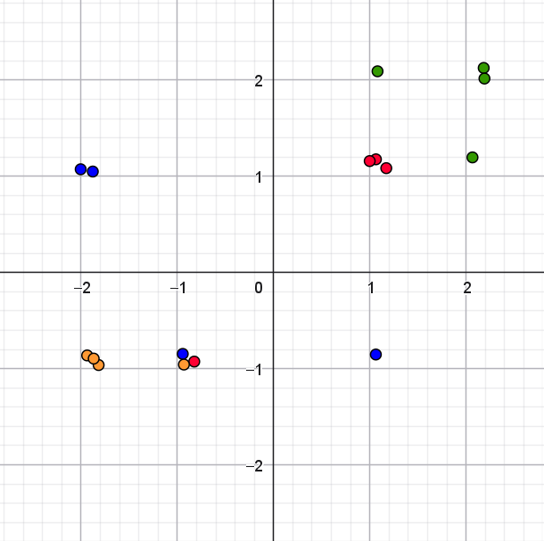
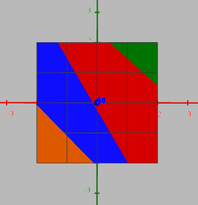
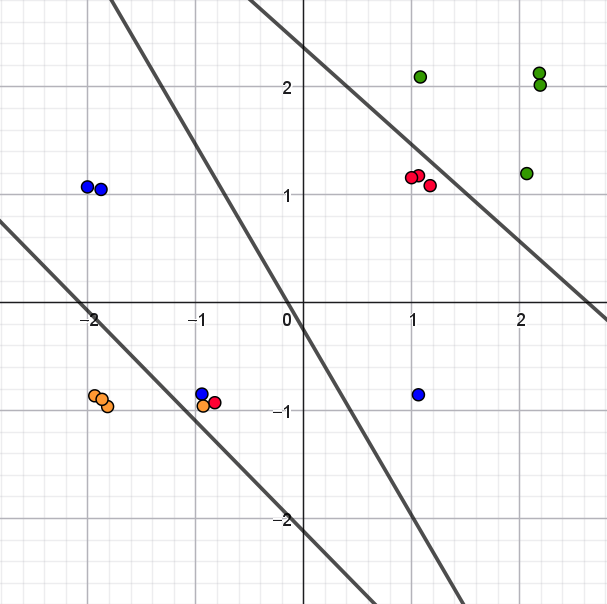
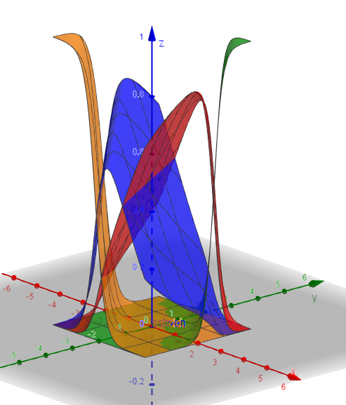

::: {.callout-note collapse="true" appearance="minimal"}  
### Facit til opgave 1

[Bella]{.fremhaev_underline}

| Parti | Score | $\mathrm{e}^{\textrm{score}}$ | Sandsynlighed |
|:---:|:---:|:---:|:---:|
| **V** | $1$ | $2.72$ | $66.5 \%$ |
| **S** | $-1$ | $0.37$ | $9.00 \%$ |
| **E** | $0$ | $1$ | $24.5 \%$ |
: {.bordered}

Uheldigt, da hun faktisk stemmer på **S**.

\
\

[Charlie]{.fremhaev_underline}

| Parti | Score | $\mathrm{e}^{\textrm{score}}$ | Sandsynlighed |
|:---:|:---:|:---:|:---:|
| **V** | $1$ | $2.72$ | $66.5 \%$ |
| **S** | $-1$ | $0.37$ | $9.00 \%$ |
| **E** | $0$ | $1$ | $24.5 \%$ |
: {.bordered}

Uheldigt, da han faktisk stemmer på **S**.

\
\

[Doresa]{.fremhaev_underline}

| Parti | Score | $\mathrm{e}^{\textrm{score}}$ | Sandsynlighed |
|:---:|:---:|:---:|:---:|
| **V** | $-1$ | $0.37$ | $9.00 \%$ |
| **S** | $1$ | $2.72$ | $66.5 \%$ |
| **E** | $0$ | $1$ | $24.5 \%$ |
: {.bordered}

Uheldigt, da hun faktisk stemmer på **E**.

:::

::: {.callout-note collapse="true" appearance="minimal"}  
### Facit til opgave 2
$e_1 = 6$ gør det ønskede. 

[Doresa]{.fremhaev_underline}

| Parti | Score | $\mathrm{e}^{\textrm{score}}$ | Sandsynlighed |
|:---:|:---:|:---:|:---:|
| **V** | $-3$ | $0.05$ | $0.01 \%$ |
| **S** | $1$ | $2.72$ | $0.67 \%$ |
| **E** | $6$ | $403.43$ | $99.32 \%$ |
: {.bordered}

:::

::: {.callout-note collapse="true" appearance="minimal"}  
### Facit til opgave 3
$4 < s_0 < 5$, så for eksempel $s_0 = 4.5$.

:::

::: {.callout-note collapse="true" appearance="minimal"}  
### Facit til opgave 5
En mulig løsning er at \"flytte\" nogle af punkterne meget lidt, hvor de ligger oveni hinanden. For eksempel kan man ændre $1$ til $1.05$. Så bliver punkterne synlige, men ligger stadig næsten samme sted. Man kan også bruge `Tilfældig(0,0.2)` i GeoGebra, som genererer et tilfældigt tal mellem $0$ og $0.2$.

{width=50% fig-align='center'}

:::

::: {.callout-note collapse="true" appearance="minimal"}  
### Facit til opgave 7

{width=50% fig-align='center'}

+ Enhedslisten og Socialdemokratiet, Socialdemokratiet og Venstre, Venstre og Danmarksdemokraterne.

:::

::: {.callout-note collapse="true" appearance="minimal"}  
### Facit til opgave 8

| Partier | Ligning |
|-------|:---------------------------|
| **S** og **E**| $-5.33979 \cdot x -5.95406 \cdot y + 14.0861 = 0$ |
| **S** og **V** | $1.00714 \cdot x + 0.58677 \cdot y + 0.1453 = 0$ |
| **V** og **D**| $4.39317 \cdot x + 4.30077 \cdot y + 9.0993 = 0$ |
: {.bordered}

{width=50% fig-align='center'}

:::

::: {.callout-note collapse="true" appearance="minimal"}  
### Facit til opgave 9

+ $y=1.468965714$.

| Parti | Score | Sandsynlighed |
|:---:|:---:|:---:|
| **S** | $5.95969$ | $46.87348 \%$ |
| **V** | $3.94531$ | $6.25304 \%$ |
| **E** | $5.95969$ | $46.87348 \%$ |
| **DD** | $-15.86485$ | $0.00000 \%$ |
: {.bordered}

:::

::: {.callout-note collapse="true" appearance="minimal"}  
### Facit til opgave 10

{width=50% fig-align='center'}

+ Ja, det giver præcis samme inddeling af $xy$-planen. Sandsynlighederne er ens, præcis når scorene er ens.

+ For midterpartierne, Socialdemokratiet og Venstre, er sandsynligheden størst i midten af det område, som hører til partiet. For yderpartierne, Enhedslisten og Danmarksdemokraterne, er sandsynligheden størst helt ude i hjørnet. Det giver god mening, da sandsynligheden for partiet dermed er størst, når man er længst væk fra randen mod de nærmeste andre partier.

:::

::: {.callout-note collapse="true" appearance="minimal"}  
### Facit til opgave 11
Der er $12$ bias og $288$ vægte.
:::

::: {.callout-note collapse="true" appearance="minimal"}  
### Facit til opgave 12
Du bør kunne få klassifikationsnøjagtigheden op over $90 \%$, så modellen er korrekt for flere end $789$ af politikerne.

Det tyder på, at politikere i samme parti er rimeligt enige, mens politikerne fra forskellige partier også giver forskellige svar.
:::

::: {.callout-note collapse="true" appearance="minimal"}  
### Facit til opgave 13
Klassifikationsnøjagtigheden falder, men er stadig over $70 \%$.

Det giver et mere realistisk bud på, hvor god modellen vil være til at forudsige partier fornuftigt for nye personers svar. 
:::
