Lineær regression samt plots er lavet i WordMats Excelark til regression.

Multipel lineær regression er lavet i Excel.

Beregninger i neurale netværk er indtil videre lavet med Chatgpt, men skal helst laves i vores egen app. 

::: {.callout-note collapse="true" appearance="minimal"}  
### Facit til opgave 1
Det er en rimelig antagelse, at

- mere cement gør beton stærkere.
- for meget vand gør beton svagere, men for lidt vand er også skidt.
- længere tid gør beton stærkere, især de første dage, hvor betonen hærder.

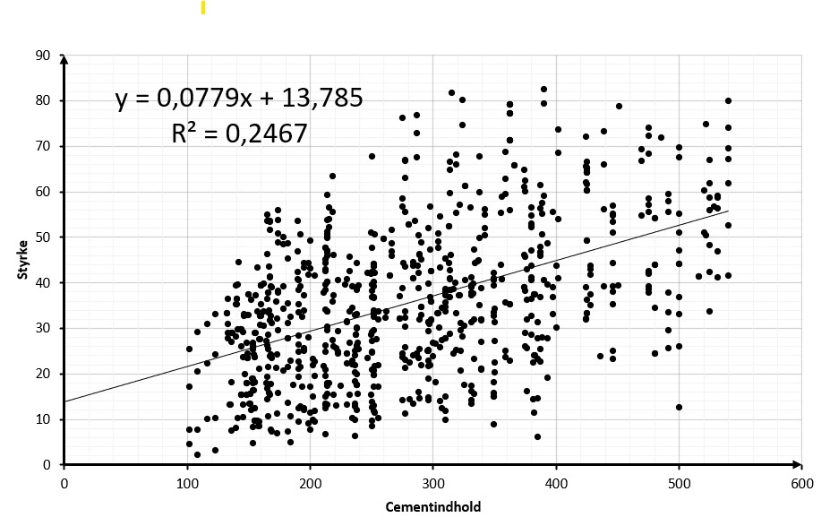{width=70% fig-align='center'}

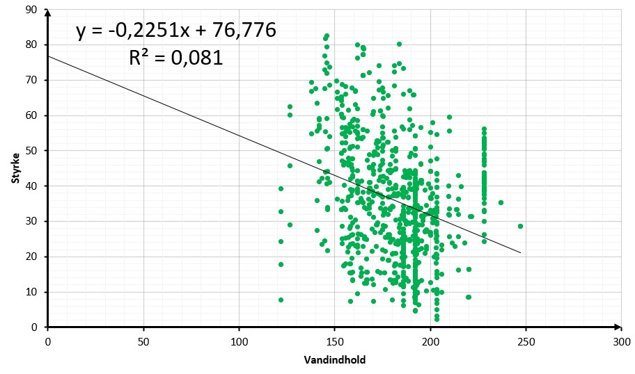{width=70% fig-align='center'}

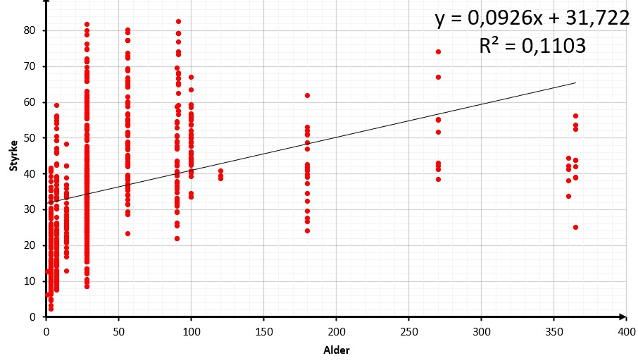{width=70% fig-align='center'}

:::

::: {.callout-note collapse="true" appearance="minimal"}  
### Facit til opgave 2

.jpg){width=70% fig-align='center'}

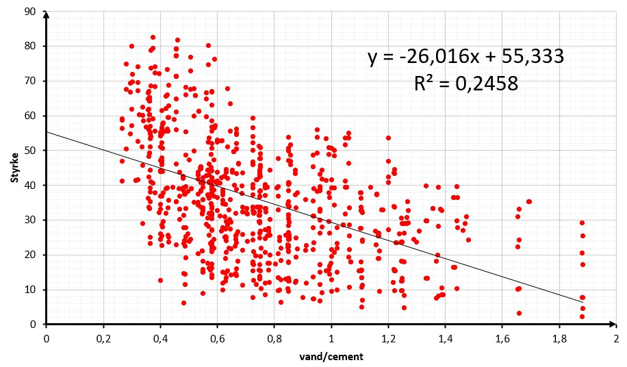{width=70% fig-align='center'}

:::

::: {.callout-note collapse="true" appearance="minimal"}  
### Facit til opgave 3

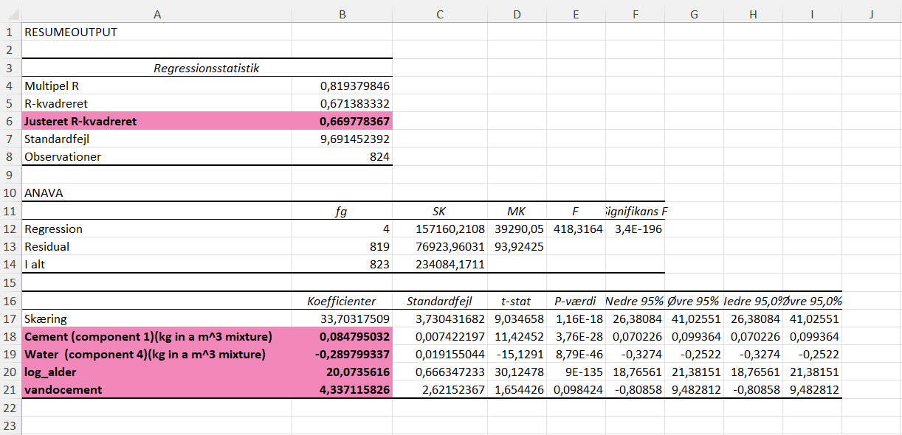{width=90% fig-align='center'}

+ For cement gælder, at hvis man øger mængden med $1 \textrm{ kg}/\textrm{m}^3$, så øges styrken med ca. $0.08$ MPa. 

+ For vand gælder, at hvis man øger mængden med $1 \textrm{ kg}/\textrm{m}^3$, så falder styrken med ca. $0.29$ MPa.

+ For alder gælder, at når $\log(\textrm{alder})$ øges med $1$, så øges styrken med ca. $20$ MPa.

+ For forholdet $\frac{\textrm{vand}}{\textrm{cement}}$ gælder, at hvis forholdet øges med $1$, så øges styrken med ca. $4.3$ MPa.

:::

::: {.callout-note collapse="true" appearance="minimal"}  
### Facit til opgave 4

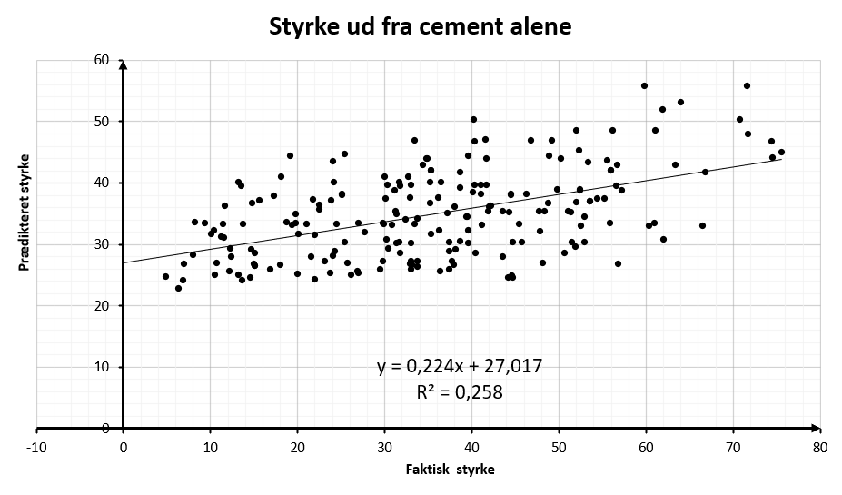{width=70% fig-align='center'}

+ Hvis modellen var perfekt, ville alle punkterne have samme værdi i begge koordinater og derfor ligge på den rette linje med ligning $y=x$.

:::

::: {.callout-note collapse="true" appearance="minimal"}  
### Facit til opgave 5

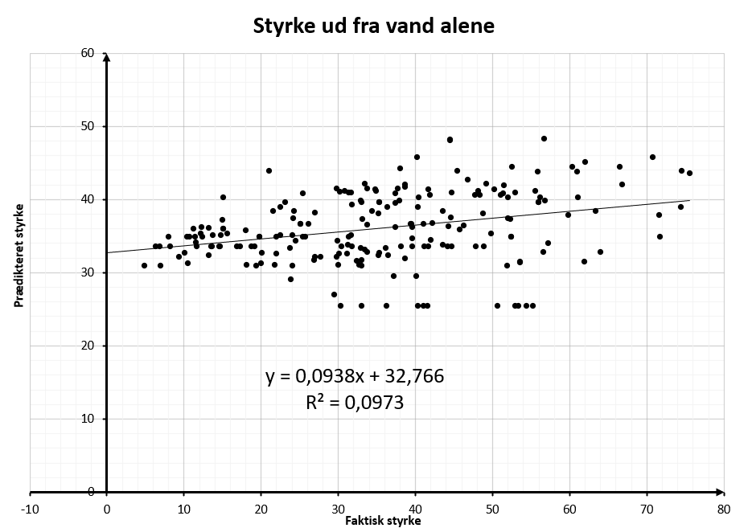{width=70% fig-align='center'}

 y-y plot.png){width=70% fig-align='center'}

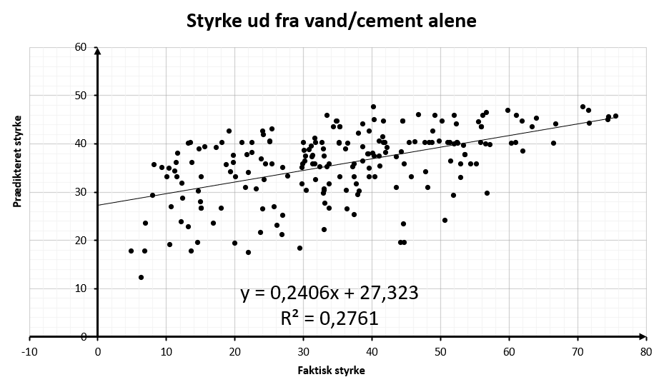{width=70% fig-align='center'}

:::

::: {.callout-note collapse="true" appearance="minimal"}  
### Facit til opgave 6

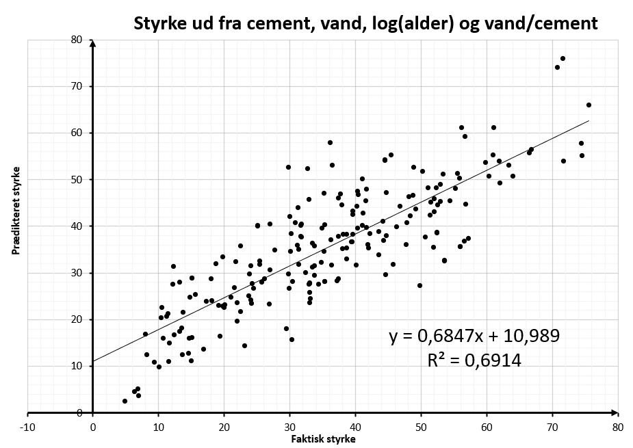{width=70% fig-align='center'}

:::

::: {.callout-note collapse="true" appearance="minimal"}  
### Facit til opgave 7

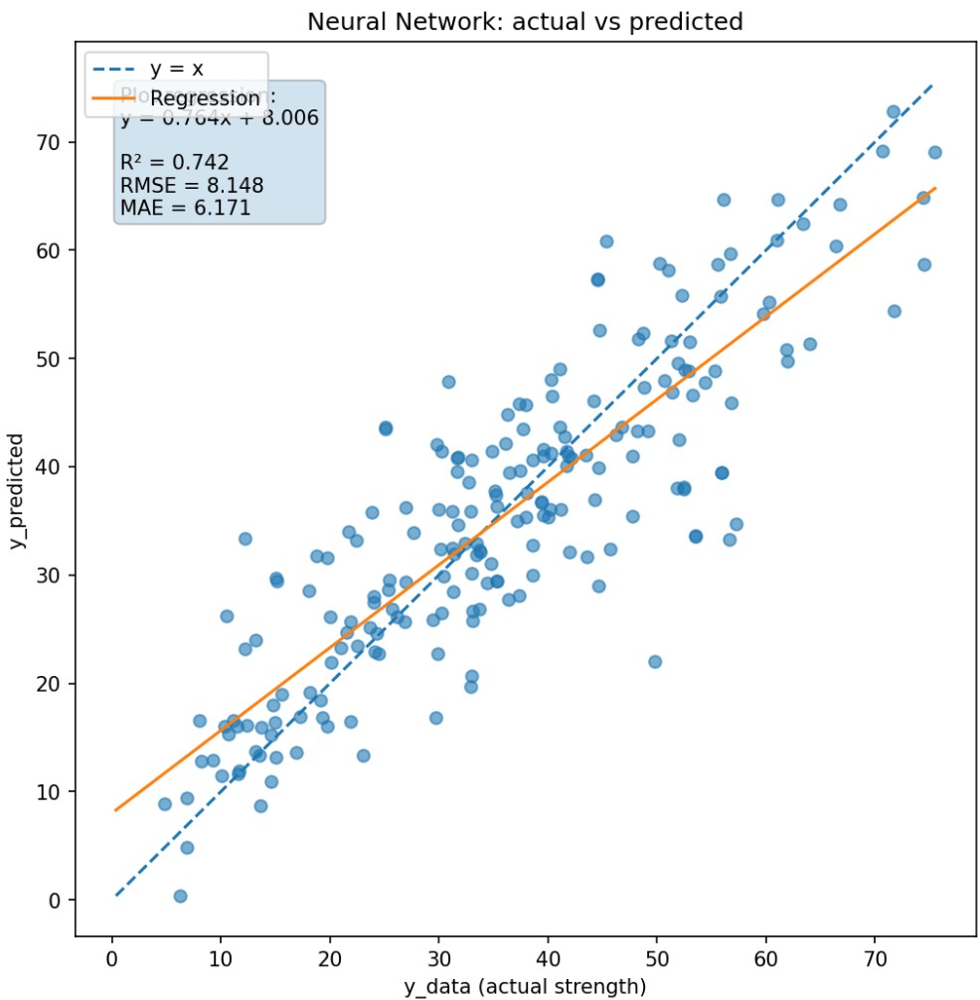{width=70% fig-align='center'}

:::

::: {.callout-note collapse="true" appearance="minimal"}  
### Facit til opgave 8

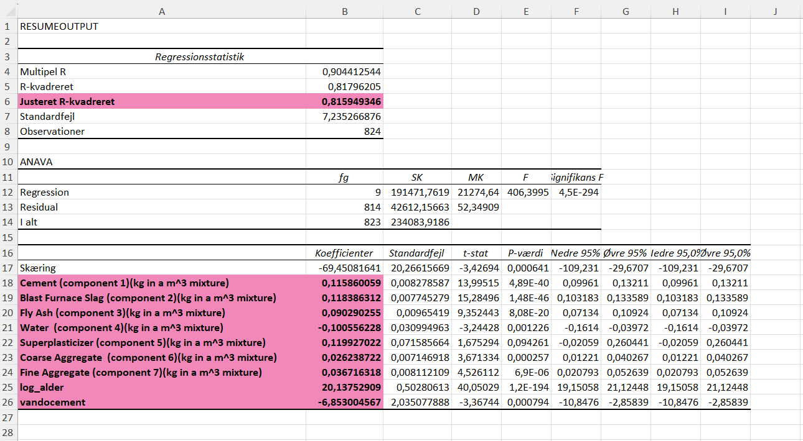{width=90% fig-align='center'}

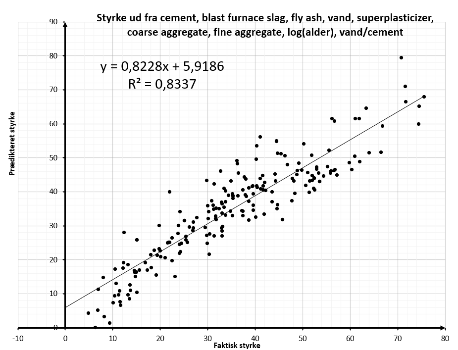{width=70% fig-align='center'}

:::

::: {.callout-note collapse="true" appearance="minimal"}  
### Facit til opgave 9

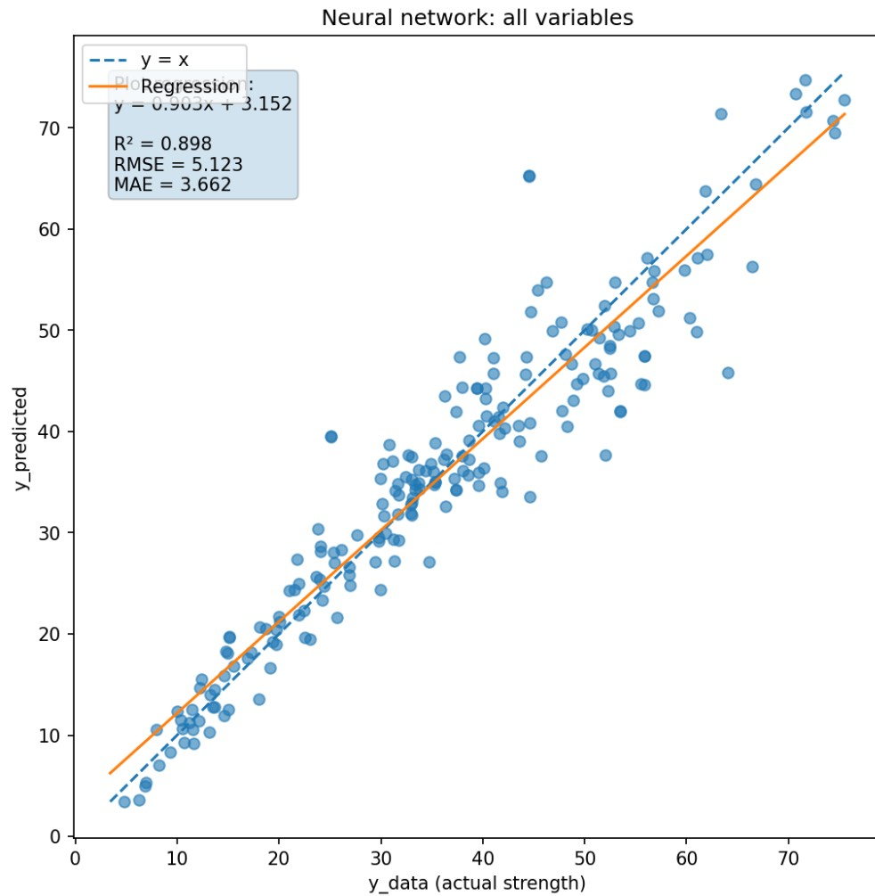{width=70% fig-align='center'}

:::