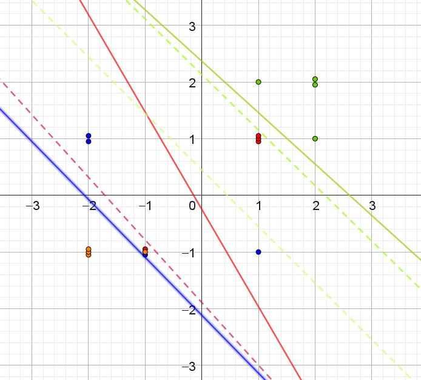

::: {.callout-note collapse="true" appearance="minimal"}  
### Facit til opgave 1

Bella
| Parti | Score | $e^\mathrm{score}$ | Sandsynlighed |
|-------|:---------------------------|:-----------:|:-----------:|
| S | $1$ | $2.72$ | $0.665$ |
| E | $-1$ | $0.37$ | $0.245$ |
| V | $0$ | $1$ | $0.090$ |
Uheldigt, da hun faktisk stemmer på E.

Charlie
| Parti | Score | $e^\mathrm{score}$ | Sandsynlighed |
|-------|:---------------------------|:-----------:|:-----------:|
| S | $1$ | $2.72$ | $0.665$ |
| E | $-1$ | $0.37$ | $0.245$ |
| V | $0$ | $1$ | $0.090$ |
Uheldigt, da han faktisk stemmer på E.

Doresa
| Parti | Score | $e^\mathrm{score}$ | Sandsynlighed |
|-------|:---------------------------|:-----------:|:-----------:|
| S | $-1$ | $0.37$ | $0.245$ |
| E | $1$ | $2.72$ | $0.665$ |
| V | $0$ | $1$ | $0.090$ |
Uheldigt, da hun faktisk stemmer på V.

:::

::: {.callout-note collapse="true" appearance="minimal"}  
### Facit til opgave 2
$v_1 = 6$ gør det ønskede. 

Doresa
| Parti | Score | $e^\mathrm{score}$ | Sandsynlighed |
|-------|:---------------------------|:-----------:|:-----------:|
| S | $-1$ | $0.37$ | $0.000$ |
| E | $1$ | $2.72$ | $0.002$ |
| V | $6$ | $403,43$ | $0.998$ |

:::

::: {.callout-note collapse="true" appearance="minimal"}  
### Facit til opgave 3
$3 < e_0 < 6$, så f.eks. $e_0 = 4.5$

:::

::: {.callout-note collapse="true" appearance="minimal"}  
### Facit til opgave 5
En mulig løsning er, at "flytte" nogle af punkterne meget lidt, hvor de ligger oveni hinanden. F.eks. kan man ændre $1$ til $1.05$. Så bliver punkterne synlige, men ligger stadig næsten samme sted.

{#fig-data_test}

:::

::: {.callout-note collapse="true" appearance="minimal"}  
### Facit til opgave 6
En mulig løsning er, at "flytte" nogle af punkterne meget lidt, hvor de ligger oveni hinanden. F.eks. kan man ændre $1$ til $1.05$. Så bliver punkterne synlige, men ligger stadig næsten samme sted.

:::

::: {.callout-note collapse="true" appearance="minimal"}  
### Facit til opgave 8
Med 4 partier er der $K(4, 2) = 6$ par, så der skal være 5 linjer mere, så det bliver 6 ialt.

:::

::: {.callout-note collapse="true" appearance="minimal"}  
### Facit til opgave 9
Linjerne mellem Enhedslisten og Socialdemokratiet, mellem Socialdemokratiet og Venstre og mellem Venstre og Danmarksdemokraterne er linjer, hvor de to partier er lige sandsynlige, og ingen er mere sandsynlige.

De tre øvrige linjer er mellem partier, som godt nok er lige sandsynlige, men hvor et tredje parti er mere sandsynligt. Disse linjer er tegnet stiplede.

:::

::: {.callout-note collapse="true" appearance="minimal"}  
### Facit til opgave 10
Punktet er i ca. $(2.7, -4.9)$. Så det ligger udenfor det område, hvor der er mulige svar. Det ville svare til ("Rigtigt meget enig" , "Virkeligt ekstremt meget uenig").

Vægtene for D, S og V er ens, ca. $7.2$. Vægten for E er ca. -21.5.
Sandsynlighederne for D, S og V er derfor ca. $33.3%$ til hver, og ca. $0.0$ til E.

:::

::: {.callout-note collapse="true" appearance="minimal"}  
### Facit til opgave 11
Der er 12 bias og 288 vægte.
:::

::: {.callout-note collapse="true" appearance="minimal"}  
### Facit til opgave 12
Du bør kunne få klassifikationsnøjagtigheden op omkring $93%$, så modellen er korrekt for flere end 800 af politikerne.

Det tyder på, at politikere i samme parti er rimeligt enige, mens politikerne fra forskellige partier også giver forskellige svar.
:::

::: {.callout-note collapse="true" appearance="minimal"}  
### Facit til opgave 12
Klassifikationsnøjagtigheden falder til ca. 78%.

Det giver et mere realistisk bud på, hvor god modellen vil være til at forudsige parti fornuftig for nye personers svar. 
:::
