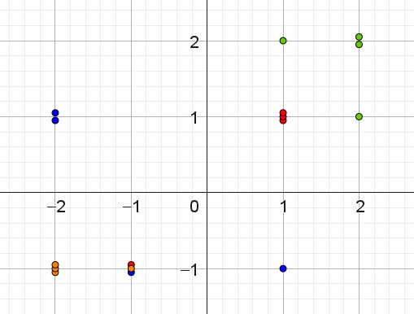

::: {.callout-note collapse="true" appearance="minimal"}  
### Facit til opgave 1

[Bella]{.fremhaev_underline}

| Parti | Score | $\mathrm{e}^{\textrm{score}}$ | Sandsynlighed |
|:---:|:---:|:---:|:---:|
| **V** | $1$ | $2.72$ | $66.5 \%$ |
| **S** | $-1$ | $0.37$ | $9.00 \%$ |
| **E** | $0$ | $1$ | $24.5 \%$ |
: {.bordered}

Uheldigt, da hun faktisk stemmer på **S**.

\
\

[Charlie]{.fremhaev_underline}

| Parti | Score | $\mathrm{e}^{\textrm{score}}$ | Sandsynlighed |
|:---:|:---:|:---:|:---:|
| **V** | $1$ | $2.72$ | $66.5 \%$ |
| **S** | $-1$ | $0.37$ | $9.00 \%$ |
| **E** | $0$ | $1$ | $24.5 \%$ |
: {.bordered}

Uheldigt, da han faktisk stemmer på **S**.

\
\

[Doresa]{.fremhaev_underline}

| Parti | Score | $\mathrm{e}^{\textrm{score}}$ | Sandsynlighed |
|:---:|:---:|:---:|:---:|
| **V** | $-1$ | $0.37$ | $9.00 \%$ |
| **S** | $1$ | $2.72$ | $66.5 \%$ |
| **E** | $0$ | $1$ | $24.5 \%$ |
: {.bordered}

Uheldigt, da hun faktisk stemmer på **E**.

:::

::: {.callout-note collapse="true" appearance="minimal"}  
### Facit til opgave 2
$e_1 = 6$ gør det ønskede. 

[Doresa]{.fremhaev_underline}

| Parti | Score | $\mathrm{e}^{\textrm{score}}$ | Sandsynlighed |
|:---:|:---:|:---:|:---:|
| **V** | $-3$ | $0.05$ | $0.01 \%$ |
| **S** | $1$ | $2.72$ | $0.67 \%$ |
| **E** | $6$ | $403.43$ | $99.32 \%$ |
: {.bordered}

:::

::: {.callout-note collapse="true" appearance="minimal"}  
### Facit til opgave 3
$4 < s_0 < 5$, så for eksempel $s_0 = 4.5$.

:::

::: {.callout-note collapse="true" appearance="minimal"}  
### Facit til opgave 5
En mulig løsning er, at \"flytte\" nogle af punkterne meget lidt, hvor de ligger oveni hinanden. For eksempel kan man ændre $1$ til $1.05$. Så bliver punkterne synlige, men ligger stadig næsten samme sted.

{#fig-data_test}

:::

::: {.callout-note collapse="true" appearance="minimal"}  
### Facit til opgave 6
En mulig løsning er, at \"flytte\" nogle af punkterne meget lidt, hvor de ligger oveni hinanden. For eksempel kan man ændre $1$ til $1.05$. Så bliver punkterne synlige, men ligger stadig næsten samme sted.

:::

::: {.callout-note collapse="true" appearance="minimal"}  
### Facit til opgave 8
Med fire partier er der $K(4, 2) = 6$ par, så der skal være fem linjer mere, så det bliver seks i alt.

:::

::: {.callout-note collapse="true" appearance="minimal"}  
### Facit til opgave 9
Linjerne mellem Enhedslisten & Socialdemokratiet, mellem Socialdemokratiet & Venstre og mellem Venstre & Danmarksdemokraterne er linjer, hvor de to partier er lige sandsynlige, og ingen er mere sandsynlige.

De tre øvrige linjer er mellem partier, som godt nok er lige sandsynlige, men hvor et tredje parti er mere sandsynligt. Disse linjer er tegnet stiplede i nedenstående:

:::

::: {.callout-note collapse="true" appearance="minimal"}  
### Facit til opgave 10
Punktet er i cirka $(2.7, -4.9)$. Så det ligger udenfor det område, hvor der er mulige svar. Det ville svare til (\"Rigtigt meget enig\" , \"Virkeligt ekstremt meget uenig\").

Vægtene for D, **S** og **V** er ens, cirka $7.2$. Vægten for **E** er cirka $-21.5$.
Sandsynlighederne for D, **S** og **V** er derfor cirka $33.3 \%$ til hver, og cirka $0.0$ til E.

:::

::: {.callout-note collapse="true" appearance="minimal"}  
### Facit til opgave 11
Der er $12$ bias og $288$ vægte.
:::

::: {.callout-note collapse="true" appearance="minimal"}  
### Facit til opgave 12
Du bør kunne få klassifikationsnøjagtigheden op omkring $93 \%$, så modellen er korrekt for flere end $800$ af politikerne.

Det tyder på, at politikere i samme parti er rimeligt enige, mens politikerne fra forskellige partier også giver forskellige svar.
:::

::: {.callout-note collapse="true" appearance="minimal"}  
### Facit til opgave 13
Klassifikationsnøjagtigheden falder til cirka $78 \%$.

Det giver et mere realistisk bud på, hvor god modellen vil være til at forudsige partier fornuftigt for nye personers svar. 
:::
