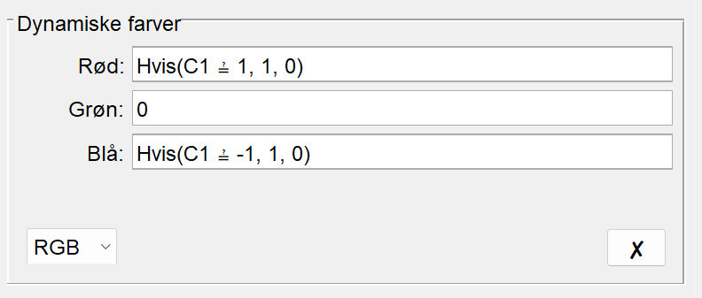
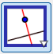

```{r include=FALSE}
rgl::setupKnitr(autoprint = TRUE)
options(rgl.useNULL = TRUE)
```


::: {.callout-caution collapse="true" appearance="minimal"}
### Forudsætninger og tidsforbrug
Forløbet kræver kendskab til:

+ Linjens ligning på formen $a \cdot x+b \cdot y+c=0$.
+ Afstand fra punkt til linje i planen: $$\textrm{dist}(P,l) = \frac{|a \cdot x_0 + b \cdot y_0 + c|}{\sqrt{a^2+b^2}} $$
+ Cirklen ligning i planen på formen $(x-a)^2+(y-b)^2=r^2$.
+ Planens ligning i rummet på formen $a \cdot x+b \cdot y+c \cdot z+d=0$.
+ Afstand fra punkt til plan i rummet: $$\textrm{dist}(P,\alpha) = \frac{|a \cdot x_0 + b \cdot y_0 + c \cdot z_0 +d|}{\sqrt{a^2+b^2+c^2}}
$$

**Tidsforbrug:** Ca. 3 x 90 minutter.

:::

::: {.purpose}

### Formål

Formålet med dette forløb er at stifte bekendtskab med den AI metode, som kaldes for **Support Vector Machines**. Samtidig er det en oplagt mulighed for at se noget af teorien fra analytisk plan- og rumgeometri anvendt i praksis.

:::

## Klassifikation ved hjælp af rette linjer

Start med at læse afsnittet [Klassifikation ved hjælp af rette linjer](../noter/SVM/SVM.qmd#klassifikation-ved-hjælp-af-rette-linjer){target="_blank"} i noten om [Support Vector Machines](../noter/SVM/SVM.qmd){target="_blank"}.

I de følgende opgaver skal vi bruge dette datasæt med seks fiktive patienter:

| Patient | $x_1$ | $x_2$ | $t$  |
|:-------:|:-----:|:-----:|:----:|
|    1    |  $0$  |  $3$  | $-1$ |
|    2    |  $0$  |  $2$  | $1$  |
|    3    |  $1$  |  $1$  | $1$  |
|    4    |  $3$  | $0.5$ | $1$  |
|    5    |  $2$  |  $3$  | $-1$ |
|    6    |  $3$  | $1.5$ | $-1$ |

: {.bordered}

Her er $t$ vores **target**, som angiver om en given medicin har effekt:

$$
t = 
\begin{cases}
1 & \textrm{hvis medicinen har effekt} \\
-1 & \textrm{hvis medicinen ikke har effekt}
\end{cases}
$$
mens $x_1$ og $x_2$ er vores **features** eller **inputvariable**, som vi forestiller os angiver to biologiske markører, som lægen har målt på patienterne.

::: {.callout-note collapse="false" appearance="minimal"}
### Opgave 1: Træningsdata

-   Indtegn punkterne $\big(x_{1}^{(i)},x_{2}^{(i)}\big)$ for $i=1,\ldots,6$ fra datasættet i tabellen ovenfor i et koordinatsystem, og farv dem alt efter, hvilken klasse de tilhører (hvis $t=1$ kan du for eksempel farve punktet rødt og blåt ellers).

<details>
<summary> Sådan gør du i GeoGebra </summary>

* Indskriv data i et regneark i GeoGebra.

* Stil dig i celle `D1` og skriv `=(A1,B1)` (du skulle nu gerne kunne se det første punkt i tegneblokken).

* Stil dig igen i celle `D1`, højreklik og vælg \"Egenskaber\". Fjern fluebenet ved \"Vis navn\". 

* Stil dig i celle `D1`, højreklik og vælg \"Egenskaber\". Vælg herefter fanen \"Avanceret\". 

* I det felt, hvor der står \"Rød\", skriver du `If(C1==1,1,0)`. 

* I det felt, hvor der står \"Grøn\", skriver du `0`. 

* I det felt, hvor der står \"Blå\", skriver du `If(C1==-1,1,0)`. 

Det kommer til at se sådan her ud (hvis du har GeoGebra på dansk bliver \"If\" lavet om til \"Hvis\"):

{width=60% fig-align="center"}

* Marker celle `D1` og tag ved den lille kasse i nederste hjørne af celle `D1` og trække ned, så du får udfyldt kolonne `D` for hele datasættet. Alle punkterne skulle nu gerne være farvet som ønsket.

</details>

- Find ved at kigge på din tegning en linje, der adskiller de to klasser. Skriv for eksempel i inputfeltet `y=a*x+b` og GeoGebra vil oprette skydere for $a$ og $b$, så kan du prøve dig lidt frem. Notér ligningen for den linje, du finder.


:::

## Support Vector Machines algoritmen

Læs afsnittet [Support Vector Machines algoritmen](../noter/SVM/SVM.qmd#support-vector-machines-algoritmen){target="_blank"} *indtil* beviset for sætning 1.


::: {.callout-note collapse="false" appearance="minimal"}
### Opgave 2: Beregn margin til linje

Vi skal nu for alle punkterne have beregnet afstanden ind til linjen. Vi gør det i GeoGebra:

* Find den vinkelrette afstand fra hvert punkt til linjen.

<details>
<summary> Sådan gør du i GeoGebra </summary>

* Vælg værktøjet \"Vinkelret linje\" ({width=1.2em}).

* Tryk på et af punkterne og linjen, som du har indtegnet. Gentag for alle punkterne.

* Find skæringspunkterne mellem linjen og alle de vinkelrette linjer. Brug \"Skæringsværktøj\".

* Skjul alle de vinkelrette linjer (men du må ikke slette dem).

* Vælg værktøjet \"Linjestykke\" ({width=1.2em}) og brug det til at indtegne linjestykker fra punkterne og vinkelret ind på linjen (det kan være en fordel at zoome godt ind). Prøv at ændre på linjen ved hjælp af skyderne, og du kan se, at linjestykkerne følger med.

</details>

:::


Vi skal nu bruge idéen bag Support Vector Machines:

::: {.highlight .centertext}
**Support vector machines vælger den linje, der har størst mulig afstand til den nærmeste observation.**
:::

::: {.callout-note collapse="false" appearance="minimal"}
### Opgave 3: Størst mulig afstand

Brug den figur, som du har konstrueret i opgave 2.

* Find ved hjælp af skyderne den linje, der har størst mulig afstand til den nærmeste observation. Bestem en ligning for linjen på formen $ax_1+bx_2 +c=0$.

:::

Den næste opgave er beviset for sætning 1 -- det er din lærer, som bestemmer, om I skal arbejde med det!

::: {#thm-fortegn}
Hvis $az_1 + bz_2 + c>0$, så ligger punktet $P = (z_1,z_2)$ på den side af linjen, som $\vec{n} = \begin{pmatrix} a\\ b \end{pmatrix}$ peger mod, og hvis $az_1 + bz_2 + c<0$, så ligger punktet på modsat side.
:::

::: {.callout-note collapse="false" appearance="minimal"}
### Opgave 4: Bevis for sætning 1


Lad $P_0=(w_1,w_2)$ være et punkt på linjen $l$  med ligning $ax_1 + bx_2 + c = 0$. 

* Tegn en figur, som viser en ret linje $l$ og et punkt $P_0$, som ligger på linjen.

* Da punktet ligger på linjen, passer punktets koordinater i linjens ligning. Opskriv den ligning du får ved at udnytte dette.

Vi ser nu på punktet $P=(z_1,z_2)$ (som ikke ligger på linjen), og vi vil gerne undersøge, hvilket fortegn $az_1 + bz_2 + c$ har. 

* Indtegn punktet $P$ på din figur (og sørg for at tegne det, så det ikke ligger på linjen).

* Du har lige opskrevet et udtryk, som giver $0$. Træk det derfor fra $az_1 + bz_2 + c$.

* Reducér og sæt henholdsvis $a$ og $b$ uden for hver sin parentes.

* Indse, at det du lige har skrevet, kan skrives som et prikprodukt mellem to vektorer. Opskriv dette prikprodukt.

Du skulle nu gerne være kommet frem til, at

$$
az_1 + bz_2 + c=\vec{n} \cdot \overrightarrow{P_0P}
$$ {#eq-skalarprodukt}

* På din figur, skal du nu med udgangspunkt i $P_0$ tegne en repræsentant for $\vec{n}$ (husk, at den står vinkelret på linjen) og $\overrightarrow{P_0P}$.

* Omskriv højreside i (@eq-skalarprodukt) ved at bruge formlen for prikproduktet:

   $$
   \vec a \cdot \vec b = |\vec a|\cdot |\vec b| \cdot \cos(v)
   $$ 
   
   hvor $v$ er vinklen mellem de to vektorer $\vec a$ og $\vec b$ (som ligger i intervallet $[0^\circ, 180^\circ]$).

* Indtegn vinklen $v$ mellem $\vec{n}$ og $\overrightarrow{P_0P}$ på din figur.

Der er nu to muligheder (og én af dem passer med din figur):

[Mulighed 1]{.fremhaev_underline}

Antag, at $az_1 + bz_2 +c>0$. 

* Se på det udtryk for $az_1 + bz_2 +c>0$, som du lige har opstillet. Husk på, at længden af en ikke-nulvektor altid er positiv. Hvad kan du sige, om fortegnet på $\cos(v)$?

* Hvilket interval er vinklen $v$ da nødt til at ligge i?

* Hvordan ligger vektorerne $\vec{n}$ og $\overrightarrow{P_0P}$ i forhold til hinanden?

* På hvilken side af linjen ligger punktet $P$ i forhold til $\vec n$?

[Mulighed 2]{.fremhaev_underline}

Antag, at $az_1 + bz_2 +c<0$.

* Gør som ovenfor. På hvilken side af linjen ligger punktet $P$ nu i forhold til $\vec n$?

* Hvilken af mulighederne passer med din figur?


:::

::: {.callout-note collapse="false" appearance="minimal"}
### Opgave 5: Brug af sætningen

-   Indtegn linjen $2x_1-x_2 +1=0$ i et koordinatsystem.

-   Find en normalvektor til linjen og indtegn den i koordinatsystemet.

-   På hvilken side af linjen er $2x_1-x_2 +1>0$ og på hvilken side er $2x_1-x_2 +1<0$?

:::

::: {.callout-note collapse="false" appearance="minimal"}
### Opgave 6: Tilbage til datasættet

Brug dit resultat fra opgave 3.

-   På hvilken side af linjen er $ax_1+bx_2+c>0$ og på hvilken side er $ax_1+bx_2+c<0$?

-   Hvilke punkter er supportvektorer?

-   En ny patient har fået målt $(x_1,x_2)=(1,3)$. Kan lægemidlet forventes at have en effekt på patienten?

:::

## Løsning med Excel

Læs resten af afsnittet [Support Vector Machines algoritmen](../noter/SVM/SVM.qmd#support-vector-machines-algoritmen){target="_blank"} (efter beviset for sætning 1) samt afsnittet [Løsning med Excel](../noter/SVM/SVM.qmd#løsning-med-excel){target="_blank"}.

Vi minder om det optimeringsproblem, som vi skal løse:

::: {.highlight}

[Support Vector Machine i planen -- optimeringsproblem]{.fremhaev_underline}

Find $a,b,c\in \mathbb{R}$ og $M>0$, der maksimerer $M$ under betingelserne 

$$
t^{(i)} \cdot \big(ax_{1}^{(i)} + bx_{2}^{(i)} + c\big)\geq  M
$$ {#eq-c} 

og 

$$
a^2+b^2=1
$$ {#eq-ab}

:::


::: {.callout-note collapse="false" appearance="minimal"}
### Opgave 7: Løsning i Excel

Brug igen datasættet fra de foregående opgaver og gense eventuelt [videoen](https://youtu.be/B-Gy9upBChw?si=I-qkNuCRo2hi0b4z){target="_blank"}. 

-   Find den optimale skillelinje ved hjælp af Excel og opskriv linjens ligning.

-   Indtegn linjen fra Excel i samme koordinatsystem som linjen fra opgave 3. Havde du gættet rigtigt?

-   Sammenlign linjens ligning med resultatet fra opgave 3 (det er en god ide at gange med $\sqrt{5}$ på begge sider i ligningen fra Excel for at gøre det nemmere at sammenligne).


:::


::: {.callout-note collapse="false" appearance="minimal"}
### Opgave 8: Problemer med algoritmen

* Prøv at finde den optimale linje for nedenstående datasæt (som er plottet i @fig-slack) ved hjælp af Excel. Hvad tror du, der går galt?


* Læs afsnittet [Problemer med algoritmen](../noter/SVM/SVM.qmd#problemer-med-algoritmen){target="_blank"}.


:::

Nedenstående datasæt er plottet i @fig-slack og skal bruges i opgave 8.

| Observation | $x_1$  | $x_2$  | $t$  |
|:-----------:|:------:|:------:|:----:|
|      1      | $-0.6$ | $0.3$  | $1$  |
|      2      | $0.2$  | $-0.5$ | $-1$ |
|      3      | $-0.8$ |  $1$   | $-1$ |
|      4      | $-0.2$ | $-0.2$ | $-1$ |
|      5      | $0.8$  | $0.8$  | $1$  |
|      6      | $0.9$  | $1.5$  | $1$  |
|      7      | $1.5$  | $0.7$  | $1$  |
|      8      | $1.4$  | $1.2$  | $-1$ |
|      9      | $0.2$  | $0.2$  | $-1$ |

: {.bordered}

```{tikz fig.width=4, fig.height=4}
#| echo: false
#| label: fig-slack
#| fig-cap: Plot af datasættet som skal bruges i opgave 8.
\definecolor{myblue}{HTML}{8086F2}
\definecolor{myred}{HTML}{F288B9}
\definecolor{myyellow}{HTML}{F2B33D}    
\begin{tikzpicture}
        \draw[->] (-1,0) -- (2,0);
        \draw[->] (0,-1) -- (0,2);
        %\draw[] (-1,2) -- (2,-1);
        
        \draw[fill,myblue] (0.2,0.2) circle (0.05);
        \draw[fill, myred] (-0.6, 0.3) circle (0.05);
        \draw[fill,myblue] (0.2,-0.5) circle (0.05);
        \draw[fill,myblue] (-0.8,1) circle (0.05);
        \draw[fill,myblue] (- 0.2,-0.2) circle (0.05);
        \draw[fill,myred] (0.8,0.8) circle (0.05);
        \draw[fill,myred] (0.9,1.5) circle (0.05);
        \draw[fill,myred] (1.5,0.7) circle (0.05);
        \draw[fill,myblue] (1.4,1.2) circle (0.05);
    \end{tikzpicture}
```


## Skillelinje med blød margin

Læs afsnittet [Skillelinje med blød margin](../noter/SVM/SVM.qmd#skillelinje-med-blød-margin){target="_blank"}.


::: {.callout-note collapse="false" appearance="minimal"}
### Opgave 9: Skillelinje med blød margin


Brug nedenstående datasæt. Lad os sige, at vi vil lave en skillelinje mellem klasserne med ligningen $x_2-1=0$ og en blød margin med $M=1$.

-   Tegn punkterne, skillelinjen og dens margin ind i et koordinatsystem.

-   Hvilke punkter er supportvektorer?

-   Find for hvert punkt $i$ afstanden fra punktet til linjen.

-   Beregn værdien af $\varepsilon_i$ for hvert punkt.


:::


Nedenstående datasæt skal bruges i opgave 9.

| Observation | $x_1$  | $x_2$  | $t$  |
|:-----------:|:------:|:------:|:----:|
|      1      |  $1$   | $2.5$  | $1$  |
|      2      |  $-1$  | $0.3$  | $-1$ |
|      3      |  $3$   |  $0$   | $-1$ |
|      4      | $1.5$  | $-0.4$ | $-1$ |
|      5      | $1.8$  | $0.7$  | $1$  |
|      6      | $-0.5$ |  $2$   | $1$  |
|      7      | $2.5$  |  $3$   | $1$  |

: {.bordered}


## Support vector machines i tre dimensioner

Læs afsnittet [Support vector machines i tre dimensioner](../noter/SVM/SVM.qmd#support-vector-machines-i-tre-dimensioner){target="_blank"}.

::: {.callout-note collapse="false" appearance="minimal"}
### Opgave 10: Klassifikation af punkter i rummet

Antag, at vi klassificerer effekten af et lægemiddel efter fortegnet på 

$$
2x_1 + x_2 - x_3+1
$$

- En patient får målt $(x_1,x_2,x_3)=(1,3,0)$. Forventes lægemidlet at have en effekt?

- Ville man forvente en effekt, hvis målingen var $(x_1,x_2,x_3)=(2,0,3)$?

- Bestem afstanden fra hvert af punkterne $(1,3,0)$ og $(2,0,2)$ til planen med ligning 

   $$
   2x_1 + x_2 - x_3+1=0,
   $$

   der adskiller klasserne.

- For hvilket af de to punkter er vi mest sikker på klassifikationen?

:::

Husk på, at det optimeringsproblem vi skal løse, når punkterne ligger i rummet er:

::: {.highlight}

[Support Vector Machine i rummet -- optimeringsproblem med hård margin]{.fremhaev_underline}

Find $a,b,c,d\in \mathbb{R}$ og $M>0$, der maksimerer $M$ under betingelserne 

$$
{t^{(i)} \cdot \big(ax_{1}^{(i)} + bx_{2}^{(i)} +cx_{3}^{(i)} + d \big)}\geq  M\qquad \text{ for alle } i=1,\ldots,n
$$ {#eq-d}

og

$$
a^2+b^2+c^2=1
$$ {#eq-abc}

:::


::: {.callout-note collapse="false" appearance="minimal"}
### Opgave 11: Klassifikation af punkter i rummet

Nedenstående datasæt er brugt til at lave @fig-3D herunder og kan downloades [her](virker_medicinen/data_opgave11.xlsx).


- Løs optimeringsproblemet for at finde den bedste plan med hård margin i Excel. Det kan gøres lige som i [videoen](https://youtu.be/B-Gy9upBChw?si=I-qkNuCRo2hi0b4z){target="_blank"} ved at lave en ekstra søjle indeholdende værdierne af $x_3$ og tilføje en ekstra celle for den ukendte variabel $d$. Endelig skal formlerne i (@eq-d) og (@eq-abc) bruges i stedet for de tidligere anvendte formler.

:::


| Observation | $x_1$  |  $x_2$  | $x_3$  | $t$  |
|:-----------:|:------:|:------:|:------:|:------:|
|      1      | $0.5$ |  $1$  | $1$ |$1$ |
|      2      |  $1.5$  | $0$  | $0$ |$-1$ |
|      3      | $-1.5$  |   $0$   | $0$ | $1$ |
|      4      |  $-0.5$   | $-1$ | $-1$ |$-1$ |
|      5      |  $1.5$   | $-1.5$  | $-1.5$ | $-1$ |
|      6      |  $-0.8$   | $0.8$ | $0.8$ |$1$ |
|      7      | $0.5$ |  $0.5$  | $-1.5$ |$-1$ |
|      8      | $-0.5$ |  $1.5$  | $-0.5$ |$1$ |
|      9      | $0.5$  |   $-1.5$   | $0.5$ |$-1$  |
|     10      | $-0.5$ |  $-0.5$  | $1.5$ |$1$  |
 

: {.bordered}


```{r}
library(rgl)
```

```{r fig.width=4, fig.height=4}
#| echo: false
#| label: fig-3D
#| fig-cap: Punkter i tre dimensioner.

x1=c(0.5,1.5,-1.5,-0.5,1.5,-0.8,0.5,-0.5,0.5,-0.5)
x2=c(1,0,0,-1,-1.5,0.8,0.5,1.5,-1.5,-0.5)
x3= c(1,0,0,-1,-1.5,0.8,-1.5,-0.5,0.5,1.5) 
  y=c(1,-1,1,-1,-1,1,-1,1,-1,1)

spheres3d( 
  x=x1, y=x2, z=x3, 
  col = ifelse(y == 1,
               rgb(242, 136, 185, alpha = 0.6, maxColorValue = 255),
               rgb(128, 134, 242, alpha = 0.6, maxColorValue = 255)), 
  radius = .05, xlim=c(-2,2), ylim = c(-2,2), zlim=c(-2,2),       xlab=expression(x[1]), ylab=expression(x[2]),  zlab=expression(x[3]), depth_mask = FALSE)
box3d()
```

## Ikke-lineære support vector machines

Læs afsnittet [Ikke-lineære support vector machines](../noter/SVM/SVM.qmd#ikke-lineære-support-vector-machines){target="_blank"}.


::: {.callout-note collapse="false" appearance="minimal"}
### Opgave 12: Ikke-lineære support vector machines

Antag, at vi indlejrer punkterne $(x_1,x_2)$ i $\mathbb{R}^3$ som punkterne $(x_1,x_2,x_1^2 + x_2^2)$. Vi adskiller klasser i $\mathbb{R}^3$ med den vandrette plan $x_3-4=0$.

-   Redegør for, at det svarer til at adskille de oprindelige punkter i $\mathbb{R}^2$ med en cirkel. 

    *Hint! Indsæt punktet $(x_1,x_2,x_1^2 + x_2^2)$ i planens ligning.*

-   Hvad er centrum og radius for cirklen?

-   Hvilken af klasserne $1$ og $-1$ ligger inden for cirklen? 

    *Hint! Se på fortegnet for $x_3-4$ når punktet $(x_1,x_2,x_1^2 + x_2^2)$ indsættes.*

:::


::: {.callout-note collapse="false" appearance="minimal"}
### Opgave 13: Ikke-lineære support vector machines -- løsning i Excel

Nedenstående datasæt er brugt til at lave @fig-kurve herunder og kan downloades [her](virker_medicinen/data_opgave13.xlsx).


-   Løs optimeringsproblemet for at finde den bedste plan med hård margin  til at adskille klasserne i $\mathbb{R}^3$ ved hjælp af Excel. Det kan gøres lige som i [videoen](https://youtu.be/B-Gy9upBChw?si=I-qkNuCRo2hi0b4z){target="_blank"} ved at lave en ekstra søjle indeholdende værdierne af $x_3=x_1^2$ og tilføje en ekstra celle for den ukendte variabel $d$. Endelig skal formlerne i (@eq-d) og (@eq-abc) bruges, som du gjorde det i opgave 11.

- Find ligningen for den tilsvarende parabel, der adskiller klasserne i $\mathbb{R}^2$.


:::

| Observation | $x_1$  |  $x_2$  | $t$  |
|:-----------:|:------:|:-------:|:----:|
|      1      | $-1.5$ |  $0.5$  | $-1$ |
|      2      |  $-1$  | $1.25$  | $-1$ |
|      3      | $1.5$  |   $0$   | $-1$ |
|      4      |  $1$   | $-0.75$ | $-1$ |
|      5      |  $2$   | $1.25$  | $-1$ |
|      6      |  $0$   | $-0.75$ | $-1$ |
|      7      | $-1.4$ |  $1.5$  | $-1$ |
|      8      | $-0.8$ |  $0.2$  | $-1$ |
|      9      | $0.5$  |   $2$   | $1$  |
|     10      | $-0.5$ |  $1.5$  | $1$  |
|     11      | $1.5$  |  $1.5$  | $1$  |
|     12      | $0.1$  |  $0.7$  | $1$  |
|     13      | $0.3$  |  $1.7$  | $1$  |
|     14      | $0.5$  |  $0.5$  | $1$  |
|     15      | $0.9$  |  $1.2$  | $1$  |

: {.bordered}

```{tikz fig.width=4, fig.height=4}
#| echo: false
#| label: fig-kurve
#| fig-cap: Datasæt hvor det vil give mere mening at adskille klasserne med en blød kurve.
\definecolor{myblue}{HTML}{8086F2}
\definecolor{myred}{HTML}{F288B9}
\definecolor{myyellow}{HTML}{F2B33D}    
\begin{tikzpicture}
    \draw[->] (-2,0) -- (2,0);
    \node at (2,-0.35) {$x_1$};
    \draw[->] (0,-1) -- (0,2);
    \node at (-0.35,1.9) {$x_2$};
    %\draw[] (-1,2) -- (2,-1);
    
    \draw[fill,myblue] (-1.5,0.5) circle (0.05);
    \draw[fill,myblue] (-1,1.25) circle (0.05);
    \draw[fill,myblue] (1.5,0) circle (0.05);
    \draw[fill,myblue] (1,-0.75) circle (0.05);
    \draw[fill,myblue] (2,1.25) circle (0.05);
    \draw[fill,myblue] (0,-0.75) circle (0.05);
\draw[fill,myblue] (-1.4,1.5) circle (0.05);
    \draw[fill,myblue] (-0.8,0.2) circle (0.05);
    \draw[fill,myred] (0.5,2) circle (0.05);
    \draw[fill,myred] (-0.5,1.5) circle (0.05);
    \draw[fill,myred] (1.5,1.5) circle (0.05);
        \draw[fill,myred] (0.1,0.7) circle (0.05);
            \draw[fill,myred] (0.3,1.7) circle (0.05);
    \draw[fill,myred] (0.5,0.5) circle (0.05);
\draw[fill,myred] (0.9,1.2) circle (0.05);


\end{tikzpicture} 
```


## Delvis facitliste

[Facitliste](virker_medicinen/virker_medicinen_facit.qmd){target="_blank"}.