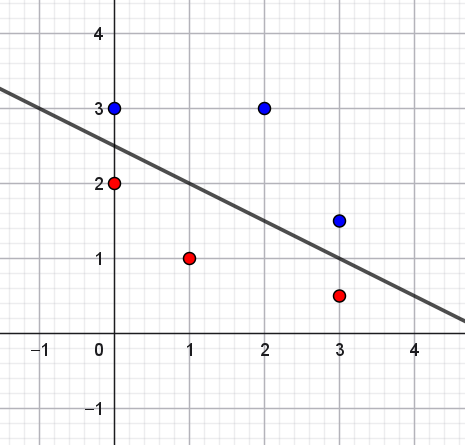
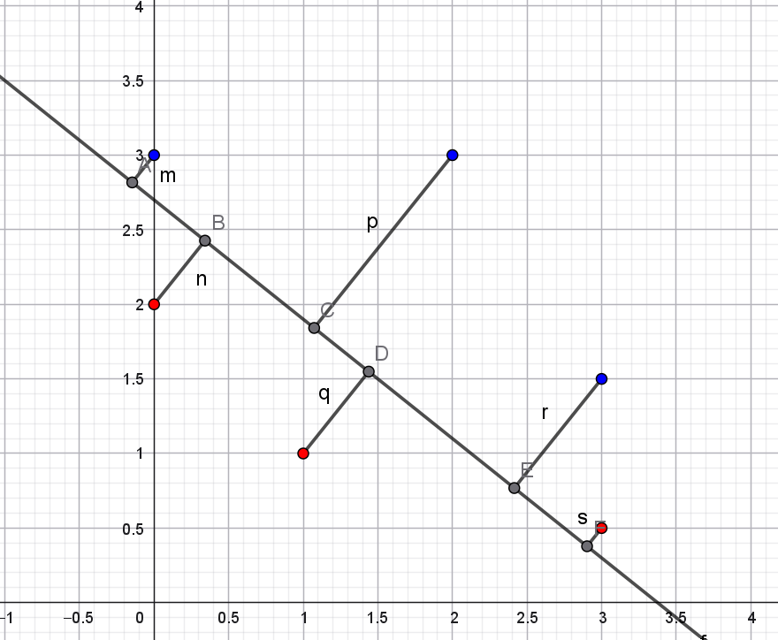
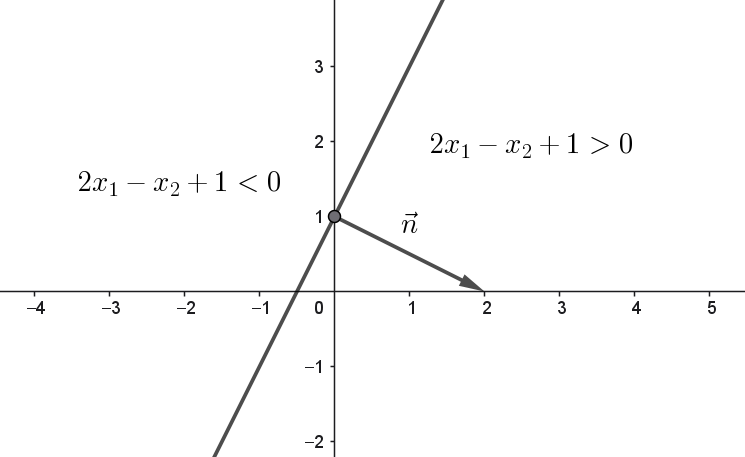
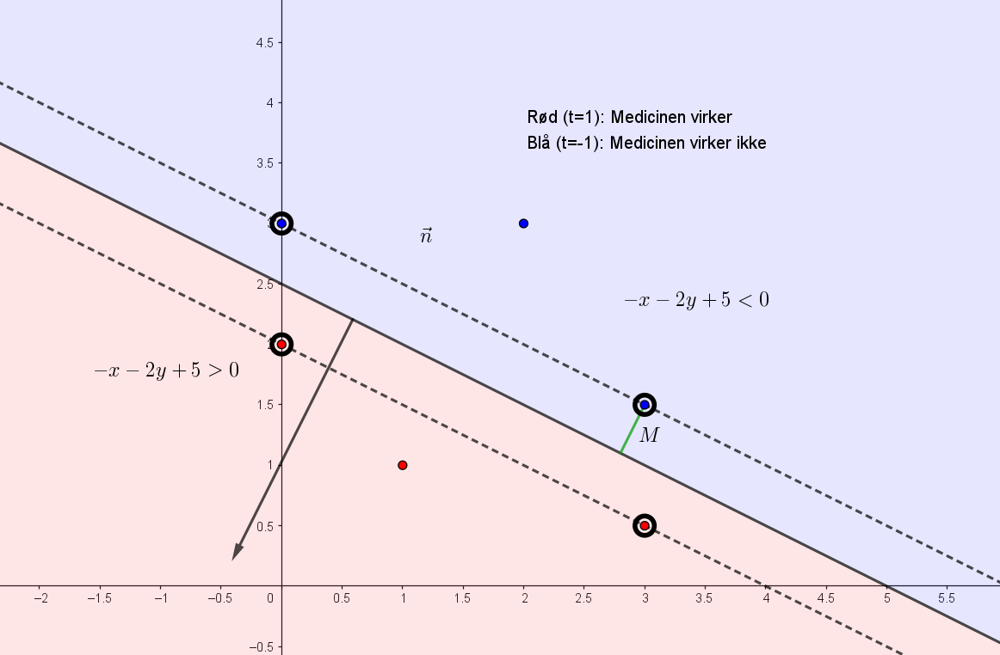
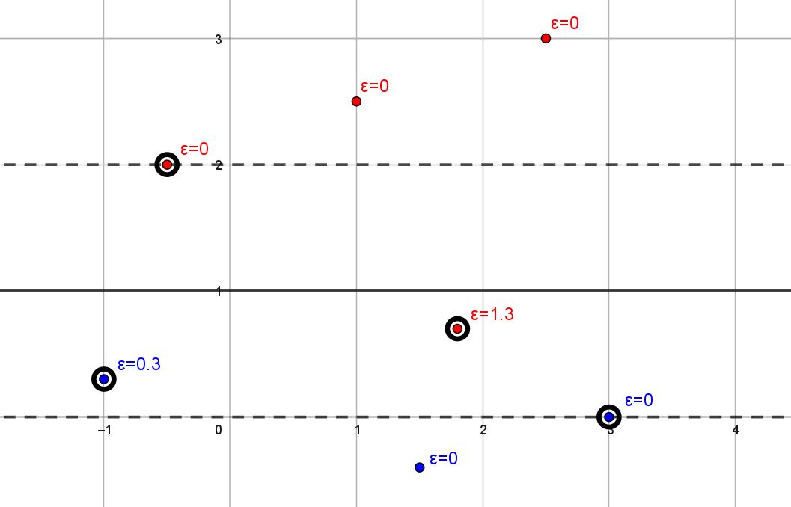
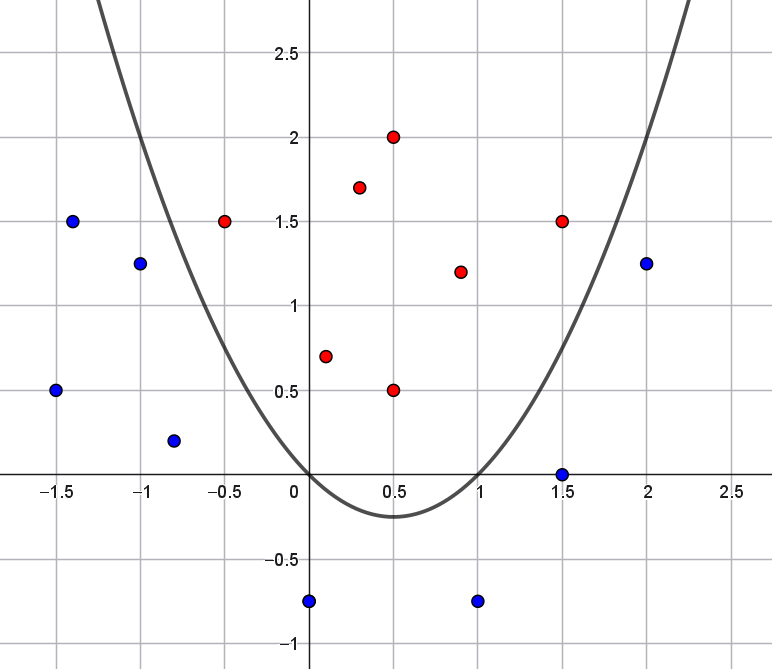

::: {.callout-note collapse="true" appearance="minimal"}  
### Facit -- opgave 1

{width=60% fig-align="center"}

:::

::: {.callout-note collapse="true" appearance="minimal"}  
### Facit -- opgave 2

Det kan for eksempel se sådan her ud:

{width=60% fig-align="center"}

:::

::: {.callout-note collapse="true" appearance="minimal"}  
### Facit -- opgave 3

Vent med at kontrollere dit resultat til opgave 7.

:::

::: {.callout-note collapse="true" appearance="minimal"}  
### Facit -- opgave 5

{width=60% fig-align="center"}
:::

::: {.callout-note collapse="true" appearance="minimal"}  
### Facit -- opgave 6

{width=60% fig-align="center"}

Punktet $(x_1,x_2)=(1,3)$ giver ved indsættelse i linjens ligning:

$$
-1-2\cdot3+5=-2<0
$$
Punktet ligger altså på den modsatte side af linjen, som normalvektoren peger ind i (det blå område på figuren ovenfor), hvor vi ikke forventer, at medicinen har effekt. 

:::

::: {.callout-note collapse="true" appearance="minimal"}  
### Facit -- opgave 7

Excel giver

$$
\begin{aligned}
a &= -0.44721 \\
b &= -0.89443 \\
c &= 2.236066 \\
M &= 0.447213
\end{aligned}
$$

Hvis værdierne ganges med $\sqrt{5}$ fås linjen med ligning

$$
-x-2y+5=0
$$

:::

::: {.callout-note collapse="true" appearance="minimal"}  
### Facit -- opgave 8

Problemløseren kan ikke finde en løsning, fordi punkterne ikke kan adskilles ved hjælp af en ret linje.

:::

::: {.callout-note collapse="true" appearance="minimal"}  
### Facit -- opgave 9

| Observation | $x_1$  | $x_2$  | $t$  | Afstand | $\varepsilon_i$ |
|:-----------:|:------:|:------:|:----:|:----:|:----:|
|      1      |  $1$   | $2.5$  | $1$  | $1.5$ | $0$ |
|      2      |  $-1$  | $0.3$  | $-1$ | $0.7$ | $0.3$ |
|      3      |  $3$   |  $0$   | $-1$ | $1$ | $0$ |
|      4      | $1.5$  | $-0.4$ | $-1$ | $1.4$ | $0$ |
|      5      | $1.8$  | $0.7$  | $1$  | $0.3$ | $1.3$ |
|      6      | $-0.5$ |  $2$   | $1$  | $1$ | $0$ |
|      7      | $2.5$  |  $3$   | $1$  | $2$ | $0$ |

: {.bordered}

Resultatet er illustreret på figuren her:

{width=60% fig-align="center"}

:::

::: {.callout-note collapse="true" appearance="minimal"}  

### Facit -- opgave 10

* Måling $(x_1,x_2,x_3)=(1,3,0)$:

   $$
   2x_1 + x_2 - x_3+1 = 6 > 0
   $$
   
   Altså forventer vi en effekt.
   
* Måling $(x_1,x_2,x_3)=(2,0,3)$:

   $$
   2x_1 + x_2 - x_3+1 = 2 > 0
   $$
   
   Altså forventer vi en effekt.

* Afstand til planen:

   Måling $(x_1,x_2,x_3)=(1,3,0)$: Afstanden er cirka $2.449$. 
   
   Måling $(x_1,x_2,x_3)=(2,0,3)$: Afstanden er cirka $0.816$. 
   
   Den første måling på $(x_1,x_2,x_3)=(1,3,0)$ har den største afstand til skillelinje. Derfor er vi mest sikker på denne klassifikation.

:::

::: {.callout-note collapse="true" appearance="minimal"}  

### Facit -- opgave 11

Excel giver

$$
\begin{aligned}
a &= -0.57735 \\
b &= 0.57735 \\
c &= 0.57735 \\
d &= 0 \\
M &= 0.866026
\end{aligned}
$$

:::

::: {.callout-note collapse="true" appearance="minimal"}  

### Facit -- opgave 12

* Når punktet $(x_1,x_2,x_1^2 + x_2^2)$ indsættes i planens ligning fås

   $$
   x_1^2+x_2^2=4
   $$
   
   Det er ligningen for en cirkel i planen med centrum i origo $(0,0)$ og med radius $r=\sqrt{4}=2$.
   
* Punkter $(x_1,x_2,x_1^2 + x_2^2)$, som opfylder, at $x_3-4>0$ klassificeres som hørende til klasse $1$. Det svarer til, at 

   $$
   x_1^2+x_2^2>4
   $$
   
   Altså punkter, som ligger uden for cirklen i planen. Omvendt hvis $x_1^2+x_2^2<4$, ligger punktet inden i cirklen og  bliver klassificeret som hørende til klasse $-1$.

:::

::: {.callout-note collapse="true" appearance="minimal"}  

### Facit -- opgave 13

Excel giver

$$
\begin{aligned}
a &= 0.57735 \\
b &= 0.57735 \\
c &= -0.57735 \\
d &= 0 \\
M &= 0.433013
\end{aligned}
$$

Ligningen for parablen er

$$
x_2 = x_1^2-x_1
$$

Resultatet er illustreret her:

{width=60% fig-align="center"}
   
:::
